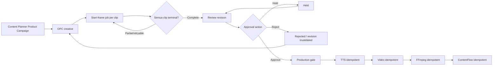

# Implementation Plan — Product Campaign Pipeline Hardening

## 1. Tujuan

Menutup seluruh pekerjaan teknis yang masih terbuka pada rencana utama sebelum Product Campaign menjalani pilot enam item. Fokus hardening:

1. feature flag tenant-scoped beserta admin control;
2. start-frame worker yang non-blocking, restart-safe, dan dapat menangani partial failure;
3. satu service bersama untuk generate, regenerate, replace, poll, download, checksum, dan manifest asset;
4. approval state machine yang mendukung approve, reject, hold, resume, revision lock, dan concurrency;
5. idempotency untuk TTS, video, FFmpeg, upload, dan ContentFlow;
6. notification events serta structured logging tanpa secret;
7. automated tests untuk tenant isolation, stale revision, duplicate action, recovery, dan provider failure;
8. deployment hanya ke Mac Mini Dev.

Rencana ini tetap menggunakan **OPC** sebagai canonical campaign engine. Strategic Campaign tidak menjadi acuan dan tidak boleh ditambahkan kembali.

## 2. Batasan

Termasuk:

- implementasi dan automated tests;
- migrasi idempotent pada schema `dev`;
- simulasi provider melalui fake adapter;
- deploy dan smoke test Dev;
- release patch.

Tidak termasuk:

- pilot provider nyata enam item;
- merge atau push ke `main`;
- deployment Staging atau Production;
- social posting.

## 3. Urutan arsitektur akhir



## 4. State machine

### Start frame

- `pending`
- `queued`
- `submitting`
- `provider_processing`
- `downloading`
- `completed`
- `partial`
- `retry_wait`
- `failed_terminal`
- `skipped`

### Review/approval

- `creative_processing`
- `start_frames_processing`
- `ready_for_review`
- `held`
- `rejected`
- `production_processing`
- `completed`
- `completed_with_warnings`

Aturan:

- hanya `ready_for_review` dengan revision yang sama dapat di-approve;
- `held` tidak dapat diproduksi dan dapat dikembalikan ke `ready_for_review` tanpa mengubah revision;
- `rejected` membatalkan approval serta mengharuskan revision baru;
- approval, hold, reject, dan resume memakai conditional update untuk mencegah lost update;
- seluruh action menerima idempotency key.

## 5. Feature flag

Setting tenant:

```text
content_automation_product_campaign_enabled=false
content_automation_product_campaign_pilot_enabled=false
```

Semantik:

- flag pertama mengatur visibilitas dan pembuatan schedule Product Campaign;
- flag kedua mengatur eksekusi `run-now` dan scheduler;
- schedule existing tetap dapat dibaca saat flag off;
- brand editorial tidak terpengaruh;
- default migrasi untuk tenant existing yang sudah memakai fitur: `true`; tenant baru: `false` melalui provisioning default.

## 6. Perubahan per file

### 6.1 `lib/db-pg.js`

Tujuan:

- menambah asset job lifecycle, approval reason/state, dan stage execution ledger;
- menambah index/unique constraint untuk idempotency;
- migrasi aman dan idempotent.

#### Code Sebelum (Current/Before)

```sql
CREATE TABLE IF NOT EXISTS pillar_campaign_item_assets (
  campaign_item_id TEXT,
  clip_index INTEGER,
  asset_type TEXT,
  revision INTEGER,
  status TEXT,
  local_path TEXT,
  checksum TEXT
);
```

#### Code Sesudah (Proposed/After)

```sql
ALTER TABLE pillar_campaign_item_assets
  ADD COLUMN IF NOT EXISTS provider_task_id TEXT,
  ADD COLUMN IF NOT EXISTS attempt_count INTEGER NOT NULL DEFAULT 0,
  ADD COLUMN IF NOT EXISTS next_attempt_at TIMESTAMPTZ,
  ADD COLUMN IF NOT EXISTS last_error_code TEXT,
  ADD COLUMN IF NOT EXISTS last_error_message TEXT,
  ADD COLUMN IF NOT EXISTS submitted_at TIMESTAMPTZ,
  ADD COLUMN IF NOT EXISTS completed_at TIMESTAMPTZ;

ALTER TABLE pillar_campaign_items
  ADD COLUMN IF NOT EXISTS review_state TEXT,
  ADD COLUMN IF NOT EXISTS review_reason TEXT,
  ADD COLUMN IF NOT EXISTS review_actor_id TEXT,
  ADD COLUMN IF NOT EXISTS review_state_updated_at TIMESTAMPTZ;

CREATE TABLE IF NOT EXISTS pillar_campaign_stage_executions (
  id TEXT PRIMARY KEY,
  tenant_id TEXT NOT NULL,
  campaign_item_id TEXT NOT NULL,
  stage TEXT NOT NULL,
  revision INTEGER NOT NULL,
  idempotency_key TEXT NOT NULL,
  status TEXT NOT NULL,
  provider_task_id TEXT,
  output_json JSONB,
  error_json JSONB,
  attempt_count INTEGER NOT NULL DEFAULT 0,
  started_at TIMESTAMPTZ,
  completed_at TIMESTAMPTZ,
  UNIQUE (tenant_id, idempotency_key)
);
```

### 6.2 `lib/content-automation-feature-flags.js` — file baru

Tujuan: satu sumber kebenaran untuk flag tenant serta guard schedule/run.

#### Code Sebelum (Current/Before)

```js
// Product Campaign selalu tersedia bila route dapat diakses.
```

#### Code Sesudah (Proposed/After)

```js
export function getProductCampaignFlags() {
  return {
    enabled: getSetting('content_automation_product_campaign_enabled') === 'true',
    pilotEnabled: getSetting('content_automation_product_campaign_pilot_enabled') === 'true'
  };
}

export function assertProductCampaignEnabled({ execution = false } = {}) {
  const flags = getProductCampaignFlags();
  if (!flags.enabled || (execution && !flags.pilotEnabled)) {
    throw new FeatureDisabledError();
  }
  return flags;
}
```

### 6.3 `app/api/v2/content-automations/feature-flags/route.js` — file baru

Tujuan:

- GET untuk authenticated tenant user;
- PUT hanya tenant admin;
- audit event setiap perubahan.

#### Code Sebelum (Current/Before)

```js
// Belum ada endpoint feature flag Product Campaign.
```

#### Code Sesudah (Proposed/After)

```js
export const GET = withTenantContext(async () =>
  NextResponse.json({ success: true, flags: getProductCampaignFlags() })
);

export const PUT = withTenantContext(async (request, _context, user) => {
  requireTenantAdmin(user);
  return NextResponse.json({ success: true, flags: await saveProductCampaignFlags(await request.json(), user) });
});
```

### 6.4 `app/api/v2/content-automations/route.js`

Tujuan: guard pembuatan Product Campaign tanpa memengaruhi editorial.

#### Code Sebelum (Current/Before)

```js
const prepared = body.campaign_kind === 'product_campaign'
  ? await prepareProductCampaignSchedule(body)
  : { body };
```

#### Code Sesudah (Proposed/After)

```js
if (body.campaign_kind === 'product_campaign') {
  assertProductCampaignEnabled();
}
const prepared = body.campaign_kind === 'product_campaign'
  ? await prepareProductCampaignSchedule(body)
  : { body };
```

### 6.5 `app/api/v2/content-automations/[id]/run-now/route.js`

Tujuan: guard eksekusi pilot dan notification saat flag off.

#### Code Sebelum (Current/Before)

```js
if (schedule.campaign_kind === 'product_campaign') {
  const snapshot = await captureProductSnapshot(...);
}
```

#### Code Sesudah (Proposed/After)

```js
if (schedule.campaign_kind === 'product_campaign') {
  assertProductCampaignEnabled({ execution: true });
  const snapshot = await captureProductSnapshot(...);
}
```

### 6.6 `app/content-automations/page.js`

Tujuan:

- membaca flag;
- menyembunyikan/disable Product Campaign bila off;
- admin control yang jelas;
- menampilkan alasan flag dan status pilot.

#### Code Sebelum (Current/Before)

```jsx
<button onClick={() => setCampaignKind('product_campaign')}>
  Product Campaign
</button>
```

#### Code Sesudah (Proposed/After)

```jsx
<button
  disabled={!flags.enabled}
  title={!flags.enabled ? 'Dinonaktifkan oleh Admin tenant' : ''}
  onClick={() => setCampaignKind('product_campaign')}
>
  Product Campaign
</button>
<ProductCampaignFlagControl flags={flags} admin={user?.role === 'admin'} />
```

### 6.7 `lib/pillar-start-frame-service.js`

Tujuan: refactor menjadi stateful job service; finalize tidak lagi menganggap satu pemanggilan sinkron sebagai seluruh lifecycle.

#### Code Sebelum (Current/Before)

```js
export async function finalizeStartFrameCheckpoint(itemId, { paths = null } = {}) {
  const revision = Number(item.start_frame_revision || 0) + 1;
  // insert manifest langsung dari paths
}
```

#### Code Sesudah (Proposed/After)

```js
export async function queueStartFrameRevision(itemId, options = {}) { /* manifest queued */ }
export async function claimNextStartFrameAsset(workerId) { /* SKIP LOCKED */ }
export async function submitStartFrameAsset(asset, adapter) { /* provider task */ }
export async function pollStartFrameAsset(asset, adapter) { /* non-blocking */ }
export async function downloadStartFrameAsset(asset, adapter) { /* checksum + atomic rename */ }
export async function reconcileStartFrameRevision(itemId) { /* aggregate terminal states */ }
export async function recoverStaleStartFrameAssets(now) { /* lease timeout */ }
```

Revision hanya bertambah ketika revision baru dibuat, bukan setiap refresh/reconcile.

### 6.8 `lib/start-frame-worker.js` — file baru

Tujuan: worker tick non-blocking, bounded concurrency, retry/backoff, dan graceful restart.

#### Code Sebelum (Current/Before)

```js
// Submit, polling, delay, dan download berada di route/process panjang.
```

#### Code Sesudah (Proposed/After)

```js
export async function processStartFrameTick({ adapter, limit = 4 }) {
  const assets = await claimStartFrameAssets(limit);
  return Promise.allSettled(assets.map(asset => advanceStartFrameAsset(asset, adapter)));
}
```

### 6.9 `lib/start-frame-provider-adapter.js` — file baru

Tujuan: interface provider yang dapat diganti fake adapter saat test.

#### Code Sebelum (Current/Before)

```js
await generateImage(...);
await getTaskStatus(...);
await getFileUrl(...);
```

#### Code Sesudah (Proposed/After)

```js
export const glabsStartFrameAdapter = {
  submit(input) {},
  poll(providerTaskId) {},
  download(output, destination) {}
};
```

### 6.10 `app/api/v2/pillar-campaigns/items/[itemId]/regenerate-start-frames/route.js`

Tujuan: route hanya membuat revision/job dan segera mengembalikan HTTP 202.

#### Code Sebelum (Current/Before)

```js
for (const clip of clipsToProcess) {
  const task = await generateImage(...);
  await pollUntilComplete(task);
  await download(...);
}
```

#### Code Sesudah (Proposed/After)

```js
const revision = await queueStartFrameRevision(itemId, { reason: 'manual_regenerate', actorId: user.id });
return NextResponse.json({ success: true, revision, status: 'queued' }, { status: 202 });
```

### 6.11 `app/api/v2/pillar-campaigns/items/[itemId]/replace-start-frame/route.js`

Tujuan: memakai asset service dan checksum yang sama; invalidasi review revision secara konsisten.

#### Code Sebelum (Current/Before)

```js
fs.writeFileSync(destination, buffer);
await updatePillarCampaignItem(itemId, { t2i_images_json: ... });
```

#### Code Sesudah (Proposed/After)

```js
const asset = await replaceStartFrameAsset({ itemId, clipIndex, buffer, actorId: user.id });
await reconcileStartFrameRevision(itemId);
return NextResponse.json({ success: true, asset });
```

### 6.12 `lib/pillar-campaign-approval.js`

Tujuan: conditional transition dan action state machine.

#### Code Sebelum (Current/Before)

```js
await updatePillarCampaignItem(item.id, {
  approved_revision: requestedRevision,
  workflow_status: 'production_processing'
});
```

#### Code Sesudah (Proposed/After)

```js
export async function transitionPillarReview({
  itemId, action, reviewRevision, reason, actorId, idempotencyKey
}) {
  // transaction + SELECT FOR UPDATE
  // validate expected state/revision
  // insert audit action with unique idempotency key
  // conditional state transition
}
```

### 6.13 `app/api/v2/pillar-campaigns/items/[itemId]/review-action/route.js` — file baru

Tujuan: endpoint tunggal untuk `approve`, `hold`, `resume`, dan `reject`.

#### Code Sebelum (Current/Before)

```js
// Hanya endpoint approve tersedia.
```

#### Code Sesudah (Proposed/After)

```js
const result = await transitionPillarReview({
  itemId, action: body.action, reviewRevision: body.review_revision,
  reason: body.reason, actorId: user.id,
  idempotencyKey: request.headers.get('Idempotency-Key')
});
```

Endpoint approve lama dipertahankan sebagai compatibility wrapper.

### 6.14 `app/api/v2/content-automations/runs/[runId]/approve/route.js`

Tujuan: bulk action transactional-per-item, deterministic idempotency keys, partial result yang dapat diulang.

#### Code Sebelum (Current/Before)

```js
for (const item of eligible) {
  await approvePillarCampaignItemUnchanged(item.id, ...);
}
```

#### Code Sesudah (Proposed/After)

```js
for (const item of eligible) {
  await transitionPillarReview({
    itemId: item.id,
    action: 'approve',
    reviewRevision,
    idempotencyKey: `bulk:${runId}:${reviewRevision}:${item.id}`
  });
}
```

### 6.15 `lib/pillar-stage-execution-service.js` — file baru

Tujuan: ledger idempotency untuk TTS/video/FFmpeg/upload.

#### Code Sebelum (Current/Before)

```js
if (item.tts_status === 'pending') processTts(item);
```

#### Code Sesudah (Proposed/After)

```js
export async function executeIdempotentStage({ item, stage, revision, execute }) {
  const key = `${item.tenant_id}:${item.id}:${revision}:${stage}`;
  const execution = await claimStageExecution(key);
  if (execution.status === 'completed') return execution.output_json;
  return completeStageExecution(execution, await execute(execution));
}
```

### 6.16 `lib/campaign-scheduler.js`

Tujuan: seluruh stage OPC melalui execution ledger dan menghormati held/rejected state.

#### Code Sebelum (Current/Before)

```js
if (currentItem.workflow_status === 'production_processing') {
  await processNextStage(currentItem);
}
```

#### Code Sesudah (Proposed/After)

```js
if (currentItem.workflow_status === 'production_processing') {
  await executeIdempotentStage({ item: currentItem, stage: nextStage, revision, execute });
}
```

### 6.17 `lib/content-automation-contentflow.js`

Tujuan: mengikat idempotency ContentFlow ke item/revision/final checksum dan membedakan retryable vs terminal failure.

#### Code Sebelum (Current/Before)

```js
if (item.contentflow_sync_status === 'completed') return { idempotent: true };
```

#### Code Sesudah (Proposed/After)

```js
const key = `contentflow:${item.id}:${item.approved_revision}:${finalChecksum}`;
return executeIdempotentStage({ item, stage: 'contentflow', revision, idempotencyKey: key, execute: sync });
```

### 6.18 `lib/content-automation-events.js` — file baru

Tujuan: katalog event internal dan external notification.

#### Code Sebelum (Current/Before)

```js
await createNotification(run, 'awaiting_approval', ...);
```

#### Code Sesudah (Proposed/After)

```js
export const AUTOMATION_EVENTS = {
  START_FRAMES_READY: 'start_frames_ready',
  START_FRAMES_PARTIAL: 'start_frames_partial',
  ITEM_HELD: 'item_held',
  ITEM_REJECTED: 'item_rejected',
  PRODUCTION_STARTED: 'production_started',
  CONTENTFLOW_WARNING: 'contentflow_warning'
};

export async function emitAutomationEvent(context, event) {
  await Promise.all([writeAuditEvent(context, event), createInAppNotification(context, event), enqueueExternalNotification(context, event)]);
}
```

### 6.19 `lib/structured-logger.js` — file baru

Tujuan: log JSON dengan correlation context dan redaction.

#### Code Sebelum (Current/Before)

```js
console.log(`[OPC] Processing item ${item.id}`);
```

#### Code Sesudah (Proposed/After)

```js
logger.info('opc.stage.started', {
  tenant_id, run_id, campaign_id, item_id, stage, revision, attempt
});
```

Redact key: `password`, `token`, `api_key`, `authorization`, `cookie`, `secret`, `bot_token`.

### 6.20 `lib/operator-content-worker.js`

Tujuan: emit event dan structured context pada lifecycle run; tidak auto-approve held/rejected items.

#### Code Sebelum (Current/Before)

```js
for (const item of readyItems) await approvePillarCampaignItemUnchanged(item.id);
```

#### Code Sesudah (Proposed/After)

```js
for (const item of readyItems.filter(item => item.review_state === 'ready')) {
  await transitionPillarReview({ action: 'approve', ... });
}
```

### 6.21 `scripts/test-product-campaign-hardening.mjs` — file baru

Tujuan: unit/contract tests pure helpers, flags, state machine, redaction, retry classification.

#### Code Sebelum (Current/Before)

```js
// Belum ada suite hardening terpadu.
```

#### Code Sesudah (Proposed/After)

```js
await testFeatureFlags();
await testReviewStateMachine();
await testStageIdempotencyKeys();
await testLogRedaction();
await testRetryClassification();
```

### 6.22 `scripts/test-product-campaign-hardening-integration.mjs` — file baru

Tujuan: isolated transaction/schema test untuk concurrency dan recovery.

#### Code Sebelum (Current/Before)

```js
// Belum ada concurrent/recovery integration suite.
```

#### Code Sesudah (Proposed/After)

```js
await testCrossTenantIsolation();
await testDoubleClickApproval();
await testStaleRevisionRejected();
await testConcurrentApproveVsReject();
await testStartFramePartialRecovery();
await testDuplicateTtsVideoFfmpeg();
await testContentFlowRetryAndDuplicate();
```

### 6.23 `package.json`

#### Code Sebelum (Current/Before)

```json
"test:content-automation:product-integration": "node scripts/test-content-automation-product-integration.mjs"
```

#### Code Sesudah (Proposed/After)

```json
"test:product-campaign:hardening": "node scripts/test-product-campaign-hardening.mjs",
"test:product-campaign:hardening-integration": "node scripts/test-product-campaign-hardening-integration.mjs"
```

### 6.24 `docs/content-automation-product-campaign/runbook.md`

Tujuan: recovery operator dan rollback.

#### Code Sebelum (Current/Before)

```md
## Binding saat Save
...
```

#### Code Sesudah (Proposed/After)

```md
## Recovery Start Frame
## Approval Hold/Reject
## Stage Idempotency Ledger
## ContentFlow Retry
## Feature Flag Emergency Disable
## Structured Log Correlation
```

## 7. Test matrix

| Area | Skenario wajib |
|---|---|
| Feature flag | off/on per tenant, editorial unaffected, run blocked saat pilot off |
| Tenant isolation | tenant A tidak dapat memakai schedule/product/item tenant B |
| Start frame | success, partial, provider timeout, download failure, checksum mismatch, restart setelah claim |
| Approval | approve, hold, resume, reject, stale revision, double-click, approve-vs-reject race |
| Idempotency | duplicate TTS, video, FFmpeg, upload, ContentFlow menghasilkan satu side effect |
| ContentFlow | duplicate response, retryable 5xx, terminal 4xx, completed-with-warnings |
| Notification | event dedup, quiet hours, secret redaction |
| Regression | Brand Editorial dan OPC manual tetap bekerja |

## 8. Deployment dan rollback

Deployment hanya:

```bash
npm run deploy:macmini-dev
```

Target:

- `~/maknaflow-dev`;
- UI 5020;
- API 7020;
- schema `dev`;
- `PGPOOL_MAX=3`.

Rollback:

1. matikan `content_automation_product_campaign_pilot_enabled`;
2. biarkan worker menyelesaikan stage yang sudah claimed atau expire lease;
3. deploy tag Dev sebelumnya;
4. jangan hapus ledger atau manifest; data tersebut diperlukan untuk idempotent recovery;
5. tidak ada deployment Staging/Production.

## 9. Definition of Done

- semua automated test matrix lulus;
- worker restart tidak menggandakan provider task atau output;
- approval concurrency tidak menghasilkan state ambigu;
- held/rejected item tidak masuk produksi;
- ContentFlow duplicate/retry aman;
- log tidak mengandung credential;
- feature flag dapat mematikan create/run Product Campaign per tenant;
- Brand Editorial regression lulus;
- build dan Dev deployment sehat;
- main checklist teknis terkait ditandai selesai.

## 10. Execution Task List

### A. Baseline

- [x] Catat branch, HEAD, dan dirty files.
- [x] Baca dokumentasi Next.js lokal yang relevan.
- [x] Jalankan seluruh baseline Content Automation/OPC/Planner tests.
- [x] Snapshot schema Dev dan status feature settings.

### B. Feature flag

- [x] Implementasikan tenant-scoped flag service.
- [x] Implementasikan GET/PUT admin endpoint dan audit.
- [x] Guard create schedule, run-now, dan scheduler execution.
- [x] Tambahkan UI admin control dan disabled states.
- [x] Tambahkan multi-tenant flag tests.

### C. Start-frame worker

- [x] Tambahkan migrasi lifecycle asset dan index.
- [x] Implementasikan provider adapter.
- [x] Implementasikan queue/claim/submit/poll/download/reconcile.
- [x] Implementasikan lease timeout dan stale recovery.
- [x] Refactor regenerate route menjadi HTTP 202.
- [x] Refactor replace route memakai asset service.
- [x] Tambahkan partial failure dan restart recovery tests.

### D. Approval state machine

- [x] Tambahkan review state/reason/audit fields.
- [x] Implementasikan approve/hold/resume/reject transition.
- [x] Implementasikan review-action endpoint.
- [x] Jadikan approve lama sebagai compatibility wrapper.
- [x] Terapkan bulk deterministic idempotency key.
- [x] Tambahkan stale revision, double-click, dan concurrency tests.

### E. Production idempotency

- [x] Tambahkan stage execution ledger.
- [x] Terapkan ledger pada TTS.
- [x] Terapkan ledger pada video.
- [x] Terapkan ledger pada FFmpeg/upload.
- [x] Terapkan ledger pada ContentFlow.
- [x] Tambahkan duplicate/retry/failure tests.

### F. Events dan observability

- [x] Tambahkan event catalog.
- [x] Tambahkan in-app/external notification events.
- [x] Tambahkan structured logger dan redaction.
- [x] Tambahkan correlation context pada worker/scheduler.
- [x] Tambahkan dedup dan redaction tests.

### G. Verifikasi

- [x] Jalankan `git diff --check`.
- [x] Jalankan hardening unit tests.
- [x] Jalankan hardening integration/concurrency tests pada Dev/isolation schema.
- [x] Jalankan existing Product Campaign tests.
- [x] Jalankan OPC dan Content Planner regressions.
- [x] Jalankan production build.
- [x] Perbarui runbook dan main implementation checklist.

### H. Deploy Dev dan release

- [x] Deploy hanya dengan `npm run deploy:macmini-dev`.
- [x] Verifikasi PM2 Dev, port 5020/7020, schema `dev`, pool 3.
- [x] Jalankan smoke test flags, approval actions, dan recovery tanpa provider berbiaya.
- [x] Konfirmasi tidak ada deploy Staging/Production.
- [ ] Jalankan release patch non-interactive.
- [ ] Verifikasi commit, tag, dan push branch kerja.
- [x] Jangan merge/push `main` pada tahap hardening tanpa keputusan setelah pilot.
