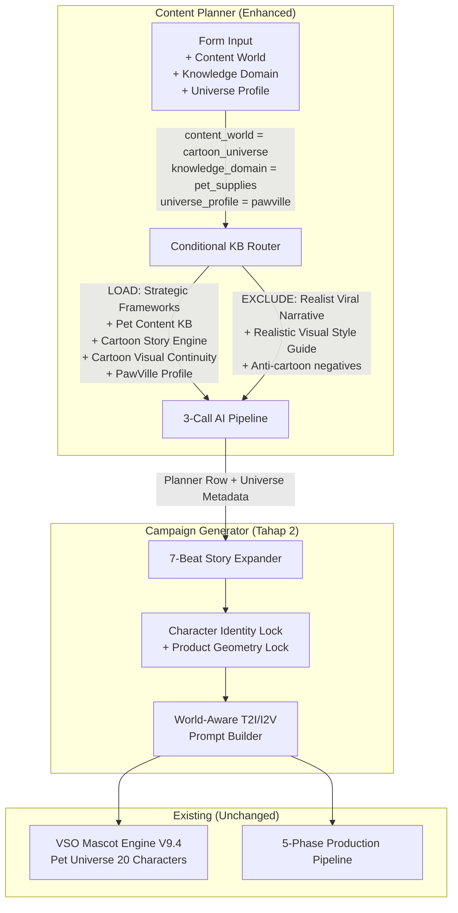

# Rencana Implementasi: World-Aware Content Planning (PawVille MVP)

Diadopsi dari [00_USULAN_INTERNALISASI](file:///Users/sabeqmmursyid/_maknaflow-staging/docs/idekartun/00_USULAN_INTERNALISASI_PET_CARTOON_UNIVERSE_MAKNAFLOW.md), diperkaya dengan mapping kode teknis.

---

## Prinsip Desain (7 Keputusan Wajib)

1. **Bangun `Cartoon Universe` generik.** PawVille = preset pertama, bukan fitur hardcoded.
2. **Pisahkan Content World dari Visual Style.** Kartun = hukum dunia + format naratif, bukan hanya tampilan.
3. **Conditional KB Routing.** Jangan memuat KB realistis ke prompt kartun — mereka saling bertentangan.
4. **PawVille = Universe Profile (data).** Karakter dan lokasi harus reusable, bukan global rule.
5. **Content Planner tetap di level ide.** Storyboard 7-scene dibuat di Campaign Generator, bukan di Planner.
6. **Gunakan fondasi mascot workflow existing.** `MASCOT_UNIVERSES`, `MASCOT_ART_STYLES`, `buildVisualSwapOverridePrompt()` sudah siap.
7. **Pet-specific compliance wajib.** Konten kartun tetap tidak boleh diagnosis medis atau klaim tersirat.

---

## Arsitektur Target



---

# TAHAP 1 — MVP World-Aware Planner

**Tujuan**: Content Planner dapat menghasilkan kalender ide PawVille yang tidak dipaksa mengikuti dunia manusia realistis.

---

## 1.1 [NEW] Knowledge Base: `PET_CONTENT_KB.md`

**Lokasi**: [`kb/PET_CONTENT_KB.md`](file:///Users/sabeqmmursyid/_maknaflow-staging/kb/PET_CONTENT_KB.md)

KB domain pet yang **reusable** (bisa untuk konten hewan nyata maupun kartun):

```markdown
# PET CONTENT KNOWLEDGE BASE

## 1. Kategori Hewan yang Didukung

### Kucing
- British Shorthair, Persia, Anggora, Kampung, Calico, Ragdoll
- Perilaku khas: mengendus sebelum makan/minum, mengabaikan air diam, grooming berlebihan saat stres, 
  bermain aktif menjelang senja, tidur 12-16 jam/hari, mendengkur saat nyaman

### Anjing
- Corgi, Shiba Inu, Golden Retriever, Poodle, Labrador
- Perilaku khas: mengais lantai, mengunyah barang, berlari berputar, menunggu di depan pintu,
  menjilat tangan pemilik, menggonggong saat kesepian

### Hewan Kecil
- Hamster, Kelinci, Guinea Pig, Landak Mini
- Perilaku khas: mengumpulkan makanan di pipi, melompat lincah, bersembunyi saat takut,
  menggulung diri saat terkejut

### Burung & Ikan
- Parrot, Kenari, Ikan Mas Koki, Ikan Cupang
- Perilaku khas: meniru suara, berkicau pagi hari, meniup gelembung, mengembangkan sirip

## 2. Problem-to-Product Mapping

| Kategori Masalah | Masalah Observable | Produk Relevan | Visual Cue |
|---|---|---|---|
| Hydration | Kucing mengendus mangkuk lalu pergi, air mangkuk tidak diminati | Pet water fountain, auto-refill bowl | Air mengalir, gemericik lembut |
| Nutrition | Makanan tercecer di lantai, porsi dimakan tidak habis | Auto feeder, slow feeder bowl, food mat | Makanan tersaji rapi, porsi terukur |
| Grooming | Bulu berserakan di sofa, bulu kusut sulit disisir | Sisir furminator, grooming glove, nail clipper | Bulu halus mengkilap, sisiran lembut |
| Hygiene | Pasir berceceran di sekitar litter box, bau ruangan | Self-cleaning litter box, litter mat, deodorizer | Area bersih dan wangi |
| Enrichment | Kucing tiduran sepanjang hari, tidak tertarik mainan lama | Cat tree, interactive toy, laser pointer, puzzle feeder | Bermain aktif, melompat riang |
| Comfort | Hewan tidur di tempat tidak nyaman, gelisah malam hari | Pet bed, calming diffuser, blanket, heated pad | Tidur nyenyak melingkar |
| Travel | Kesulitan membawa hewan bepergian, hewan stres di carrier | Pet carrier, travel bowl, harness, car seat | Perjalanan aman dan tenang |
| Safety | Memanjat tempat bahaya, mencoba kabur dari rumah | Cat net, GPS tracker, pet gate, window guard | Lingkungan aman terlindungi |

## 3. Pet Compliance Rules

### DILARANG
- Mendiagnosis kondisi medis hewan
- Menjanjikan kesehatan atau perubahan perilaku secara pasti
- Menggambarkan produk sebagai pengganti dokter hewan
- Menggunakan ketakutan berlebihan tentang kesehatan hewan
- Menyebut: "menyembuhkan", "mencegah penyakit", "pasti sehat", "wajib dimiliki", "dijamin berhasil"

### GUNAKAN
- "membantu membuat area minum lebih menarik"
- "dirancang untuk menjaga air tetap mengalir"
- "dapat menjadi pilihan untuk aktivitas sehari-hari"
- "membantu menjaga area makan lebih rapi"
- "cocok dipertimbangkan untuk kebutuhan tertentu"

### Aturan Karakter Dokter (Dr. Paw dsb.)
- Posisikan sebagai observer, inventor, atau problem solver — BUKAN diagnoser
- Dialog dan tindakannya TIDAK BOLEH membentuk diagnosis medis tanpa dasar
- AMAN: "Dr. Paw melihat mangkuk dan memperhatikan air tidak bergerak"
- BAHAYA: "Dr. Paw memastikan fountain menyelesaikan masalah kesehatan Mochi"

## 4. Pet Content Pillars

### Pet Hydration & Feeding
Konten seputar kebiasaan makan dan minum hewan peliharaan.
CEP Preferences: problem_solution_based, routine_based
VFO Preferences: concrete, instinctive

### Pet Grooming & Hygiene
Konten perawatan bulu, kuku, kebersihan area hewan.
CEP Preferences: routine_based, commitment_based
VFO Preferences: concrete, aspirational

### Pet Enrichment & Play
Konten aktivitas bermain, stimulasi mental, mainan interaktif.
CEP Preferences: emotional_based, aspirational_based
VFO Preferences: instinctive, uncharted

### Pet Comfort & Wellness
Konten kenyamanan tidur, relaksasi, kesejahteraan hewan.
CEP Preferences: emotional_based, commitment_based
VFO Preferences: aspirational, instinctive

### Pet Travel & Safety
Konten keamanan, perjalanan, perlindungan hewan.
CEP Preferences: problem_solution_based, opportunistic_based
VFO Preferences: concrete, uncharted
```

---

## 1.2 [NEW] Knowledge Base: `CARTOON_UNIVERSE_STORY_ENGINE.md`

**Lokasi**: [`kb/CARTOON_UNIVERSE_STORY_ENGINE.md`](file:///Users/sabeqmmursyid/_maknaflow-staging/kb/CARTOON_UNIVERSE_STORY_ENGINE.md)

Aturan pola cerita kartun generik (bukan PawVille-specific):

```markdown
# CARTOON UNIVERSE STORY ENGINE

## Story Beat Structure (7-Beat Arc)

### Beat 1 — Visual Hook
Tampilkan masalah karakter secara langsung.
- Tidak ada penjelasan panjang
- Emosi karakter langsung terlihat
- Produk BELUM muncul
- Harus memunculkan pertanyaan di benak penonton

### Beat 2 — Problem Development
Perlihatkan dampak ringan dari masalah.
- Karakter pendukung boleh mulai menyadari
- Konflik tidak terlalu dramatis
- Jangan menggambarkan kondisi medis berat

### Beat 3 — Discovery
Karakter pendukung memeriksa situasi dan menemukan penyebab utama.
- Gunakan ekspresi, gesture, properti, atau observasi visual
- Jangan gunakan dialog diagnosis medis

### Beat 4 — Solution Introduction
Produk mulai diperkenalkan sebagai solusi.
- Produk TIDAK BOLEH terasa muncul tiba-tiba tanpa hubungan cerita
- Produk bukan deus ex machina

### Beat 5 — Product Demonstration
Tampilkan fungsi utama produk.
- Close-up, macro shot, satisfying movement
- Detail mekanisme produk terlihat
- Reaksi karakter terhadap produk

### Beat 6 — Resolution
Karakter utama menggunakan produk dan masalah mulai terselesaikan.
- Fokus pada perubahan emosi atau perilaku karakter
- Jangan klaim produk "menyembuhkan"

### Beat 7 — Emotional Closing + CTA
Tampilkan hasil akhir yang nyaman, lucu, atau memuaskan.
- CTA disampaikan melalui voice-over atau caption
- CTA TIDAK BOLEH berupa teks di dalam dunia visual
- Satu aksi utama per scene
- Cerita tetap terbaca tanpa voice-over

## Anthropomorphism Rules
- Karakter boleh berdiri dengan dua kaki belakang
- Anatomi dasar spesies harus dipertahankan (bentuk tubuh, jumlah kaki, tekstur bulu/kulit)
- Antropomorfisme tidak boleh merusak ciri dasar spesies
- Karakter tidak boleh berubah bentuk antar-scene (morphing forbidden)

## Product Integration Rules
- Produk berhubungan langsung dengan masalah
- Baru muncul setelah konflik dipahami (paling cepat Beat 4)
- Digunakan dalam aktivitas karakter, bukan ditampilkan statis
- Memiliki fungsi yang terlihat jelas
- Tidak memenuhi frame sepanjang video
- Tidak dipuji secara berlebihan
```

---

## 1.3 [NEW] Knowledge Base: `CARTOON_VISUAL_CONTINUITY_KB.md`

**Lokasi**: [`kb/CARTOON_VISUAL_CONTINUITY_KB.md`](file:///Users/sabeqmmursyid/_maknaflow-staging/kb/CARTOON_VISUAL_CONTINUITY_KB.md)

```markdown
# CARTOON VISUAL CONTINUITY KNOWLEDGE BASE

## Character Identity Lock
Setiap karakter WAJIB mempertahankan:
- Species dan breed yang sama
- Warna bulu/kulit yang identik
- Pola/marking yang konsisten
- Warna mata yang sama
- Pakaian/aksesori signature yang tidak berubah
- Proporsi tubuh yang konsisten
- Ukuran relatif antar-karakter yang terjaga

## Product Geometry Lock
Produk affiliate WAJIB mempertahankan:
- Bentuk geometri yang identik antar-scene
- Warna dan material yang konsisten
- Komponen dan bagian yang sama
- Ukuran relatif terhadap karakter yang terjaga
- Bagian yang bergerak tetap di posisi natural
- Logo merek boleh dihilangkan, bentuk produk TIDAK BOLEH berubah

## Negative Prompts untuk Animasi Kartun
WAJIB disertakan di setiap prompt:
- NO character morphing between scenes
- NO extra limbs or anatomical errors
- NO wardrobe drift (clothing/accessories must not change)
- NO style drift (animation style must remain consistent)
- NO human characters appearing
- NO human hands in frame
- NO text overlay inside the animated world
- NO watermark or brand logos
- NO photorealistic rendering (maintain stylized look)

## Camera Movement Rules for I2V
- Gerakan kamera harus halus dan stabil
- Hindari zoom cepat yang menyebabkan distorsi karakter
- Pan dan dolly lebih aman daripada zoom
- Transisi antar-scene menggunakan cut, bukan morphing
```

---

## 1.4 [NEW] Universe Profile: `PAWVILLE_UNIVERSE_PROFILE.md`

**Lokasi**: [`kb/universes/PAWVILLE_UNIVERSE_PROFILE.md`](file:///Users/sabeqmmursyid/_maknaflow-staging/kb/universes/PAWVILLE_UNIVERSE_PROFILE.md)

Data spesifik PawVille (bukan aturan generik):

```markdown
# PAWVILLE UNIVERSE PROFILE

## World Identity
- Nama: PawVille Pet Universe
- Premis: Kota mini yang dihuni hewan-hewan peliharaan. Produk pet supplies hadir sebagai alat bantu, 
  bagian aktivitas sehari-hari, atau solusi terhadap konflik cerita.
- Tone: Hangat, lucu, emosional ringan, family-friendly
- Human Presence: NONE (tidak ada manusia sama sekali)
- Default Visual Style: cinematic_3d_clay
- Default Aspect Ratio: 9:16
- Default Scene Count: 7
- Default Scene Duration: 8 seconds

## Main Character: Mochi
- Species: British Shorthair
- Body: Round chubby body, short legs, thick soft grey fur
- Eyes: Large amber eyes
- Nose: Small pink nose
- Accessory: Green scarf
- Personality: Penasaran, sedikit manja, lembut, mudah takut hal baru, suka makanan dan tempat nyaman
- Role: main_character (pusat sebagian besar cerita)

## Supporting Characters

### Dr. Paw
- Species: Shiba Inu
- Appearance: Wearing tiny white doctor coat, carrying small brown medical bag
- Personality: Tenang, pintar, observatif
- Role: observer / problem_solver (BUKAN diagnoser medis)

### Coco
- Species: Corgi (brown-white)
- Appearance: Wearing tiny sling bag
- Personality: Aktif, ceria, suka membantu
- Role: first_observer (karakter pertama menyadari masalah)

### Boba
- Species: Hamster (cream-colored)
- Appearance: Big puffy cheeks, moves quickly
- Personality: Cepat, ahli komponen kecil
- Role: builder_helper

### Tofu
- Species: Rabbit (white)
- Appearance: Wearing green apron
- Personality: Teliti, lincah, kreatif
- Role: assembler_helper

## Locations
- PawVille Town Square: Area terbuka dengan rumah-rumah mini, bangku kayu, dan lampu jalan
- Mochi's Home: Interior nyaman dengan sofa kecil, jendela bundar, rak mainan
- Dr. Paw's Clinic: Ruangan kecil rapi dengan meja periksa, poster kesehatan hewan
- PawVille Park: Taman hijau dengan pohon, kolam kecil, dan jalur jalan setapak
- PawVille Market: Deretan toko kecil dengan awning warna-warni

## CTA Personality
- Tidak boleh terasa seperti iklan langsung
- Gaya: "[Produk] yang dipakai Mochi bisa dilihat di keranjang"
- Hanya muncul di Beat 7 (Emotional Closing)
```

---

## 1.5 [MODIFY] KB Stitcher — Conditional Routing

#### File: [`lib/kb-stitcher.js`](file:///Users/sabeqmmursyid/_maknaflow-staging/lib/kb-stitcher.js)

**Code Sebelum (Current — L5-18):**
```js
const KB_FILES_ORDER = [
  'PROMPT_SYSTEM_v47.9.md',
  'NARRATIVE_STRUCTURE_v47.9.md',
  'STRATEGIC_FRAMEWORKS_v47.9.md',
  'REALIST_VIRAL_NARRATIVE_v47.9.md',
  'VISUAL_STYLE_GUIDE_v47.9.md',
  'COMPLIANCE_GUIDE.md',
  '01_BRAND_VOICE_GUIDE_en.md',
  '02_PLATFORM_COPYWRITING_GUIDE_en.md',
  'CTA_RULES.md',
  'SEO_GUIDE.md',
  'STRATEGIC_DECISION_TREE.md',
  'Food Styling & Photography KB.md'
];
```

**Code Sesudah (Proposed):**
```js
// === KB Sets by Content World ===
const KB_CORE = [
  'PROMPT_SYSTEM_v47.9.md',
  'NARRATIVE_STRUCTURE_v47.9.md',
  'STRATEGIC_FRAMEWORKS_v47.9.md',
  'STRATEGIC_DECISION_TREE.md',
];

const KB_PUBLISHING = [
  'COMPLIANCE_GUIDE.md',
  '01_BRAND_VOICE_GUIDE_en.md',
  '02_PLATFORM_COPYWRITING_GUIDE_en.md',
  'CTA_RULES.md',
  'SEO_GUIDE.md',
];

const KB_REAL_WORLD = [
  'REALIST_VIRAL_NARRATIVE_v47.9.md',
  'VISUAL_STYLE_GUIDE_v47.9.md',
];

const KB_DOMAIN_FOOD = [
  'Food Styling & Photography KB.md',
];

const KB_DOMAIN_PET = [
  'PET_CONTENT_KB.md',
];

const KB_CARTOON_UNIVERSE = [
  'CARTOON_UNIVERSE_STORY_ENGINE.md',
  'CARTOON_VISUAL_CONTINUITY_KB.md',
];

// Legacy default — backward compatible
const KB_FILES_ORDER = [...KB_CORE, ...KB_REAL_WORLD, ...KB_PUBLISHING, ...KB_DOMAIN_FOOD];

/**
 * Build KB list based on content world + knowledge domain.
 * @param {Object} options
 * @param {string} options.contentWorld - 'real_world' | 'real_animal' | 'cartoon_universe'
 * @param {string} options.knowledgeDomain - 'general' | 'pet_supplies' | 'food_culinary'
 * @param {string} [options.universeProfile] - e.g. 'pawville'
 * @returns {string[]} Ordered KB file list
 */
export function buildKBFileList({ contentWorld = 'real_world', knowledgeDomain = 'general', universeProfile = null } = {}) {
  const files = [...KB_CORE];

  // World-specific KB — MUTUALLY EXCLUSIVE
  if (contentWorld === 'cartoon_universe') {
    files.push(...KB_CARTOON_UNIVERSE);
    // DO NOT load Realist Viral Narrative or Realistic Visual Style Guide
  } else {
    files.push(...KB_REAL_WORLD);
  }

  // Domain-specific KB — ADDITIVE
  if (knowledgeDomain === 'pet_supplies') {
    files.push(...KB_DOMAIN_PET);
  }
  if (knowledgeDomain === 'food_culinary') {
    files.push(...KB_DOMAIN_FOOD);
  }

  // Universe Profile — loaded from kb/universes/ subfolder
  if (universeProfile) {
    files.push(`universes/${universeProfile.toUpperCase()}_UNIVERSE_PROFILE.md`);
  }

  // Always include publishing KB
  files.push(...KB_PUBLISHING);

  return files;
}

/**
 * Stitch KB with conditional routing (new entry point).
 */
export function getStitchedKB(options = {}) {
  const fileList = buildKBFileList(options);
  return stitchFiles(fileList);
}

/**
 * Legacy: reads all KB files (unchanged behavior for existing callers).
 */
export function getStitchedMasterKB() {
  return stitchFiles(KB_FILES_ORDER);
}

// Internal helper — extracted from getStitchedMasterKB
function stitchFiles(fileList) {
  const seedsFolder = path.join(process.cwd(), 'kb');
  let stitchedString = `## MAKNA ENGINE KNOWLEDGE BASE ##\n`;
  stitchedString += `Adhere to all rules strictly.\n\n`;

  for (const fileName of fileList) {
    const filePath = path.join(seedsFolder, fileName);
    if (fs.existsSync(filePath)) {
      const fileContent = fs.readFileSync(filePath, 'utf-8');
      stitchedString += `\n\n========================================================================\n`;
      stitchedString += `MODULE START: ${fileName.toUpperCase()}\n`;
      stitchedString += `========================================================================\n\n`;
      stitchedString += fileContent;
      stitchedString += `\n\n========================================================================\n`;
      stitchedString += `MODULE END: ${fileName.toUpperCase()}\n`;
      stitchedString += `========================================================================\n`;
    } else {
      console.warn(`[KB Stitcher] File ${fileName} not found! Skipping.`);
    }
  }
  return stitchedString;
}
```

> **Backward Compatibility**: `getStitchedMasterKB()` tetap ada dan perilakunya tidak berubah. Semua pemanggil existing (RE Campaigns, Instant Factory, dll.) tidak terpengaruh.

---

## 1.6 [MODIFY] Database Schema — Kolom Baru Content Planner

#### File: [`lib/db.js`](file:///Users/sabeqmmursyid/_maknaflow-staging/lib/db.js) (safe startup migration)

**Kolom baru di `content_planners`:**

```sql
ALTER TABLE content_planners ADD COLUMN content_world TEXT DEFAULT 'real_world';
ALTER TABLE content_planners ADD COLUMN knowledge_domain TEXT DEFAULT 'general';
ALTER TABLE content_planners ADD COLUMN universe_profile TEXT DEFAULT NULL;
ALTER TABLE content_planners ADD COLUMN universe_config_json TEXT DEFAULT NULL;
```

**Kolom baru di `content_planner_rows`:**

```sql
ALTER TABLE content_planner_rows ADD COLUMN main_character TEXT DEFAULT NULL;
ALTER TABLE content_planner_rows ADD COLUMN supporting_characters TEXT DEFAULT NULL;
ALTER TABLE content_planner_rows ADD COLUMN story_premise TEXT DEFAULT NULL;
ALTER TABLE content_planner_rows ADD COLUMN pet_problem TEXT DEFAULT NULL;
ALTER TABLE content_planner_rows ADD COLUMN product_role TEXT DEFAULT NULL;
ALTER TABLE content_planner_rows ADD COLUMN product_reveal_beat TEXT DEFAULT NULL;
ALTER TABLE content_planner_rows ADD COLUMN universe_profile TEXT DEFAULT NULL;
```

---

## 1.7 [MODIFY] Content Planner Form — 3 Input Baru

#### File: [`app/content-planner/page.js`](file:///Users/sabeqmmursyid/_maknaflow-staging/app/content-planner/page.js)

**State baru (setelah existing state declarations ~L74):**
```js
const [contentWorld, setContentWorld] = useState('real_world');
const [knowledgeDomain, setKnowledgeDomain] = useState('general');
const [universeProfile, setUniverseProfile] = useState(null);
```

**UI baru di modal generator (sisipkan setelah Planner Focus toggle, ~L497):**

```jsx
{/* === Content World Selector === */}
<div className="form-group">
  <label>🌍 Dunia Konten</label>
  <select value={contentWorld} onChange={e => {
    const world = e.target.value;
    setContentWorld(world);
    if (world === 'cartoon_universe') {
      setUniverseProfile('pawville');
      setKnowledgeDomain('pet_supplies');
      if (plannerFocus === 'brand_editorial') {
        setPillars(['Pet Hydration & Feeding', 'Pet Grooming & Hygiene',
                    'Pet Enrichment & Play', 'Pet Comfort & Wellness',
                    'Pet Travel & Safety']);
      }
    } else {
      setUniverseProfile(null);
    }
  }}>
    <option value="real_world">🏠 Dunia Nyata (Manusia & Lifestyle)</option>
    <option value="real_animal">🐾 Hewan Nyata (Tanpa Antropomorfisme)</option>
    <option value="cartoon_universe">🎬 Cartoon Universe (Dunia Karakter Fiksi)</option>
  </select>
</div>

{/* === Knowledge Domain Selector === */}
<div className="form-group">
  <label>📚 Domain Pengetahuan</label>
  <select value={knowledgeDomain} onChange={e => setKnowledgeDomain(e.target.value)}>
    <option value="general">Umum</option>
    <option value="pet_supplies">🐱 Pet Supplies</option>
    <option value="food_culinary">🍳 Food & Culinary</option>
  </select>
</div>

{/* === Universe Profile (conditional) === */}
{contentWorld === 'cartoon_universe' && (
  <div className="form-group">
    <label>🏰 Universe Profile</label>
    <select value={universeProfile || ''} onChange={e => setUniverseProfile(e.target.value || null)}>
      <option value="pawville">🐾 PawVille Pet Universe</option>
    </select>
    <small style={{color: 'var(--text-secondary)'}}>
      Preset: 3D Clay Animation • 7 Scene × 8s • No Human • Mochi + Dr. Paw + Coco + Boba + Tofu
    </small>
  </div>
)}
```

**Submit handler `handleGenerate` (~L189-254) — tambah field baru ke payload:**

```js
// Di dalam body POST ke /api/content-planner
const body = {
  // ... existing fields ...
  content_world: contentWorld,
  knowledge_domain: knowledgeDomain,
  universe_profile: universeProfile,
  universe_config_json: universeProfile === 'pawville' ? JSON.stringify({
    visual_style: 'cinematic_3d_clay',
    human_presence: 'none',
    scene_count: 7,
    scene_duration: 8,
    aspect_ratio: '9:16',
  }) : null,
};
```

---

## 1.8 [MODIFY] Content Planner Engine — Conditional KB & Prompt

#### File: [`lib/content-planner-engine.js`](file:///Users/sabeqmmursyid/_maknaflow-staging/lib/content-planner-engine.js)

### 1.8a — `createDraftContentPlanner()` (L166): Tambah parameter baru

**Code Sebelum (L167-190):**
```js
export async function createDraftContentPlanner(params) {
  const {
    title,
    account_name = 'account',
    // ... existing params ...
    target_audience = 'genz_casual'
  } = params;
```

**Code Sesudah:**
```js
export async function createDraftContentPlanner(params) {
  const {
    title,
    account_name = 'account',
    // ... existing params ...
    target_audience = 'genz_casual',
    // NEW: World-Aware fields
    content_world = 'real_world',
    knowledge_domain = 'general',
    universe_profile = null,
    universe_config_json = null,
  } = params;
```

INSERT query (~L215-243) ditambah 4 kolom baru ke VALUES.

### 1.8b — `executeContentPlanner()` (L277): Conditional KB loading

**Code Sebelum (~L322-324):**
```js
// 2. AI Call 1: Strategic Skeleton Generator
const strategicKb = getStrategicSkeletonKB();
```

**Code Sesudah:**
```js
// 2. AI Call 1: Strategic Skeleton Generator — with Conditional KB Routing
const { content_world = 'real_world', knowledge_domain = 'general', universe_profile = null } = planner;

const isCartoonUniverse = content_world === 'cartoon_universe';

// Use conditional routing for non-real-world modes; legacy path otherwise
const strategicKb = (content_world !== 'real_world')
  ? getStitchedKB({ contentWorld: content_world, knowledgeDomain: knowledge_domain, universeProfile: universe_profile })
  : getStrategicSkeletonKB();
```

### 1.8c — System Instruction AI Call 1: Cartoon Universe branch

Sisipkan setelah header system instruction (~L326):

```js
const cartoonDirective = isCartoonUniverse ? `
CRITICAL MODE: CARTOON UNIVERSE
- Kamu sedang merencanakan konten untuk dunia karakter fiksi.
- Konteks situasi HARUS terjadi di dalam dunia karakter, BUKAN dunia manusia.
- W'S Matrix HARUS menggunakan konteks hewan/karakter:
  * When? → "Pagi hari saat Mochi biasanya minum" (BUKAN "Pukul 06.30 sebelum kerja")
  * Where? → "Area makan di rumah Mochi" (BUKAN "Dapur apartemen")
  * With/For Whom? → "Bersama Coco dan Dr. Paw" (BUKAN "Bersama anak dan suami")
  * How Feeling? → "Mochi kehilangan minat" (BUKAN "Merasa kembung")
- DILARANG memasukkan manusia ke dalam cerita.
- DILARANG menggunakan konteks manusia (kantor, berangkat kerja, jam istirahat).
` : '';
```

### 1.8d — Output schema tambahan untuk cartoon_universe

```js
const cartoonExtraFields = isCartoonUniverse ? `
  "main_character": string (karakter utama episode, contoh: "Mochi"),
  "supporting_characters": string (karakter pendukung, contoh: "Dr. Paw, Coco"),
  "story_premise": string (premis cerita 1 kalimat),
  "pet_problem": string (masalah observable hewan yang terlihat),
  "product_role": string ("none" | "incidental" | "supporting_solution" | "primary_solution"),
  "product_reveal_beat": string ("beat_4" | "beat_5" | "none"),
  "universe_profile": "${universe_profile}",
` : '';
```

---

## 1.9 [MODIFY] API Route — Pass World Fields

#### File: [`app/api/content-planner/route.js`](file:///Users/sabeqmmursyid/_maknaflow-staging/app/api/content-planner/route.js)

Teruskan `content_world`, `knowledge_domain`, `universe_profile`, `universe_config_json` dari request body ke `createDraftContentPlanner(body)`. Karena engine sudah destructure dari `params`, cukup pastikan field-field ini ada di body yang dikirim.

---

## Execution Task List — Tahap 1

- [ ] Buat file `kb/PET_CONTENT_KB.md`
- [ ] Buat file `kb/CARTOON_UNIVERSE_STORY_ENGINE.md`
- [ ] Buat file `kb/CARTOON_VISUAL_CONTINUITY_KB.md`
- [ ] Buat folder `kb/universes/` dan file `PAWVILLE_UNIVERSE_PROFILE.md`
- [ ] Modifikasi `lib/kb-stitcher.js` — tambah `buildKBFileList()`, `getStitchedKB()`, refaktor `stitchFiles()`
- [ ] Modifikasi `lib/db.js` — ALTER TABLE migrasi 4 kolom `content_planners` + 7 kolom `content_planner_rows`
- [ ] Modifikasi `app/content-planner/page.js` — tambah 3 state + 3 dropdown + preset auto-fill + submit payload
- [ ] Modifikasi `lib/content-planner-engine.js` — conditional KB loading + cartoon directive + extra output fields
- [ ] Modifikasi `app/api/content-planner/route.js` — teruskan field baru
- [ ] Testing: generate 6 baris planner PawVille mode → verifikasi context dunia kartun
- [ ] Testing: generate 6 baris planner real_world mode → verifikasi tidak ada regresi

---

# TAHAP 2 — Storyboard & Production Continuity

**Tujuan**: Ide terpilih dari Content Planner dapat dikembangkan menjadi storyboard 7-scene dan prompt produksi yang konsisten.

---

## 2.1 [MODIFY] Pillar Campaign — Narrative Mode `Pet-Story-Arc`

#### File: [`app/pillar-campaigns/page.js`](file:///Users/sabeqmmursyid/_maknaflow-staging/app/pillar-campaigns/page.js)

**Code Sebelum (L1421-1425):**
```jsx
<option value="Storytelling">Storytelling (Bercerita / Daily-life)</option>
<option value="Problem-Solution">Problem-Solution (Masalah & Solusi)</option>
<option value="Educational">Educational (Tutorial / Penjelasan Ilmiah)</option>
```

**Code Sesudah:**
```jsx
<option value="Storytelling">Storytelling (Bercerita / Daily-life)</option>
<option value="Problem-Solution">Problem-Solution (Masalah & Solusi)</option>
<option value="Educational">Educational (Tutorial / Penjelasan Ilmiah)</option>
<option value="Pet-Story-Arc">🐾 Pet Story Arc (7-Beat Cartoon Universe)</option>
```

**Auto-configure saat `Pet-Story-Arc` dipilih:**
```js
useEffect(() => {
  if (narrativeMode === 'Pet-Story-Arc') {
    setTargetClipsCount(7);
    setBridgeAtClip(4);         // Beat 4 = Solution Introduction
    setBridgeDurationClips(2);  // Beat 4-5 = Solution + Demo
    setFaceVisibility('cartoon_face');
    setIsBridgingActive(true);
  }
}, [narrativeMode]);
```

---

## 2.2 [MODIFY] OPC Prompt Builder — Pet Story Arc Directive

#### File: [`lib/prompts.js`](file:///Users/sabeqmmursyid/_maknaflow-staging/lib/prompts.js) — `buildOrganicPillarPrompt` (~L1712)

Tambah branch untuk narrative mode `Pet-Story-Arc`:

```js
const narrativeDirective = narrativeMode === 'Pet-Story-Arc' ? `
NARRATIVE MODE: PET STORY ARC (7-BEAT CARTOON UNIVERSE)
Struktur cerita WAJIB:
Beat 1 (0-8s): Visual Hook — masalah karakter terlihat, produk BELUM muncul
Beat 2 (8-16s): Problem Development — dampak ringan, karakter pendukung menyadari
Beat 3 (16-24s): Discovery — karakter pendukung memeriksa, menemukan penyebab
Beat 4 (24-32s): Solution Introduction — produk diperkenalkan sebagai solusi
Beat 5 (32-40s): Product Demonstration — macro shot, fungsi produk terlihat
Beat 6 (40-48s): Resolution — karakter utama menggunakan produk, emosi berubah
Beat 7 (48-56s): Emotional Closing + CTA — hasil memuaskan, CTA hanya via VO

ATURAN:
- Produk TIDAK BOLEH muncul sebelum Beat 4. CTA hanya di Beat 7.
- TANPA manusia. Cerita harus terbaca tanpa voice-over.
- VO: maksimal 15 kata per beat, tone hangat, TANPA klaim medis.
` : existingNarrativeDirective;
```

---

## 2.3 [MODIFY] Negative Prompt Logic — Suppress Anti-Cartoon

#### File: [`lib/prompts.js`](file:///Users/sabeqmmursyid/_maknaflow-staging/lib/prompts.js) (~L1938-1941)

**Code Sebelum:**
```js
// (appends anti-cartoon negatives unconditionally for realistic styles)
negativePrompt += ', CGI look, plastic skin, anime, cartoon';
```

**Code Sesudah:**
```js
const isCartoonMode = (narrativeMode === 'Pet-Story-Arc') || 
                       subjectDemographic?.startsWith('mascot_universe_');
if (!isCartoonMode) {
  negativePrompt += ', CGI look, plastic skin, anime, cartoon';
}
```

---

## 2.4 [MODIFY] Planner → OPC Import — Universe Metadata Forwarding

Saat planner row di-import ke Pillar Campaign, metadata universe ikut:

```js
const opcDefaults = {
  narrative_mode: plannerRow.universe_profile ? 'Pet-Story-Arc' : 'Storytelling',
  visual_mode: plannerRow.universe_profile ? 'mascot_universe_pet' : 'hybrid_lock',
  target_clips_count: plannerRow.universe_profile ? 7 : 4,
  bridge_at_clip: plannerRow.universe_profile ? 4 : 2,
  bridge_duration_clips: plannerRow.universe_profile ? 2 : 1,
  face_visibility: plannerRow.universe_profile ? 'cartoon_face' : 'Faceless',
};
```

---

## 2.5 [MODIFY] Character & Product Locks di T2I/I2V Prompts

Saat `Pet-Story-Arc` mode aktif, injeksikan character identity lock dan product geometry lock dari universe profile ke setiap scene prompt:

```js
// Dalam prompt T2I per scene:
const characterLock = `
CHARACTER IDENTITY LOCK (MANDATORY):
- Mochi: grey British Shorthair, round body, short legs, amber eyes, green scarf — NEVER changes
- Dr. Paw: tan Shiba Inu, white coat, brown medical bag — NEVER changes
- [other characters from universe profile]
- Relative sizes MUST be consistent across all scenes
`;
```

---

## Execution Task List — Tahap 2

- [ ] Tambah `Pet-Story-Arc` di dropdown narrative mode Pillar Campaign
- [ ] Auto-configure clips/bridging/face saat `Pet-Story-Arc` dipilih
- [ ] Tambah pet story arc directive di `buildOrganicPillarPrompt`
- [ ] Modifikasi negative prompt logic — suppress anti-cartoon saat cartoon mode aktif
- [ ] Implement Planner → OPC import dengan universe metadata forwarding
- [ ] Tambah Character Identity Lock ke T2I prompt builder
- [ ] Tambah Product Geometry Lock ke T2I/I2V prompt builder
- [ ] Testing: generate 1 item OPC `Pet-Story-Arc`, verifikasi 7-beat storyboard
- [ ] Testing: verifikasi negative prompt tidak berisi `cartoon` saat cartoon mode
- [ ] Testing: verifikasi pipeline existing (real_world) tidak terpengaruh

---

# TAHAP 3 — Universe Platform

**Tujuan**: MAKNA Flow menjadi platform serial character content, mendukung berbagai universe dan niche.

---

## 3.1 [NEW] Universe Manager (CRUD)

#### Halaman: `/settings/universes`

- Tabel `universe_profiles` di database:
  ```sql
  CREATE TABLE universe_profiles (
    id TEXT PRIMARY KEY,
    name TEXT NOT NULL,
    premise TEXT,
    tone TEXT,
    human_presence TEXT DEFAULT 'none',
    default_visual_style TEXT DEFAULT 'cinematic_3d_clay',
    default_scene_count INTEGER DEFAULT 7,
    default_scene_duration INTEGER DEFAULT 8,
    cta_personality TEXT,
    rules_json TEXT,
    created_at DATETIME DEFAULT CURRENT_TIMESTAMP
  );
  ```
- CRUD UI untuk membuat, mengedit, dan menghapus universe profiles
- Dropdown Content Planner berisi semua universe dari DB (bukan hardcoded)

---

## 3.2 [NEW] Character Library & Location Library

- Tabel `universe_characters`:
  ```sql
  CREATE TABLE universe_characters (
    id TEXT PRIMARY KEY,
    universe_id TEXT REFERENCES universe_profiles(id),
    name TEXT NOT NULL,
    species TEXT, breed TEXT,
    body_shape TEXT, fur_color TEXT, eye_color TEXT,
    wardrobe TEXT, personality TEXT,
    movement_style TEXT, relative_size TEXT,
    role TEXT,
    reference_image_path TEXT,
    canonical_prompt TEXT NOT NULL,
    created_at DATETIME DEFAULT CURRENT_TIMESTAMP
  );
  ```
- Tabel `universe_locations`:
  ```sql
  CREATE TABLE universe_locations (
    id TEXT PRIMARY KEY,
    universe_id TEXT REFERENCES universe_profiles(id),
    name TEXT NOT NULL,
    visual_description TEXT,
    lighting_default TEXT,
    props TEXT,
    created_at DATETIME DEFAULT CURRENT_TIMESTAMP
  );
  ```
- UI: Character Library grid dengan upload reference image
- UI: Location Library dengan visual preview

---

## 3.3 [NEW] Episode Memory

- Tabel `universe_episodes`:
  ```sql
  CREATE TABLE universe_episodes (
    id TEXT PRIMARY KEY,
    universe_id TEXT REFERENCES universe_profiles(id),
    planner_row_id TEXT,
    campaign_item_id TEXT,
    product_used TEXT,
    problem_used TEXT,
    main_character TEXT,
    supporting_characters TEXT,
    location TEXT,
    hook_keywords TEXT,
    resolution_pattern TEXT,
    cta_used TEXT,
    created_at DATETIME DEFAULT CURRENT_TIMESTAMP
  );
  ```
- Anti-repetition per universe + karakter + produk (bukan hanya per produk)
- Digest extraction mirip HARM tapi berdasarkan universe ID

---

## 3.4 [NEW] Multi-Universe Support

- Content Planner dropdown menampilkan semua universe dari DB
- Setiap universe bisa memiliki domain knowledge berbeda
- Contoh ekspansi masa depan: Kitchen Cartoon Universe, Herbal Cartoon Universe, Fashion Universe

---

## Execution Task List — Tahap 3

- [ ] Desain dan buat tabel `universe_profiles`, `universe_characters`, `universe_locations`, `universe_episodes`
- [ ] Buat halaman `/settings/universes` (CRUD)
- [ ] Buat Character Library UI dengan upload reference image
- [ ] Buat Location Library UI
- [ ] Implementasi Episode Memory dan anti-repetition per universe
- [ ] Integrasi dropdown universe di Content Planner (dynamic dari DB)
- [ ] Migrasi PawVille dari file KB ke `universe_profiles` record di DB
- [ ] Testing: buat universe kedua selain PawVille
- [ ] Dokumentasi SOT `sot/menus/universe-manager.md`

---

## Batasan MVP (Tahap 1 TIDAK Mencakup)

- ❌ Editor visual universe yang kompleks (Tahap 3)
- ❌ Generator karakter otomatis (Tahap 3)
- ❌ Seluruh spesies hewan (cukup kucing, anjing, hewan kecil)
- ❌ Auto-rendering dari Content Planner (tetap via OPC)
- ❌ Multi-karakter lip-sync
- ❌ Branching narrative
- ❌ Lebih dari 1 universe per planner session
- ❌ Episode Memory (Tahap 3)

---

## Kriteria Keberhasilan

| # | Kriteria | Tahap |
|---|----------|-------|
| 1 | Content Planner membedakan dunia nyata dan cartoon universe | 1 |
| 2 | Mode PawVille TIDAK menerima instruksi photorealism yang bertentangan | 1 |
| 3 | Planner menghasilkan masalah pet yang observable dan relevan | 1 |
| 4 | Karakter, lokasi, dan aturan dunia ikut tersimpan pada row | 1 |
| 5 | Ide editorial tanpa produk tetap dapat dibuat | 1 |
| 6 | Workflow dunia nyata yang sudah ada TIDAK berubah perilakunya | 1 |
| 7 | Produk masuk secara natural setelah konflik dipahami (Beat 4+) | 2 |
| 8 | Row terpilih dapat dikembangkan menjadi 7-beat storyboard | 2 |
| 9 | Prompt produksi menjaga karakter dan produk konsisten antar-scene | 2 |
| 10 | Klaim pet supplies lolos compliance (tanpa diagnosis medis) | 1+2 |
