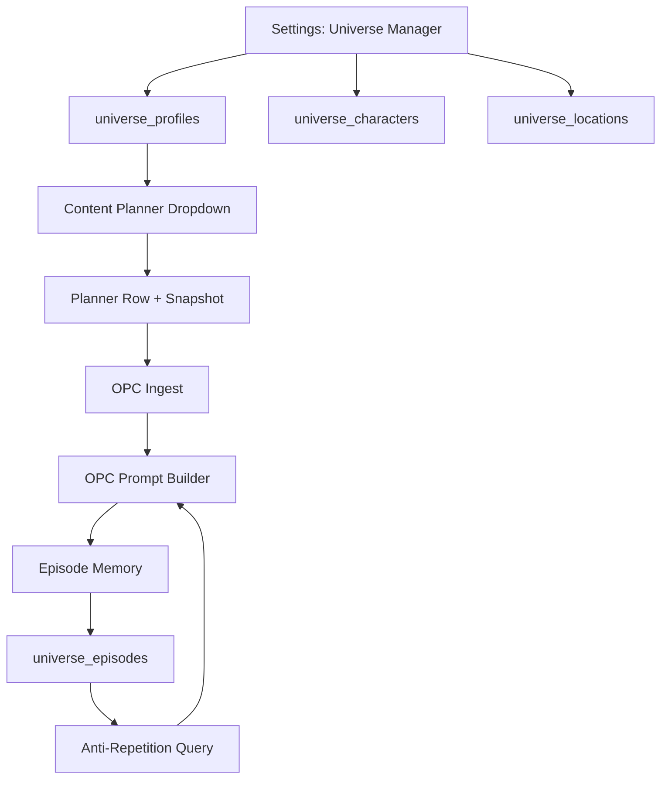

# Kartun Tahap 3: Universe Platform

## Tujuan

PawVille tidak lagi bergantung pada profile file statis. MAKNA Flow dapat mengelola lebih dari satu universe via database, dengan CRUD UI, Character Library, Location Library, dan Episode Memory anti-repetition.

---

## User Review Required

> [!IMPORTANT]
> **Universe Kedua**: Spec meminta "satu universe kedua sederhana". Saya usulkan **KitchenVille** (Kitchen Cartoon Universe) dengan 3 karakter dan 3 lokasi minimal. Apakah setuju, atau ingin universe berbeda?

> [!IMPORTANT]
> **Scope Episode Memory**: Episode memory akan merekam setiap OPC item yang selesai di-generate (post-processing). Anti-repetition meng-query episode history sebelum prompt generation. Apakah ini cukup, atau perlu juga mencatat episode dari Content Planner?

---

## Arsitektur



---

## Proposed Changes

### Komponen 1: Database Migration — 4 Tabel Baru

#### [MODIFY] [`lib/db-pg.js`](file:///Users/sabeqmmursyid/_maknaflow-staging/lib/db-pg.js)

Tambah fungsi `migrateUniversePlatform()` menggunakan pola advisory lock yang sudah ada (`pg_advisory_lock(hashtext(...))`).

**4 Tabel PostgreSQL** (tenant-aware via `interceptQuery`):

```sql
-- 1. Universe Profiles
CREATE TABLE IF NOT EXISTS universe_profiles (
  id TEXT PRIMARY KEY,
  tenant_id TEXT NOT NULL DEFAULT 'default_tenant',
  name TEXT NOT NULL,
  slug TEXT NOT NULL,
  premise TEXT,
  tone TEXT,
  knowledge_domain TEXT DEFAULT 'general',
  human_presence TEXT DEFAULT 'none',
  default_visual_style TEXT DEFAULT 'cinematic_3d_clay',
  default_aspect_ratio TEXT DEFAULT '9:16',
  default_scene_count INTEGER DEFAULT 7,
  default_scene_duration INTEGER DEFAULT 8,
  default_story_template TEXT DEFAULT 'pet_problem_solution_7beat',
  cta_personality TEXT,
  default_pillars_json TEXT,
  rules_json JSONB,
  status TEXT DEFAULT 'active',
  created_at TIMESTAMPTZ DEFAULT NOW(),
  updated_at TIMESTAMPTZ DEFAULT NOW()
);

-- 2. Universe Characters
CREATE TABLE IF NOT EXISTS universe_characters (
  id TEXT PRIMARY KEY,
  tenant_id TEXT NOT NULL DEFAULT 'default_tenant',
  universe_id TEXT NOT NULL REFERENCES universe_profiles(id) ON DELETE CASCADE,
  name TEXT NOT NULL,
  species TEXT,
  breed TEXT,
  body_description TEXT,
  fur_color TEXT,
  eye_color TEXT,
  signature_accessory TEXT,
  personality TEXT,
  role TEXT,
  relative_size TEXT DEFAULT 'medium',
  canonical_prompt TEXT NOT NULL,
  reference_image_path TEXT,
  sort_order INTEGER DEFAULT 0,
  version INTEGER DEFAULT 1,
  created_at TIMESTAMPTZ DEFAULT NOW(),
  updated_at TIMESTAMPTZ DEFAULT NOW()
);

-- 3. Universe Locations
CREATE TABLE IF NOT EXISTS universe_locations (
  id TEXT PRIMARY KEY,
  tenant_id TEXT NOT NULL DEFAULT 'default_tenant',
  universe_id TEXT NOT NULL REFERENCES universe_profiles(id) ON DELETE CASCADE,
  name TEXT NOT NULL,
  visual_description TEXT,
  lighting_default TEXT,
  props_json TEXT,
  reference_image_path TEXT,
  sort_order INTEGER DEFAULT 0,
  version INTEGER DEFAULT 1,
  created_at TIMESTAMPTZ DEFAULT NOW(),
  updated_at TIMESTAMPTZ DEFAULT NOW()
);

-- 4. Universe Episodes (Memory)
CREATE TABLE IF NOT EXISTS universe_episodes (
  id TEXT PRIMARY KEY,
  tenant_id TEXT NOT NULL DEFAULT 'default_tenant',
  universe_id TEXT NOT NULL REFERENCES universe_profiles(id) ON DELETE CASCADE,
  planner_id TEXT,
  planner_row_id TEXT,
  campaign_item_id TEXT,
  product_used TEXT,
  problem_used TEXT,
  hook_used TEXT,
  main_character TEXT,
  supporting_characters TEXT,
  location_used TEXT,
  resolution_pattern TEXT,
  cta_used TEXT,
  created_at TIMESTAMPTZ DEFAULT NOW()
);
CREATE INDEX IF NOT EXISTS idx_episodes_universe ON universe_episodes(universe_id);
```

---

### Komponen 2: CRUD Functions — DB Layer

#### [MODIFY] [`lib/db.js`](file:///Users/sabeqmmursyid/_maknaflow-staging/lib/db.js)

Tambah CRUD functions mengikuti pola `brand_profiles` (auto tenant via `interceptQuery`):

```js
// Universe Profiles
export async function getAllUniverseProfiles() { ... }
export async function getUniverseProfile(id) { ... }
export async function createUniverseProfile(data) { ... }
export async function updateUniverseProfile(id, data) { ... }
export async function archiveUniverseProfile(id) { ... }  // soft delete: status='archived'

// Universe Characters
export async function getCharactersByUniverse(universeId) { ... }
export async function getUniverseCharacter(id) { ... }
export async function createUniverseCharacter(data) { ... }
export async function updateUniverseCharacter(id, data) { ... }
export async function deleteUniverseCharacter(id) { ... }

// Universe Locations
export async function getLocationsByUniverse(universeId) { ... }
export async function createUniverseLocation(data) { ... }
export async function updateUniverseLocation(id, data) { ... }
export async function deleteUniverseLocation(id) { ... }

// Universe Episodes
export async function createUniverseEpisode(data) { ... }
export async function getEpisodesByUniverse(universeId, limit = 50) { ... }
export async function getEpisodeDigest(universeId) { ... }  // anti-repetition digest
```

---

### Komponen 3: API Routes

#### [NEW] `app/api/v2/universes/route.js` — GET (list) + POST (create)
#### [NEW] `app/api/v2/universes/[id]/route.js` — GET (detail) + PUT (update) + DELETE (archive)
#### [NEW] `app/api/v2/universes/[id]/characters/route.js` — GET + POST
#### [NEW] `app/api/v2/universes/[id]/characters/[charId]/route.js` — PUT + DELETE
#### [NEW] `app/api/v2/universes/[id]/locations/route.js` — GET + POST
#### [NEW] `app/api/v2/universes/[id]/locations/[locId]/route.js` — PUT + DELETE
#### [NEW] `app/api/v2/universes/[id]/episodes/route.js` — GET (list with anti-repetition digest)

Semua API menggunakan `withTenantContext` dari `lib/auth.js`.

---

### Komponen 4: Settings UI — Universe Manager

#### [NEW] [`app/settings/universes/page.js`](file:///Users/sabeqmmursyid/_maknaflow-staging/app/settings/universes/page.js)

UI lengkap dengan 3 tab:
1. **Universes** — list, create, edit, archive, preview
2. **Characters** — grid per universe, canonical prompt, atribut fisik, personality, reference image upload, version
3. **Locations** — list per universe, visual description, lighting, props, reference image

Pattern mengikuti `brand-profiles/page.js`:
- Inline card form (bukan modal dialog)
- `ideas-table` class untuk tabel
- Toast notifications
- Fetch via `/api/v2/universes/...`

#### [MODIFY] [`app/components/Sidebar.js`](file:///Users/sabeqmmursyid/_maknaflow-staging/app/components/Sidebar.js)

Tambah menu item "🌍 Universe Manager" → `/settings/universes` di section Settings.

---

### Komponen 5: Dynamic Content World Contract

#### [MODIFY] [`lib/content-world-contract.js`](file:///Users/sabeqmmursyid/_maknaflow-staging/lib/content-world-contract.js)

**Code Sebelum:**
```js
export const UNIVERSE_PROFILES = ['pawville'];

export function validateUniverseProfile(value) {
  if (!value) return null;
  const profile = value.toLowerCase();
  if (!UNIVERSE_PROFILES.includes(profile)) {
    const error = new Error(`Universe profile tidak dikenal: ${profile}`);
    error.code = 'CONTENT_WORLD_VALIDATION';
    throw error;
  }
  return profile;
}

export function getUniverseDefaults(profileId) {
  if (profileId === 'pawville') { ... }
  return null;
}
```

**Code Sesudah:**
```js
// UNIVERSE_PROFILES is now dynamic — loaded from DB cache
let _universeProfileCache = null;
let _universeProfileCacheTime = 0;
const CACHE_TTL = 60000; // 1 minute

export async function getAvailableUniverseProfiles() {
  if (_universeProfileCache && (Date.now() - _universeProfileCacheTime) < CACHE_TTL) {
    return _universeProfileCache;
  }
  const { getAllUniverseProfiles } = await import('./db.js');
  const profiles = await getAllUniverseProfiles();
  _universeProfileCache = profiles;
  _universeProfileCacheTime = Date.now();
  return profiles;
}

export async function validateUniverseProfile(value) {
  if (!value) return null;
  const slug = value.toLowerCase();
  const profiles = await getAvailableUniverseProfiles();
  const found = profiles.find(p => p.slug === slug || p.id === slug);
  if (!found) {
    const error = new Error(`Universe profile tidak dikenal: ${slug}`);
    error.code = 'CONTENT_WORLD_VALIDATION';
    throw error;
  }
  return found.slug;
}

export async function getUniverseDefaults(profileId) {
  const profiles = await getAvailableUniverseProfiles();
  const profile = profiles.find(p => p.slug === profileId || p.id === profileId);
  if (!profile) return null;
  return {
    content_world: 'cartoon_universe',
    knowledge_domain: profile.knowledge_domain || 'general',
    story_template: profile.default_story_template,
    human_presence: profile.human_presence,
    visual_style: profile.default_visual_style,
    scene_count: profile.default_scene_count,
    scene_duration: profile.default_scene_duration,
    aspect_ratio: profile.default_aspect_ratio,
    default_pillars: JSON.parse(profile.default_pillars_json || '[]')
  };
}

// Invalidate cache when universe is created/updated/deleted
export function invalidateUniverseCache() {
  _universeProfileCache = null;
}
```

> **Note**: Fungsi yang tadinya sync menjadi async. Caller di `content-planner-engine.js` dan `normalizeContentWorldParams` perlu di-update untuk `await`.

---

### Komponen 6: Content Planner — Dynamic Universe Dropdown

#### [MODIFY] [`app/content-planner/[id]/page.js`](file:///Users/sabeqmmursyid/_maknaflow-staging/app/content-planner/%5Bid%5D/page.js)

Dropdown universe_profile berubah dari hardcoded `['pawville']` menjadi fetched dari `/api/v2/universes`.

#### [MODIFY] [`lib/content-planner-engine.js`](file:///Users/sabeqmmursyid/_maknaflow-staging/lib/content-planner-engine.js)

Update `getUniverseDefaults()` calls menjadi `await getUniverseDefaults()`.

---

### Komponen 7: Episode Memory — Record & Anti-Repetition

#### [MODIFY] [`lib/scheduler-processors.js`](file:///Users/sabeqmmursyid/_maknaflow-staging/lib/scheduler-processors.js) — `processPillarGenerator`

Setelah generation berhasil dan data disimpan, record episode:

```js
if (effectiveContentWorld === 'cartoon_universe') {
  const { createUniverseEpisode } = await import('./db.js');
  await createUniverseEpisode({
    id: `ep_${item.id}`,
    universe_id: campaign.universe_profile,
    planner_row_id: item.planner_row_id,
    campaign_item_id: item.id,
    product_used: productData?.product_name || null,
    problem_used: rowPayload.pet_problem || null,
    hook_used: rowPayload.custom_hook || tempCampaign.custom_hook || null,
    main_character: rowPayload.main_character || null,
    supporting_characters: rowPayload.supporting_characters || null,
    location_used: /* extracted from parsed storyboard */ null,
    resolution_pattern: /* extracted from parsed beat 6 */ null,
    cta_used: /* extracted from parsed beat 7 */ null,
  });
}
```

#### [MODIFY] [`lib/prompts.js`](file:///Users/sabeqmmursyid/_maknaflow-staging/lib/prompts.js) — `buildOrganicPillarPrompt`

Inject anti-repetition digest saat cartoon_universe:

```js
if (isCartoonUniverse && campaignData._episodeDigest) {
  cartoonStoryDirective += `
ANTI-REPETITION (EPISODE HISTORY):
Berikut kombinasi yang SUDAH digunakan di episode sebelumnya. HINDARI mengulang:
${campaignData._episodeDigest}
Buat variasi baru dari masalah, hook, dan lokasi.
`;
}
```

---

### Komponen 8: PawVille Seed Migration

#### [NEW] [`scripts/seed-pawville.js`](file:///Users/sabeqmmursyid/_maknaflow-staging/scripts/seed-pawville.js)

Script idempoten yang memigrasikan data PawVille dari `kb/universes/PAWVILLE_UNIVERSE_PROFILE.md` ke database:

```js
// Idempotent: INSERT ... ON CONFLICT DO NOTHING
// 1 universe_profile (pawville)
// 5 characters (Mochi, Dr. Paw, Coco, Boba, Tofu)
// 5 locations (Town Square, Mochi's Home, Dr. Paw's Clinic, PawVille Park, PawVille Market)
```

Dipanggil saat migration di `db-pg.js` atau via `npm run seed:pawville`.

---

### Komponen 9: Universe Kedua — KitchenVille (Proof of Concept)

#### Data di seed script:

```
Universe: KitchenVille Kitchen Universe
Knowledge Domain: food_culinary
Characters:
  - Chef Spatula (Main): anthropomorphic spatula, red apron
  - Whisky (Support): fluffy white cat, baker's hat
  - Pepper (Support): small black pepper grinder, monocle
Locations:
  - KitchenVille Main Kitchen
  - The Pantry
  - Garden Market
```

---

### Komponen 10: Prompt Builder — Dynamic Character Lock

#### [MODIFY] [`lib/prompts.js`](file:///Users/sabeqmmursyid/_maknaflow-staging/lib/prompts.js) — Cartoon Story Directive

Hardcoded character lock (Mochi, Dr. Paw, dll) diganti dengan dynamic dari DB:

```js
// Load characters from DB via campaign metadata
const characters = campaignData._universeCharacters || [];
const characterLockLines = characters.map(c =>
  `- ${c.name}: ${c.canonical_prompt} — NEVER changes`
).join('\n');

const locations = campaignData._universeLocations || [];
const locationList = locations.map(l => l.name).join(', ');
```

---

## Verification Plan

### Automated Tests

Script `scripts/test-universe-platform.js`:
1. **CRUD universe** — create, read, update, archive
2. **CRUD characters** — create with canonical_prompt, update, delete
3. **CRUD locations** — create, update, delete
4. **PawVille seed** — verify 1 profile + 5 chars + 5 locs exist
5. **KitchenVille seed** — verify second universe exists
6. **Dynamic contract** — `getUniverseDefaults('pawville')` returns DB data
7. **Dynamic contract** — `getUniverseDefaults('kitchenville')` returns DB data
8. **Episode memory** — create episode, verify anti-repetition digest
9. **Content Planner dropdown** — API returns both universes
10. **Real-world regression** — no cartoon directives for real_world
11. **Dynamic character lock** — prompt contains canonical_prompt dari DB, bukan hardcoded

### Build Verification
```bash
npm run build
```

---

## Execution Task List

- [ ] Migrasi 4 tabel baru di `lib/db-pg.js` (advisory lock pattern)
- [ ] CRUD functions di `lib/db.js` (universe_profiles, characters, locations, episodes)
- [ ] API routes:
  - [ ] `/api/v2/universes/route.js` (GET + POST)
  - [ ] `/api/v2/universes/[id]/route.js` (GET + PUT + DELETE)
  - [ ] `/api/v2/universes/[id]/characters/route.js` (GET + POST)
  - [ ] `/api/v2/universes/[id]/characters/[charId]/route.js` (PUT + DELETE)
  - [ ] `/api/v2/universes/[id]/locations/route.js` (GET + POST)
  - [ ] `/api/v2/universes/[id]/locations/[locId]/route.js` (PUT + DELETE)
  - [ ] `/api/v2/universes/[id]/episodes/route.js` (GET)
- [ ] UI: `app/settings/universes/page.js` (3-tab CRUD)
- [ ] Sidebar: tambah Universe Manager menu
- [ ] Dynamic `lib/content-world-contract.js` (async dari DB + cache)
- [ ] Content Planner: dynamic universe dropdown
- [ ] Content Planner Engine: update async calls
- [ ] Episode Memory di `lib/scheduler-processors.js`
- [ ] Anti-repetition digest di `lib/prompts.js`
- [ ] Dynamic character/location lock di prompt builder
- [ ] PawVille seed script (`scripts/seed-pawville.js`)
- [ ] KitchenVille seed (proof of concept)
- [ ] Test script (`scripts/test-universe-platform.js`)
- [ ] Build verification
- [ ] Dokumentasi SOT
