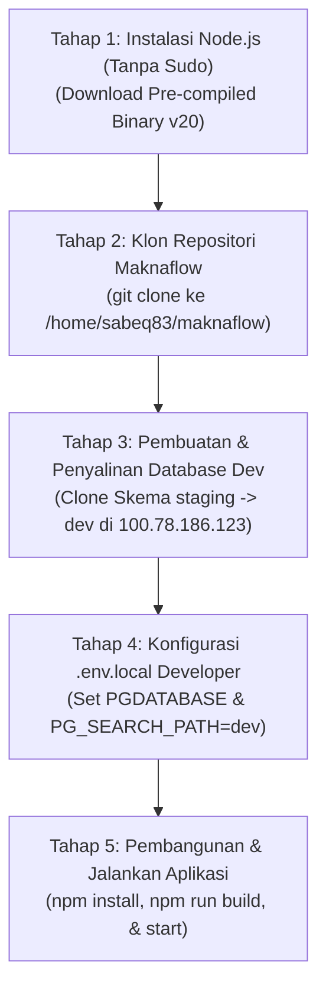

# 🗺️ Rencana Deployment ke Server Development (100.118.178.93) & Salin Database

Dokumen ini memetakan langkah-langkah untuk menyiapkan lingkungan baru pada server developer **`100.118.178.93`** dan menyalin database dari staging terpusat (`staging` schema pada `100.78.186.123`).

---

## 📌 Rangkuman Tahapan Rencana



---

## 📋 Detail Tiap Tahapan

### 📦 TAHAP 1: Instalasi Node.js (Tanpa Sudo)
Karena akun `sabeq83` di server developer tidak memiliki password sudo bebas hambatan, kita akan mengunduh dan mengekstrak Node.js biner Linux x64 resmi langsung ke dalam direktori `.local` user:
1. **Langkah Kerja**:
   * Masuk via SSH ke `sabeq83@100.118.178.93`.
   * Eksekusi perintah instalasi lokal:
     ```bash
     mkdir -p /home/sabeq83/.local
     cd /home/sabeq83/.local
     wget https://nodejs.org/dist/v20.11.0/node-v20.11.0-linux-x64.tar.xz
     tar -xf node-v20.11.0-linux-x64.tar.xz --strip-components=1
     rm node-v20.11.0-linux-x64.tar.xz
     ```
   * Daftarkan path Node ke shell `.bashrc`:
     ```bash
     echo 'export PATH=/home/sabeq83/.local/bin:$PATH' >> ~/.bashrc
     source ~/.bashrc
     ```

---

### 📂 TAHAP 2: Klon Repositori Maknaflow
1. **Langkah Kerja**:
   * Klon repositori utama:
     ```bash
     git clone https://github.com/sabeq83/maknaflow.git /home/sabeq83/maknaflow
     ```

---

### 🗄️ TAHAP 3: Pembuatan & Penyalinan Database Dev (Clone staging ➡️ dev)
Untuk menyalin data dari staging baru, kita akan memanfaatkan kekuasaan `makna_user` yang memiliki hak akses skema penuh di database pusat `100.78.186.123`. Kita akan menduplikasi struktur dan data skema `staging` ke dalam skema baru bernama **`dev`** di database terpusat yang sama.
1. **Langkah Kerja**:
   * Hapus skema `dev` lama jika ada, lalu buat skema baru:
     ```sql
     DROP SCHEMA IF EXISTS dev CASCADE;
     CREATE SCHEMA dev;
     ```
   * Gunakan skrip otomatis/utilitas SQL untuk menduplikasi seluruh tabel dan data dari skema `staging` ke skema `dev`.
   * Skrip klon tabel (eksekusi via `psql` pada database `100.78.186.123`):
     ```sql
     -- Contoh klon data content_flow_items:
     CREATE TABLE dev.content_flow_items AS SELECT * FROM staging.content_flow_items;
     -- (Prosedur ini akan diulangi untuk seluruh tabel aktif di database)
     ```

---

### ⚙️ TAHAP 4: Konfigurasi `.env.local` Developer
Mengatur konfigurasi khusus sandbox development agar tidak mengganggu data staging maupun production.
1. **Langkah Kerja**:
   * Buat file `/home/sabeq83/maknaflow/.env.local`:
     ```env
     NODE_ENV=development
     NODE_ROLE=standalone
     ENABLE_SCHEDULER_WORKER=true
     PORT=5000
     DATABASE_HOST=100.78.186.123
     PGDATABASE=maknaflow_db
     PG_SEARCH_PATH=dev
     CONTENT_FLOW_API_URL=http://100.78.186.123:3001/api/v1/content/ingest
     WEBHOOK_HOST=100.64.70.61
     WEBHOOK_PORT=8765
     ```

---

### 🚀 TAHAP 5: Pembangunan & Jalankan Aplikasi
1. **Langkah Kerja**:
   * Jalankan instalasi dependensi dan compile:
     ```bash
     npm install
     npm run build
     ```
   * Jalankan server development:
     ```bash
     npm run dev
     ```
     *(Atau jalankan port 5000/6000 di background).*
