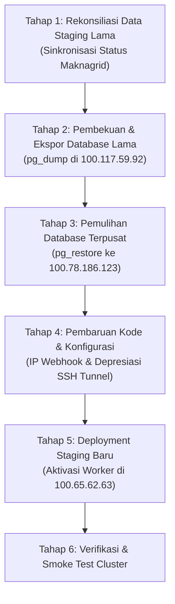

# 🗺️ Rencana Komprehensif Transisi Cluster Baru & Migrasi Database MAKNA Flow

Dokumen ini memetakan seluruh rangkaian transisi cluster server MAKNA Flow ke dalam **6 Tahapan Terstruktur** untuk memastikan keamanan data, nol kehilangan draf kampanye (zero data-loss), dan kelancaran peralihan ke arsitektur baru.

---

## 📌 Rangkuman Tahapan Transisi



---

## 📋 Detail Tiap Tahapan

### 🔄 TAHAP 1: Rekonsiliasi Data Staging Lama (Sinkronisasi Status Maknagrid)
Sebelum database di server lama (`100.117.59.92`) diekspor, kita harus memastikan seluruh status postingan sosial media asisten yang ada di database **maknagrid** (`100.65.62.63`) disinkronkan ke target database `maknaflow_staging`.
1. **Penyebab Selisih Data**: Database `makna_grid_db` (Postgres) di Node 3 saat ini sudah tidak sinkron (stale) dengan SQLite aktif di Node 1 (`15MB`, 598 items).
2. **Langkah Kerja**:
   * Salin SQLite database aktif dari `100.65.62.63` (`/home/sabeqmursyid/makna-grid/data/makna_grid.db`) ke folder `/mnt/c/tmp/makna_grid_temp.db` di server lama.
   * Buat / jalankan skrip pembaca SQLite lokal pada Node 2 untuk membandingkan dan memperbarui field status publishing (`tiktok_status`, `facebook_status`, dll.) pada database `maknaflow_staging`.
   * Jalankan Fase 1 (Dry-Run) hingga 35+ video ID yang publish terdeteksi, lalu eksekusi Fase 2 (`--execute`) untuk menyinkronkan statusnya.

---

### ❄️ TAHAP 2: Pembekuan & Ekspor Database Lama (`100.117.59.92`)
Setelah data sinkron, kita membekukan aktivitas database di server lama agar tidak ada data baru yang masuk selama proses migrasi.
1. **Langkah Kerja**:
   * Beritahu Asisten untuk keluar (log out) dari UI Staging lama dan hentikan proses scheduler/worker di Node 2.
   * Jalankan perintah pengeksporan database PostgreSQL lokal di Node 2 WSL:
     ```bash
     pg_dump -h localhost -U maknaflow_staging -F c -b -v -f /tmp/maknaflow_staging_backup.dump maknaflow_staging
     ```
   * Transfer berkas `.dump` dari Node 2 ke server database baru (`100.78.186.123`) menggunakan scp via Tailscale.

---

### 🗄️ TAHAP 3: Pemulihan (Restore) Database ke Database Pusat (`100.78.186.123`)
Data lama dimasukkan ke server database pusat di bawah skema terisolasi.
1. **Langkah Kerja (Opsi A - Rekomendasi)**:
   * Drop skema `staging` lama di database server pusat `100.78.186.123` untuk menghindari tabrakan Primary Key (PK).
   * Lakukan restorasi data menggunakan `pg_restore` ke dalam skema `staging` di database `maknaflow_db`.
     ```bash
     pg_restore -h localhost -U postgres -d maknaflow_db --schema=staging -v /tmp/maknaflow_staging_backup.dump
     ```

---

### ⚙️ TAHAP 4: Pembaruan Kode & Konfigurasi
Menyesuaikan kode aplikasi agar mengarah ke alamat server dan arsitektur yang baru.
1. **Langkah Kerja**:
   * Edit default IP Webhook Host dari `100.117.59.92` ke server dedicated webhook baru **`100.64.70.61`** pada file `node-config.js`, `webhook-client.js`, dan `glabs-worker.js`.
   * Depresiasi fungsi SSH Tunnel (`ensureGatewaySshTunnel()`) karena akses ke webhook di `100.64.70.61` sekarang langsung melalui Tailscale port `8765`.
   * Push perubahan ke GitHub branch `main` / `staging`.

---

### 🚀 TAHAP 5: Deployment Staging Baru & Aktivasi Worker (`100.65.62.63`)
Meluncurkan Next.js app ke server staging baru yang ditunjuk.
1. **Langkah Kerja**:
   * Jalankan deploy script single-pass ke staging server: `npm run deploy:staging`.
   * Pastikan konfigurasi `.env.local` di server staging baru mengaktifkan fungsionalitas worker (`ENABLE_SCHEDULER_WORKER=true`) sehingga server staging baru bisa memproses campaign queue secara lokal tanpa bergantung pada worker lama.

---

### 🩺 TAHAP 6: Verifikasi Akhir & Smoke Test Cluster
Memastikan kestabilan cluster baru secara menyeluruh.
1. **Langkah Kerja**:
   * Jalankan uji kesehatan kluster:
     ```bash
     node scripts/test-cluster-health.js
     ```
   * Lakukan pengujian manual: Masuk ke UI Staging Baru (`http://100.65.62.63:5010`), buat 1 kampanye uji coba, pastikan script worker memanggil G-Labs Webhook (`100.64.70.61`), mengunduh aset, dan menyimpannya ke database pusat (`100.78.186.123`).
