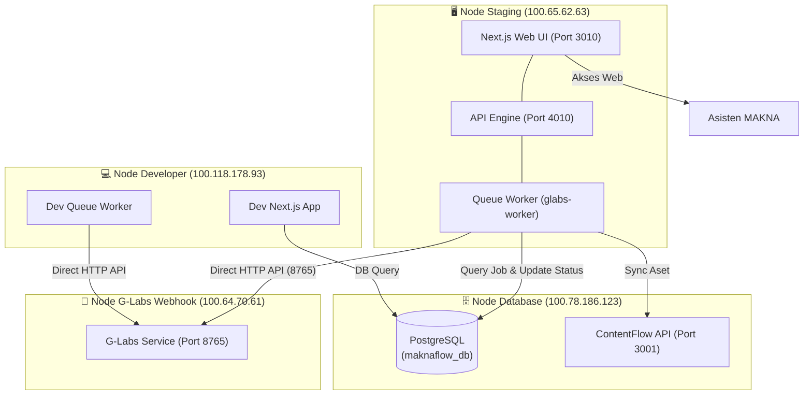

# 📘 Usulan Arsitektur Cluster Baru & Transisi Server MAKNA Flow

**Tanggal Analisis:** 5 Agustus 2026  
**Status:** Usulan Transisi Server (Decommissioning Node `100.117.59.92`)  
**Penulis:** Antigravity (AI Coding Assistant)  

---

## 📌 1. Latar Belakang & Tujuan
Dengan didekomisinya (diistirahatkannya) server staging lama **`100.117.59.92`** (sebelumnya berfungsi sebagai PC Worker GPU Windows `vibe-server`), MAKNA Flow memerlukan penyesuaian arsitektur topologi cluster agar proses pemrosesan visual, database, antarmuka pengguna (UI/API), dan staging tetap berjalan stabil dan aman.

Sebagai gantinya, terdapat 4 server/IP yang dideklarasikan dalam topologi baru:
1. **Server Database Terpusat (`100.78.186.123`)**: Server utama PostgreSQL untuk data staging/production dan storage.
2. **Server Staging Baru (`100.65.62.63`)**: Server gateway Next.js (port `3010`/`4010`) yang akan diakses oleh Asisten untuk pembuatan kampanye dan pengelolaan konten.
3. **Server Developer (`100.118.178.93`)**: Server terisolasi khusus untuk testing, sandbox, dan pengujian build developer.
4. **Server Webhook G Labs (`100.64.70.61`)**: Node terdedikasi (dedicated server) untuk melayani generasi AI Video/Image (T2I & I2V).

---

## 📐 2. Perbandingan Topologi Jaringan (Lama vs Baru)

### 🔴 Topologi Lama (3-Node)
* **Node 1 (Gateway/UI)**: `100.65.62.63` (Hanya menjalankan Next.js Web App UI, worker non-aktif).
* **Node 2 (Worker/WSL2)**: `100.117.59.92` (Menjalankan Background Queue Worker + G-Labs Webhook lokal + render FFmpeg).
* **Node 3 (Database/Storage)**: `100.78.186.123` (PostgreSQL Database & ContentFlow API).

### 🟢 Topologi Baru (4-Node Terdekopel)
* **Node Staging & App Worker**: `100.65.62.63` 
  * Menjalankan Next.js Web App UI (Port `3010`) dan API Engine (Port `4010`).
  * **BARU**: Juga mengaktifkan background queue worker (`ENABLE_SCHEDULER_WORKER=true`) untuk memproses campaign scheduler dan muxing audio/video menggunakan FFmpeg secara lokal (memanfaatkan memori 16GB NUC).
* **Node Database Terpusat**: `100.78.186.123`
  * Berfungsi penuh sebagai server PostgreSQL terpusat (Port `5432`).
  * Menghos skema `staging` dan `public` (production).
  * Menjalankan ContentFlow API Service (Port `3001`).
* **Node G-Labs Webhook Dedicated**: `100.64.70.61`
  * Server mandiri untuk API visual generator (Port `8765`).
  * Diakses secara langsung via IP Tailscale oleh node Staging (`100.65.62.63`) maupun node Developer (`100.118.178.93`) tanpa perlu port-forwarding SSH Tunnel.
* **Node Developer**: `100.118.178.93`
  * Sandbox development untuk testing kode, skema DB lokal (atau skema `dev` di DB pusat), dan debugging fungsionalitas secara terisolasi.



---

## ⚙️ 3. Konfigurasi Environment Variables (`.env.local`)

Untuk mendukung transisi ini, berikut adalah pengaturan variabel lingkungan yang diusulkan untuk masing-masing server:

### 1. Server Staging (`100.65.62.63`)
Pengaturan ini mengaktifkan fungsionalitas worker pada staging server untuk menggantikan peran Node 2 lama.
```env
NODE_ENV=production
NODE_ROLE=gateway
ENABLE_SCHEDULER_WORKER=true
PORT=3010
DATABASE_HOST=100.78.186.123
PGDATABASE=maknaflow_db
PG_SEARCH_PATH=staging
CONTENT_FLOW_API_URL=http://100.78.186.123:3001/api/v1/content/ingest
WEBHOOK_HOST=100.64.70.61
WEBHOOK_PORT=8765
```

### 2. Server Webhook G-Labs (`100.64.70.61`)
Menjalankan endpoint stateless G-Labs Python/JS Server.
```env
PORT=8765
# G-Labs configuration
```

### 3. Server Developer (`100.118.178.93`)
Menjalankan instance lokal/sandbox.
```env
NODE_ENV=development
NODE_ROLE=standalone
ENABLE_SCHEDULER_WORKER=true
PORT=3000
DATABASE_HOST=100.78.186.123  # Atau localhost jika DB lokal terinstal
PGDATABASE=maknaflow_dev      # Skema/database terisolasi khusus dev
WEBHOOK_HOST=100.64.70.61
WEBHOOK_PORT=8765
```

---

## 🛠️ 4. Implikasi Kode & Rencana Perubahan

Untuk mengimplementasikan arsitektur ini, beberapa bagian kode MAKNA Flow perlu disesuaikan:

| Komponen | File Terkait | Tindakan / Perubahan |
| :--- | :--- | :--- |
| **Default Host Webhook** | [node-config.js](file:///Users/sabeqmmursyid/_maknaflow-staging/lib/node-config.js)<br/>[webhook-client.js](file:///Users/sabeqmmursyid/_maknaflow-staging/lib/webhook-client.js) | Ubah fallback default IP Webhook Host dari `100.117.59.92` ke `100.64.70.61`. |
| **Depresiasi SSH Tunnel** | [webhook-client.js](file:///Users/sabeqmmursyid/_maknaflow-staging/lib/webhook-client.js) | Matikan fungsi auto-tunnel `ensureGatewaySshTunnel()` karena G-Labs di `100.64.70.61` sekarang diakses langsung melalui Tailscale tanpa SSH proxy. |
| **Worker Endpoint Config** | [glabs-worker.js](file:///Users/sabeqmmursyid/_maknaflow-staging/scripts/glabs-worker.js) | Buat worker membaca endpoint G-Labs secara dinamis menggunakan `process.env.WEBHOOK_HOST` alih-alih hardcoded `127.0.0.1`. |
| **Default UI Settings** | [route.js (API Settings)](file:///Users/sabeqmmursyid/_maknaflow-staging/app/api/settings/route.js) | Ubah fallback isian setting webhook di UI database ke `100.64.70.61`. |
| **Dokumentasi SOT & SOP** | [MAKNA_FLOW_DISTRIBUTED_ARCHITECTURE_SOT.md](file:///Users/sabeqmmursyid/_maknaflow-staging/sot/global/MAKNA_FLOW_DISTRIBUTED_ARCHITECTURE_SOT.md)<br/>[SOP_MENJALANKAN_MAKNA_FLOW.md](file:///Users/sabeqmmursyid/_maknaflow-staging/sot/global/SOP_MENJALANKAN_MAKNA_FLOW.md) | Perbarui seluruh bab topologi, tabel IP address, dan langkah startup untuk mencerminkan struktur 4-Node. |

---

## 📈 5. Analisis Keuntungan & Risiko Keamanan

### Keuntungan Topologi Baru
1. **Zero-SSH-Tunneling Overhead**: Menghilangkan kebutuhan untuk melakukan port forwarding SSH tunnel (`ssh -L ... vibe-server`) yang sering kali sensitif terhadap koneksi internet yang putus-nyambung.
2. **Dedicated visual compute server**: Pemrosesan GPU/Video generator sepenuhnya berpusat di `100.64.70.61`, sehingga beban CPU/GPU berat terisolasi dari antarmuka web.
3. **Dedicated Dev Sandbox**: Tim developer memiliki server mandiri (`100.118.178.93`) untuk bereksperimen tanpa mengganggu kestabilan sistem staging yang sedang digunakan Asisten.

### Mitigasi Risiko Keamanan
1. **Tailscale ACL**: Batasi akses port database (`5432` pada `100.78.186.123`) dan port webhook (`8765` pada `100.64.70.61`) hanya untuk IP Tailscale dalam daftar cluster (`100.65.62.63`, `100.118.178.93`, dan Macbook admin). Jangan ekspos port-port ini ke internet publik.
2. **Skema Database yang Jelas**: Pastikan database dev, staging, dan production menggunakan database fisik terpisah atau schema terisolasi penuh dengan kredensial user PostgreSQL yang berbeda untuk meminimalkan *blast radius*.
