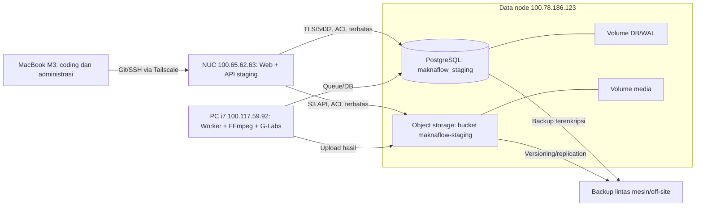

# Usulan Arsitektur Database dan Storage MAKNA Flow

**Tanggal analisis:** 4 Agustus 2026  
**Status:** Rekomendasi untuk fase staging; production belum dipindahkan ke VPS  
**Cakupan:** Database, penyimpanan aset, backup, keamanan, dan rencana transisi saat Mac mini M4 tiba

## Ringkasan Eksekutif

Untuk beberapa pekan ke depan, Intel NUC Core i3 RAM 8 GB di `100.78.186.123` dapat tetap dipakai bersama sebagai **server PostgreSQL staging dan media/object storage**. Ini layak untuk tim kecil selama layanan dipisahkan secara logis, akses dibatasi melalui Tailscale, konsumsi RAM/I/O dibatasi, dan backup disimpan di perangkat lain. RAM 8 GB cukup untuk staging ringan, tetapi tidak memberi ruang besar untuk PostgreSQL, object storage, Nextcloud, ContentFlow, serta proses tambahan berjalan bersamaan tanpa pembatasan.

Yang berisiko bukan semata-mata database dan file berada pada satu mesin, melainkan bila mesin tersebut sekaligus menjadi:

- satu-satunya salinan database dan aset;
- satu-satunya titik akses aplikasi;
- memakai disk/volume yang sama tanpa batas kapasitas;
- mengekspos PostgreSQL atau storage ke internet publik;
- menjalankan staging dan production dalam satu database atau hanya dibedakan dengan schema;
- tidak memiliki backup otomatis dan uji pemulihan.

Rekomendasi utama:

1. Gunakan Intel NUC `100.65.62.63` sebagai **gateway staging**, bukan database.
2. Gunakan PC i7/WSL2 `100.117.59.92` sebagai **worker/compute staging**.
3. Gunakan `100.78.186.123` sebagai **data node staging** untuk PostgreSQL dan object storage, tetapi pisahkan database, user, volume, kuota, dan lifecycle-nya.
4. Jangan tempatkan production di VPS untuk saat ini. Pertahankan seluruh deployment ini sebagai staging.
5. Setelah Mac mini M4 tiba, tetapkan perannya berdasarkan reliabilitas koneksi dan storage. Rekomendasi awal adalah Mac mini sebagai gateway/app production, sedangkan data production tetap pada data node yang diproteksi dan dibackup—bukan otomatis memindahkan semua komponen ke Mac mini.
6. Prioritas paling mendesak adalah backup lintas mesin dan restore drill, bukan memecah database dan storage ke dua server fisik sekarang.

## Fakta dan Asumsi

### Perangkat yang tersedia

| Perangkat | Alamat | Peran yang disarankan sekarang |
|---|---:|---|
| MacBook Apple Silicon M3 | Dinamis/workstation | Coding, AI assistant, Git, browser, administrasi |
| PC Core i7, RAM 16 GB, Windows + WSL2 | `100.117.59.92` | Development/worker/compute, G-Labs, FFmpeg |
| Intel NUC Core i3, RAM 16 GB, Ubuntu Desktop | `100.65.62.63` | Gateway web/API staging |
| Intel NUC Core i3, RAM 8 GB | `100.78.186.123` | PostgreSQL staging dan object/media storage |

Keempat perangkat berada dalam jaringan yang sama dan saling terhubung melalui Tailscale. Alamat `100.x.x.x` adalah alamat tailnet, bukan IP publik. `100.78.186.123` merupakan mesin lokal Intel NUC Core i3 dengan RAM 8 GB, bukan VPS atau managed cloud server. Jenis dan umur disk, RAID/redundansi, bandwidth aktual, UPS, serta kesehatan storage-nya masih perlu diinventarisasi sebelum menetapkan kapasitas dan SLA final.

## Evaluasi Dokumen Arsitektur Saat Ini

Dokumen yang ada sudah tepat dalam pembagian gateway, worker, dan data node. Namun ada beberapa hal yang perlu diperkuat:

- Memisahkan staging dan production hanya dengan schema PostgreSQL (`public` dan `staging`) terlalu lemah. Salah konfigurasi `search_path`, migration, atau kredensial dapat menyentuh data production.
- PostgreSQL dan media vault pada satu host menciptakan **shared failure domain**: kerusakan disk, ransomware, salah konfigurasi, kehabisan kapasitas, atau host mati dapat menghentikan keduanya sekaligus.
- Nextcloud/NAS cocok untuk sinkronisasi dan penggunaan manusia, tetapi aplikasi sebaiknya menggunakan object-storage API seperti S3/MinIO. Database hanya menyimpan metadata dan object key, bukan video/gambar besar.
- Belum ada RPO, RTO, kebijakan backup, restore drill, kuota storage, ataupun alert kapasitas.
- Penyebutan topologi sebagai “production” perlu ditahan. Selama Mac mini belum tiba dan kontrol operasional belum lengkap, seluruh cluster sebaiknya diberi label staging.

## Apakah Database dan Storage Boleh Digabung?

### Jawaban singkat

**Boleh untuk staging dan tahap awal**, dengan isolasi dan backup yang benar. **Tidak ideal sebagai rancangan production jangka panjang** jika keduanya berada pada satu mesin, satu disk, dan tanpa replika/backup eksternal.

### Risiko utama

| Risiko | Dampak | Kemungkinan saat digabung | Mitigasi minimum |
|---|---|---:|---|
| Disk penuh karena video | PostgreSQL gagal menulis/WAL, aplikasi berhenti | Tinggi | Volume/partition dan kuota terpisah; alert 70/80/90% |
| Kerusakan host/disk | Database dan aset hilang/berhenti bersama | Sedang–tinggi | Backup lintas mesin + salinan off-site |
| I/O media besar mengganggu DB | Query dan job melambat | Sedang | Disk/volume terpisah, I/O limit, jadwal transfer |
| Ransomware/kredensial bocor | DB dan aset terenkripsi/dihapus | Sedang | Akun terpisah, immutable/versioned backup |
| Salah konfigurasi staging | Data production berubah | Tinggi jika hanya schema | Database, role, secret, dan bucket terpisah |
| Port terbuka ke publik | Eksfiltrasi/serangan DB | Tinggi dampaknya | Tailscale ACL/firewall; jangan expose `5432` |
| Backup ada di host yang sama | Backup ikut hilang | Tinggi | Tujuan backup harus perangkat/lokasi berbeda |

### Kapan wajib dipisah secara fisik?

Pisahkan PostgreSQL dan object storage ke host berbeda jika salah satu kondisi berikut terjadi:

- layanan sudah melayani user production dan downtime berbiaya nyata;
- penggunaan disk aset konsisten di atas 70%;
- upload/render menyebabkan latency database yang terukur;
- RPO lebih ketat dari 24 jam atau RTO lebih ketat dari 4 jam;
- jumlah pengguna/worker meningkat sehingga satu data node menjadi bottleneck;
- data wajib memenuhi aturan keamanan atau retensi tertentu;
- hasil restore drill tidak memenuhi target.

## Topologi Staging yang Direkomendasikan Sekarang



### Isolasi wajib pada `100.78.186.123`

Walaupun masih satu host, perlakukan PostgreSQL dan object storage sebagai dua layanan terpisah:

- gunakan service/container berbeda;
- gunakan disk atau setidaknya volume/partition berbeda;
- tetapkan kuota media agar video tidak menghabiskan ruang DB;
- gunakan user OS dan kredensial aplikasi berbeda;
- buat database fisik `maknaflow_staging`, bukan hanya schema `staging` pada database production;
- gunakan bucket `maknaflow-staging` dan jangan campur prefix dengan production;
- jangan mount direktori database ke aplikasi, worker, Samba, atau Nextcloud;
- batasi CPU/memori/I/O storage agar tidak menekan PostgreSQL;
- pertahankan ruang kosong minimum 20–30% pada volume database.

Karena RAM hanya 8 GB:

- jangan menjalankan proses render, FFmpeg, atau worker AI pada data node;
- cegah swap berlebihan dan pantau memory pressure/OOM;
- mulai dengan konfigurasi PostgreSQL konservatif dan sesuaikan berdasarkan metrik, bukan mengalokasikan mayoritas RAM sebagai cache;
- beri memory limit pada MinIO/Nextcloud/ContentFlow jika dijalankan sebagai container;
- hindari antivirus/indexer yang memindai direktori data PostgreSQL;
- jika Nextcloud dan ContentFlow aktif bersamaan, ukur pemakaian idle dan beban puncak sebelum menambah layanan lain.

## Desain Data yang Disarankan

### PostgreSQL

PostgreSQL menyimpan:

- tenant, user, campaign, storyboard, prompt, status job;
- metadata media: object key, MIME type, ukuran, checksum, pemilik, dan timestamp;
- referensi relasional dan audit log;
- status antrean bila sistem saat ini memang menggunakan DB queue.

PostgreSQL tidak menyimpan video, audio, atau gambar besar sebagai `bytea`, kecuali artefak kecil yang benar-benar membutuhkan transaksi atomik.

### Object storage

Gunakan interface S3-compatible seperti MinIO pada data node atau layanan S3 eksternal di masa depan. Struktur key yang stabil, misalnya:

```text
staging/{tenant_id}/{campaign_id}/{asset_type}/{asset_id}/{filename}
```

Aktifkan:

- versioning;
- checksum saat upload;
- lifecycle untuk temporary render dan preview;
- signed URL berumur pendek;
- content-type validation dan batas ukuran;
- soft-delete/quarantine sebelum penghapusan permanen.

Nextcloud dapat tetap dipakai sebagai lapisan akses manusia/publishing, tetapi jangan jadikan folder sinkronisasi Nextcloud sebagai volume internal PostgreSQL atau satu-satunya storage API aplikasi.

## Segmentasi Jaringan dan Keamanan

Semua komunikasi internal sebaiknya melewati Tailscale. Alamat tailnet bukan alasan untuk membiarkan service terbuka tanpa autentikasi.

### Aturan akses minimum

| Sumber | Tujuan | Akses |
|---|---|---|
| MacBook admin | Semua node | SSH/admin sesuai kebutuhan |
| NUC gateway | PostgreSQL staging | `5432`, hanya user aplikasi staging |
| NUC gateway | Object storage | Port S3 API, bucket staging saja |
| PC worker | PostgreSQL staging | Query/job minimum yang diperlukan |
| PC worker | Object storage | Read/write bucket staging |
| Internet publik | PostgreSQL/object storage admin | **Dilarang** |

Tambahan kontrol:

- bind PostgreSQL pada interface yang diperlukan saja dan gunakan firewall host;
- gunakan Tailscale ACL/grants berbasis tag node;
- gunakan TLS untuk DB/storage meskipun melalui tailnet;
- jangan menaruh password di repo atau dokumen; simpan di environment/secret store;
- pisahkan role DB: migration owner, runtime app, worker, backup, dan read-only admin;
- rotasi secret setelah perubahan topologi atau insiden;
- aktifkan log login gagal dan audit operasi administratif;
- patch OS, PostgreSQL, dan storage secara terjadwal.

## Backup, Restore, dan Ketahanan Data

Backup yang belum pernah dipulihkan bukan backup yang terbukti.

### Target awal yang realistis untuk staging

- **RPO:** maksimal kehilangan 24 jam data;
- **RTO:** pulih dalam 4–8 jam;
- retention: harian 14 hari, mingguan 8 minggu, bulanan 6 bulan;
- satu restore drill setiap bulan dan setiap sebelum perubahan storage besar.

### Strategi 3-2-1

1. Data aktif pada `100.78.186.123`.
2. Salinan backup terenkripsi pada perangkat fisik lain, misalnya NUC atau external disk yang tidak selalu mounted.
3. Satu salinan off-site/cloud dengan versioning atau object lock.

Untuk PostgreSQL:

- baseline: `pg_dump` harian dalam format custom, terenkripsi;
- lebih matang: `pgBackRest` atau WAL-G dengan full backup berkala dan WAL archiving/PITR;
- backup global roles/schema secara terpisah;
- cek hasil backup, ukuran, umur, dan checksum secara otomatis.

Untuk aset:

- versioning bukan pengganti backup;
- gunakan snapshot/replication ke perangkat atau lokasi berbeda;
- simpan manifest object key + checksum agar integritas dapat diverifikasi;
- hindari menyalin file yang sedang ditulis tanpa mekanisme snapshot/object consistency.

## Observability dan Operasional

Pantau sekurangnya:

- kapasitas disk dan inode, dengan alert pada 70%, 80%, dan 90%;
- PostgreSQL connection count, query lambat, lock, WAL growth, backup age;
- CPU, RAM, load, disk latency/IOPS;
- error upload, checksum mismatch, object count dan pertumbuhan per hari;
- health gateway, worker heartbeat, queue depth dan job tertua;
- sertifikat TLS dan expiry;
- keberhasilan backup serta restore drill terakhir.

Health check sebaiknya tidak hanya memeriksa HTTP endpoint ContentFlow. Tambahkan pengecekan autentikasi read-only ke DB, read/write/delete object uji pada bucket staging, ruang disk, backup age, dan heartbeat worker.

## Tahapan Implementasi

### Fase 0 — Sekarang: staging aman (1–2 hari)

- Nyatakan ketiga node sebagai staging; jangan arahkan trafik user production.
- Inventarisasi lanjutan `100.78.186.123`: OS, jenis/umur disk, filesystem, SMART, RAID/redundansi, kapasitas, bandwidth, UPS, dan suhu operasional.
- Pastikan PostgreSQL `5432` dan panel storage tidak dapat diakses internet publik.
- Buat database, role, secret, dan bucket khusus staging.
- Pastikan scheduler/worker hanya aktif pada PC worker, bukan gateway.
- Tetapkan kuota dan alert disk.

### Fase 1 — Proteksi data (minggu pertama)

- Pisahkan volume DB/WAL dari volume media.
- Jalankan backup PostgreSQL harian ke mesin lain.
- Aktifkan versioning dan lifecycle object storage.
- Buat backup aset ke target berbeda.
- Lakukan restore drill ke database dan bucket sementara, lalu dokumentasikan waktu pemulihan.

### Fase 2 — Stabilitas staging (minggu kedua–ketiga)

- Terapkan Tailscale ACL dan firewall per port/per node.
- Tambahkan monitoring, alert disk, backup age, DB health, worker heartbeat.
- Uji kegagalan: worker mati, gateway restart, storage penuh terkontrol, DB restart, dan jaringan putus.
- Ukur baseline CPU, RAM, latency DB, I/O, ukuran aset/hari, dan pertumbuhan data.

### Fase 3 — Setelah Mac mini M4 tiba

- Burn-in hardware dan cek stabilitas 7–14 hari.
- Gunakan Ethernet kabel, UPS, auto-start service, remote recovery, dan disk terenkripsi.
- Calon peran utama: gateway/app production dan orchestration.
- Jangan langsung menjadikan Mac mini sebagai satu-satunya app + DB + storage + backup.
- Tentukan lokasi database production berdasarkan hasil benchmark, uptime listrik/internet, disk redundancy, dan target RPO/RTO.
- Buat `maknaflow_production` sebagai database fisik, role, secret, dan bucket production yang benar-benar terpisah dari staging.
- Lakukan rehearsal migration, rollback, dan restore sebelum cutover.

### Fase 4 — Production matang

Pilihan yang disarankan, urut dari sederhana ke lebih tahan gangguan:

1. **Pragmatis:** Mac mini menjalankan app; data node menjalankan DB + object storage; backup off-host.
2. **Lebih aman:** Mac mini/app terpisah, PostgreSQL pada host data khusus, object storage pada host/storage berbeda.
3. **Paling operasional:** managed PostgreSQL + managed S3/object storage; node lokal menjadi app/worker, jika biaya dan koneksi sudah layak.

VPS tidak wajib hanya karena aplikasi masuk production. Yang wajib adalah jalur akses aman, domain/TLS, uptime yang terukur, backup/restore, monitoring, dan prosedur pemulihan. Self-hosting pada Mac mini dapat dipilih setelah reliabilitas listrik, internet, IP/ingress, UPS, dan remote recovery tervalidasi.

## Kriteria Go/No-Go Production

Production **belum boleh go-live** sebelum semua poin berikut terpenuhi:

- staging dan production memiliki database fisik, role, secret, dan bucket berbeda;
- tidak ada port DB/admin storage terbuka ke internet;
- backup otomatis berhasil dan satu restore drill terbukti;
- monitoring kapasitas dan kegagalan backup mengirim alert;
- UPS dan auto-restart tervalidasi untuk node lokal yang kritis;
- tersedia prosedur rollback aplikasi dan migration DB;
- penghapusan aset bersifat recoverable dalam masa retensi;
- kapasitas 90 hari ke depan dihitung dari pertumbuhan nyata;
- ada dokumentasi owner, lokasi secret, dan recovery runbook.

## Keputusan Arsitektur yang Direkomendasikan

Untuk kondisi saat ini, pertahankan Intel NUC Core i3 RAM 8 GB di `100.78.186.123` sebagai data node gabungan **khusus staging**. Kapasitas ini memadai untuk staging ringan, bukan untuk menumpuk app, worker, database, object storage, dan backup dalam satu mesin. Segera kurangi blast radius dengan database terpisah, volume terpisah, kuota, resource limit, ACL, dan backup lintas mesin.

Ketika Mac mini M4 tiba, jangan otomatis memindahkan database ke sana. Jadikan Mac mini kandidat gateway/app production terlebih dahulu, kumpulkan metrik staging, lalu putuskan lokasi DB dan object storage berdasarkan reliabilitas serta target pemulihan. Dengan pendekatan ini, MAKNA Flow memperoleh arsitektur yang sederhana sekarang, tetapi memiliki jalur migrasi yang aman menuju production tanpa terikat pada VPS.

## Informasi yang Perlu Dikumpulkan untuk Keputusan Final

- jenis, jumlah, kesehatan, dan konfigurasi redundansi disk;
- kapasitas aset saat ini dan pertumbuhan per hari/minggu;
- ukuran database dan laju transaksi/job;
- kecepatan upload/download antar-node;
- kualitas listrik, UPS, dan koneksi internet tiap lokasi;
- jumlah user aktif dan toleransi downtime;
- kebutuhan retensi, privasi, serta nilai bisnis data;
- suhu, stabilitas, dan konsumsi RAM Intel NUC ketika PostgreSQL serta storage menerima beban bersamaan.

Data tersebut akan menentukan apakah pemisahan fisik perlu dilakukan sebelum production atau cukup dilakukan setelah beban bertambah.
