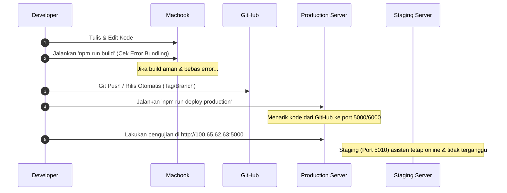

# 📐 Usulan Alur Kerja (Workflow) Coding di Macbook Pro M3 & Kebutuhan PostgreSQL Lokal

Dokumen ini menganalisis kebutuhan basis data lokal di Macbook Pro M3 Anda dan menyusun rekomendasi alur kerja coding, build, dan testing yang efisien.

---

## 💡 Kesimpulan & Rekomendasi Utama

**Anda TIDAK PERLU lagi menginstal maupun menjalankan PostgreSQL lokal di Macbook Pro M3.**

### Mengapa?
1. **Verifikasi Build Bebas Database**: Perintah `npm run build` (Next.js compilation) adalah proses *build-time* statis. Next.js mengompilasi kode, melacak dependensi, dan melakukan optimalisasi tanpa memerlukan koneksi basis data aktif.
2. **Koneksi Langsung via Tailscale**: Karena Macbook Pro M3 Anda terhubung ke jaringan Tailscale, jika Anda sesekali ingin menjalankan aplikasi secara lokal di Macbook (`npm run dev` pada `http://localhost:3000`), Anda bisa **langsung mengarahkan koneksinya ke database terpusat `100.78.186.123`** menggunakan skema `dev` yang terisolasi.
3. **Efisiensi Sumber Daya**: Tidak menjalankan mesin PostgreSQL lokal menghemat memori (RAM), baterai, dan ruang penyimpanan pada Macbook Pro M3 Anda.

---

## 🛠️ Usulan Konfigurasi `.env.local` di Macbook Pro M3

Untuk mempermudah coding dan testing lokal tanpa basis data lokal, cukup buat file `.env.local` di Macbook Anda dengan setelan berikut:

```env
NODE_ENV=development
NODE_ROLE=standalone
PORT=3000

# Terhubung langsung ke database pusat Node 3 via Tailscale
DATABASE_HOST=100.78.186.123
PGDATABASE=maknaflow_db
PG_SEARCH_PATH=dev  # Mengarah ke skema dev terisolasi (aman dari production/staging)

# Endpoint Webhook G-Labs Terpusat
WEBHOOK_HOST=100.64.70.61
WEBHOOK_PORT=8765
```

---

## 🔄 Alur Kerja Coding, Build, dan Deployment Terintegrasi

Berikut adalah alur kerja yang kami usulkan agar **tidak mengganggu pekerjaan asisten** di staging server (`port 5010`):



### Penjelasan Langkah Alur Kerja:
1. **Coding di Macbook**: Anda menulis kode di Macbook dengan nyaman.
2. **Verifikasi Sintaks**: Jalankan `npm run build` lokal untuk memastikan tidak ada error TypeScript, sintaks Next.js, atau import yang rusak.
3. **Commit & Push**: Gunakan perintah rilis non-interaktif untuk membuat versi baru (tag) dan men-push-nya ke repositori GitHub.
4. **Deploy ke Production**: Jalankan skrip deployment single-pass (misal `npm run deploy:production`) untuk memperbarui server produksi `100.65.62.63` pada port **`5000`** (UI) dan **`6000`** (API).
5. **Testing**: Anda melakukan pengujian fitur langsung di server produksi (`http://100.65.62.63:5000`) secara nyata tanpa menyentuh server staging.
6. **Staging Tetap Aman**: Staging port **`5010`** yang sedang diakses asisten tetap online tanpa adanya downtime build Next.js.
