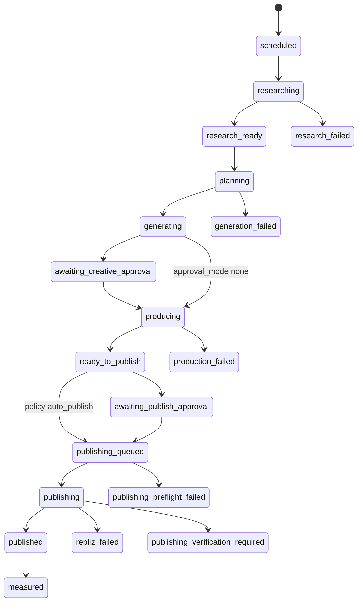

# Implementation Plan — Hermes AI Agent × MAKNA Flow × Repliz

## 1. Status dan Tujuan

Status dokumen: **Proposed / belum dieksekusi**  
Target repository: `/Users/sabeqmmursyid/_maknaflow-staging`  
Target awal: **staging**, bukan production.

Membangun jalur otomatis yang memungkinkan pengguna memberi instruksi berbahasa alami kepada Hermes AI Agent untuk:

1. menjalankan riset web terjadwal;
2. mengirim research brief terstruktur dan bersumber ke MAKNA Flow;
3. memulai Content Planner dan OPC Single-Pass Engine;
4. memproduksi aset melalui worker MAKNA yang sudah ada;
5. menyinkronkan hasil ke ContentFlow;
6. menerapkan approval dan publishing policy;
7. menjadwalkan posting melalui Repliz;
8. merekonsiliasi status, post ID, permalink, dan kegagalan ke satu orchestration run yang dapat diaudit.

## 2. Keputusan Arsitektur

```text
Hermes = research, reasoning, memory, dan instruksi pengguna
MAKNA  = schedule authority, workflow state, production, policy, audit, dan retry
Repliz = delivery provider ke social platform
```

MAKNA menjadi pemilik jadwal utama. Content Automation worker memanggil Hermes Runs API ketika jadwal jatuh tempo. Hermes mengembalikan research brief ke callback MAKNA. Pendekatan ini mencegah satu workflow memiliki dua cron authority.

Hermes tidak boleh:

- mengakses database MAKNA secara langsung;
- memegang kredensial Repliz;
- memanggil endpoint publishing berbasis browser session;
- mengubah status workflow secara arbitrer;
- melakukan live publish tanpa policy MAKNA;
- melewati preflight, compliance, approval, atau emergency pause.

Strategic Campaign tetap memakai **Single-Pass Engine (1-Call Architecture)**. Rencana ini tidak mengaktifkan Call 2 yang deprecated.

## 3. Scope

### In scope

- Hermes server client dan health check server-side.
- Research brief contract dengan source provenance dan freshness.
- Agent automation orchestration run yang durable dan tenant-scoped.
- Callback terautentikasi dan idempotent dari Hermes ke MAKNA.
- Trigger Hermes dari Content Automation scheduler.
- Handoff output Operator → ContentFlow → Publishing Scheduler → Repliz.
- Publishing policy `draft_only`, `approval_required`, dan feature-gated `auto_publish`.
- Status API, audit event, notification, retry, pause, dan emergency stop.
- Skill/instruksi Hermes yang hanya menggunakan API resmi MAKNA.
- Unit, boundary, integration, dan staging smoke test.

### Out of scope fase awal

- Deployment production tanpa instruksi eksplisit pengguna.
- Browser automation untuk mengoperasikan UI MAKNA atau Repliz.
- Menyimpan credential Hermes/Repliz di client atau payload job.
- Auto-publish aktif secara default.
- Mengambil analytics sosial yang belum tersedia dari Repliz.
- Mengganti scheduler, Operator worker, ContentFlow, atau publishing worker existing.

## 4. Existing Baseline

- Operator API v1 sudah bearer-authenticated, tenant-scoped, asynchronous, dan idempotent.
- Operator contract sengaja memaksa `enable_social_post: false`.
- Content Automation sudah memiliki daily/weekly/monthly schedule, timezone, missed-run policy, retry, audit, notification, dan auto-pause.
- Repliz client dan publishing worker sudah menangani create, reconcile, retry, cancel, ContentFlow status, serta permalink.
- `POST /api/v2/publishing/jobs` masih menggunakan user/session auth dan tidak boleh dipakai langsung oleh Hermes.

## 5. Target Workflow dan Ownership



Satu `agent_automation_run` memiliki:

- satu immutable trigger snapshot;
- maksimal satu Hermes run aktif;
- satu immutable research revision yang dipakai untuk generation;
- satu Operator job;
- nol atau lebih ContentFlow item;
- satu publishing intent per ContentFlow item/platform/account;
- satu publishing job per target account;
- audit event untuk setiap transisi.

## 6. Kontrak Research Brief

```json
{
  "schema_version": "1",
  "query": "tren sarapan sehat keluarga Indonesia 24 jam terakhir",
  "researched_at": "2026-08-31T07:45:00+07:00",
  "locale": "id-ID",
  "summary": "Ringkasan singkat berbasis sumber.",
  "insights": [{
    "claim": "Topik meal prep sekolah sedang meningkat.",
    "confidence": 0.84,
    "source_ids": ["src_1"]
  }],
  "sources": [{
    "id": "src_1",
    "url": "https://example.com/article",
    "title": "Judul sumber",
    "publisher": "Example",
    "published_at": "2026-08-30T09:00:00Z",
    "retrieved_at": "2026-08-31T00:30:00Z"
  }],
  "recommended_angles": [{
    "title": "Sarapan praktis sebelum sekolah",
    "reason": "Sesuai tren dan persona brand.",
    "risk_level": "low",
    "source_ids": ["src_1"]
  }],
  "prohibited_claims": [],
  "limitations": []
}
```

Validation minimum:

- `researched_at` valid dan tidak lebih tua dari `max_research_age_hours` policy;
- URL hanya `https:` dan dibatasi panjangnya;
- maksimal 30 sources, 30 insights, dan 12 angles;
- setiap `source_id` harus merujuk source yang ada;
- confidence berada pada rentang 0–1;
- seluruh string dibatasi panjangnya;
- tidak menerima HTML aktif, credential, prompt tersembunyi, atau instruksi tool dalam research brief;
- sources adalah untrusted evidence, bukan system instruction.

## 7. Kontrak API

### Endpoint MAKNA yang digunakan Hermes

| Method | Endpoint | Scope | Fungsi |
|---|---|---|---|
| `GET` | `/api/operator/v2/whoami` | `automation:read` | Verifikasi identity, tenant, capabilities |
| `GET` | `/api/operator/v2/research-tasks/{id}` | `research:read` | Ambil immutable task context |
| `POST` | `/api/operator/v2/research-tasks/{id}/complete` | `research:submit` | Submit research brief idempotent |
| `POST` | `/api/operator/v2/research-tasks/{id}/fail` | `research:submit` | Laporkan kegagalan tersanitasi |
| `GET` | `/api/operator/v2/automation-runs/{id}` | `automation:read` | Baca status end-to-end |

Semua mutation wajib memakai `Idempotency-Key`, `Cache-Control: no-store`, `runtime = 'nodejs'`, dan tenant dari authenticated identity—bukan dari body.

### Endpoint Hermes yang digunakan MAKNA

| Method | Endpoint | Fungsi |
|---|---|---|
| `GET` | `/health/detailed` | Readiness tanpa membuka secret |
| `POST` | `/v1/runs` | Memulai research run secara idempotent |
| `GET` | `/v1/runs/{run_id}` | Reconcile bila callback terlambat |
| `POST` | `/v1/runs/{run_id}/stop` | Emergency stop/cancel |

Callback URL dan short-lived callback token disediakan dalam instructions run. Jangan menaruh long-lived MAKNA operator token di prompt Hermes.

## 8. Publishing Policy

| Policy | Hasil |
|---|---|
| `draft_only` | Berhenti pada ContentFlow `Ready`; tidak membuat Repliz job |
| `approval_required` | Membuat publishing intent; job baru dibuat setelah approval manusia |
| `auto_publish` | Job dibuat otomatis hanya jika seluruh gate lolos dan feature flag aktif |

Gate `auto_publish`:

1. `ENABLE_HERMES_AUTO_PUBLISH=true` pada server.
2. Policy, brand, account, dan platform berada dalam allowlist tenant.
3. Research memiliki sumber dan masih fresh.
4. Creative/claim compliance lolos.
5. ContentFlow item memiliki media final dan caption.
6. Publishing preflight lolos.
7. Daily quota dan allowed posting window belum dilanggar.
8. Dedupe fingerprint tidak menemukan intent/job aktif yang sama.
9. Global/tenant publishing control tidak paused.
10. Tidak ada ambiguous provider outcome sebelumnya.

Pilot wajib dimulai dengan `draft_only`, lalu `approval_required`. `auto_publish` tidak boleh diaktifkan hanya karena test unit lulus.

## 9. Perubahan per File

> Snippet berikut adalah kontrak desain, bukan instruksi untuk menyalin tanpa audit ulang. Agent wajib menyesuaikan nama helper dengan kode aktual dan memperbarui plan bila lokasi berubah.

### 9.1 `[NEW] lib/hermes-research-contract.js`

#### Code Sebelum (Current/Before)

```javascript
// File belum ada; research context belum memiliki schema khusus.
```

#### Code Sesudah (Proposed/After)

```javascript
export function normalizeHermesResearchBrief(input, policy) {
  // validate version, freshness, size limits, https sources,
  // confidence, source references, prohibited content, and limitations
  return Object.freeze(normalizedBrief);
}

export function hashHermesResearchBrief(brief) {
  return sha256(stableJson(brief));
}
```

### 9.2 `[NEW] lib/hermes-client.js`

#### Code Sebelum (Current/Before)

```javascript
// Belum ada server-side adapter untuk Hermes Runs API.
```

#### Code Sesudah (Proposed/After)

```javascript
export async function createHermesRun(config, payload, idempotencyKey) {}
export async function getHermesRun(config, runId) {}
export async function stopHermesRun(config, runId) {}
export async function getHermesReadiness(config) {}
```

Adapter wajib memiliki timeout, bounded response, bearer auth server-side, error classification, URL allowlist, secret redaction, dan tidak melakukan retry mutation tanpa idempotency key yang sama.

### 9.3 `[NEW] lib/agent-automation-contract.js`

#### Code Sebelum (Current/Before)

```javascript
// Belum ada kontrak orchestration run lintas Hermes, Operator, ContentFlow, dan Publishing.
```

#### Code Sesudah (Proposed/After)

```javascript
export const AGENT_RUN_STATES = Object.freeze([/* state machine section 5 */]);
export function normalizeAgentAutomationDefinition(input) {}
export function validateAgentRunTransition(from, to) {}
export function normalizePublishingPolicy(input) {}
```

### 9.4 `[NEW] lib/agent-automation-repository.js`

#### Code Sebelum (Current/Before)

```javascript
// Belum ada durable repository untuk end-to-end agent runs.
```

#### Code Sesudah (Proposed/After)

```javascript
export async function createAgentRun(input) {}
export async function claimDueResearchRun(workerId) {}
export async function attachHermesRun(runId, hermesRunId) {}
export async function saveResearchRevision(runId, brief, sha256) {}
export async function transitionAgentRun(runId, expectedState, nextState, patch) {}
export async function appendAgentRunEvent(runId, type, event) {}
```

Claim dan transition wajib memakai transaksi, row lock atau compare-and-swap, serta tenant filter.

### 9.5 `[MODIFY] lib/db-pg.js`

#### Code Sebelum (Current/Before)

```javascript
CREATE TABLE IF NOT EXISTS content_automation_schedules (...);
CREATE TABLE IF NOT EXISTS content_automation_runs (...);
```

#### Code Sesudah (Proposed/After)

```sql
CREATE TABLE IF NOT EXISTS agent_automation_runs (...);
CREATE TABLE IF NOT EXISTS agent_research_revisions (...);
CREATE TABLE IF NOT EXISTS agent_publishing_intents (...);
CREATE TABLE IF NOT EXISTS agent_automation_events (...);
CREATE UNIQUE INDEX ... ON agent_automation_runs(tenant_id, idempotency_key);
CREATE UNIQUE INDEX ... ON agent_research_revisions(run_id, revision);
CREATE UNIQUE INDEX ... ON agent_publishing_intents(
  tenant_id, content_flow_item_id, account_id, scheduled_at, payload_sha256
);
```

Migration harus idempotent, memakai PostgreSQL advisory lock, foreign key yang tepat, dan tidak mengubah data legacy.

### 9.6 `[MODIFY] lib/content-automation-contract.js`

#### Code Sebelum (Current/Before)

```javascript
const operatorRequest = normalizeOperatorContentRequest(...);
if (operatorRequest.production.enable_social_post) {
  throw new ContentAutomationError('Social posting tidak diizinkan pada automation pilot.');
}
```

#### Code Sesudah (Proposed/After)

```javascript
const research = normalizeResearchAutomation(merged.research || {});
const publishingPolicy = normalizePublishingPolicy(merged.publishing || { mode: 'draft_only' });
return { ...existing, research, publishing_policy: publishingPolicy };
```

Jangan menghapus guardrail `enable_social_post`; publishing tetap melalui publishing intent terpisah.

### 9.7 `[MODIFY] lib/content-automation-worker.js`

#### Code Sebelum (Current/Before)

```javascript
const job = await createOperatorJobFromRequest({ request, idempotencyKey, actor });
await updateRun(run.id, { operator_job_id: job.id, status: 'job_created' });
```

#### Code Sesudah (Proposed/After)

```javascript
const agentRun = await createAgentRunFromSchedule(schedule, run);
await enqueueHermesResearch(agentRun);
// Operator job hanya dibuat setelah immutable research revision tervalidasi.
```

Schedule existing tanpa research configuration harus tetap memakai jalur lama tanpa regresi.

### 9.8 `[NEW] lib/agent-automation-worker.js`

#### Code Sebelum (Current/Before)

```javascript
// Belum ada reconciler lintas tahap.
```

#### Code Sesudah (Proposed/After)

```javascript
export async function runAgentAutomationTick() {
  await dispatchDueHermesResearch();
  await reconcileHermesRuns();
  await dispatchValidatedResearchToOperator();
  await reconcileOperatorAndContentFlow();
  await evaluatePublishingIntents();
  await reconcilePublishingJobs();
}
```

Worker harus single-owner per claim, bounded per tick, graceful on error, retry-aware, dan tidak memegang transaksi selama network call.

### 9.9 `[MODIFY] instrumentation.js`

#### Code Sebelum (Current/Before)

```javascript
if (backgroundServicesEnabled && process.env.ENABLE_CONTENT_AUTOMATION_WORKER !== 'false') {
  const { startContentAutomationWorker } = await import('./lib/content-automation-worker.js');
  startContentAutomationWorker();
}
```

#### Code Sesudah (Proposed/After)

```javascript
if (backgroundServicesEnabled && process.env.ENABLE_AGENT_AUTOMATION_WORKER === 'true') {
  const { startAgentAutomationWorker } = await import('./lib/agent-automation-worker.js');
  startAgentAutomationWorker();
}
```

Pertahankan conditional dynamic import di dalam `register()` dan guard `NEXT_RUNTIME === 'nodejs'`, sesuai dokumentasi Next.js lokal.

### 9.10 `[MODIFY] lib/operator-content-contract.js`

#### Code Sebelum (Current/Before)

```javascript
return {
  contract_version: normalizedOpc ? '2' : '1',
  planner: normalizePlanner(input.planner || {}),
  production: normalizedOpc?.production || normalizeProduction(input.production || {})
};
```

#### Code Sesudah (Proposed/After)

```javascript
return {
  contract_version: input.research_brief ? '3' : (normalizedOpc ? '2' : '1'),
  planner: normalizePlanner(input.planner || {}),
  research_brief: input.research_brief
    ? normalizeHermesResearchBrief(input.research_brief, input.research_policy)
    : null,
  production: normalizedOpc?.production || normalizeProduction(input.production || {})
};
```

`enable_social_post` tetap `false`; contract version lama harus backward compatible.

### 9.11 `[MODIFY] lib/content-planner-engine.js`

#### Code Sebelum (Current/Before)

```javascript
const prompt = buildPlannerPrompt(params);
```

#### Code Sesudah (Proposed/After)

```javascript
const evidence = buildUntrustedResearchEvidence(params.research_brief);
const prompt = buildPlannerPrompt({ ...params, evidence });
```

Prompt wajib menandai seluruh source content sebagai data tidak tepercaya, mempertahankan citation IDs, tidak mengikuti instruksi dari source, dan tidak membuat claim tanpa source yang mendukung.

### 9.12 `[MODIFY] lib/operator-auth.js`

#### Code Sebelum (Current/Before)

```javascript
await authenticateOperator(request, 'content:create');
```

#### Code Sesudah (Proposed/After)

```javascript
await authenticateOperator(request, 'research:submit');
await authenticateOperator(request, 'automation:read');
```

Tambahkan scope secara additive. Jangan menerima tenant dari header/body bila token telah terikat tenant.

### 9.13 `[NEW] app/api/operator/v2/research-tasks/[id]/route.js`

#### Code Sebelum (Current/Before)

```javascript
// Route belum ada.
```

#### Code Sesudah (Proposed/After)

```javascript
export const runtime = 'nodejs';
export const dynamic = 'force-dynamic';
export async function GET(request, { params }) {
  const { id } = await params;
  // authenticate research:read, apply tenant context, return bounded task context
}
```

### 9.14 `[NEW] app/api/operator/v2/research-tasks/[id]/complete/route.js`

#### Code Sebelum (Current/Before)

```javascript
// Callback route belum ada.
```

#### Code Sesudah (Proposed/After)

```javascript
export async function POST(request, { params }) {
  const { id } = await params;
  // verify short-lived callback token + Idempotency-Key
  // validate brief, persist immutable revision, CAS transition to research_ready
  return Response.json(result, { status: result.reused ? 200 : 202 });
}
```

Gunakan async `params` sesuai Next.js 16. Jangan log raw body atau token.

### 9.15 `[NEW] app/api/operator/v2/automation-runs/[id]/route.js`

#### Code Sebelum (Current/Before)

```javascript
// End-to-end status route belum ada.
```

#### Code Sesudah (Proposed/After)

```javascript
export async function GET(request, { params }) {
  const identity = await authenticateOperator(request, 'automation:read');
  const { id } = await params;
  return runAsOperatorTenant(identity, () => getPublicAgentRunStatus(id));
}
```

Respons tidak boleh menyertakan prompts internal, credentials, raw provider error, atau source content berukuran besar.

### 9.16 `[NEW] lib/agent-publishing-service.js`

#### Code Sebelum (Current/Before)

```javascript
// Belum ada service-level handoff dari orchestration run ke publishing repository.
```

#### Code Sesudah (Proposed/After)

```javascript
export async function evaluatePublishingIntent(run) {}
export async function approvePublishingIntent(input) {}
export async function dispatchPublishingIntent(intent) {
  // validate policy + preflight, then call createPublishingJobs() directly
}
```

Service memakai repository existing; jangan melakukan internal HTTP ke session-authenticated `/api/v2/publishing/jobs`.

### 9.17 `[NEW] app/api/operator/v2/automation-runs/[id]/publishing-approval/route.js`

#### Code Sebelum (Current/Before)

```javascript
// Machine-safe publishing approval route belum ada.
```

#### Code Sesudah (Proposed/After)

```javascript
export async function POST(request, { params }) {
  // require publishing:approve, approval revision/hash, and Idempotency-Key
  // dispatch only the exact reviewed intent revision
}
```

Hermes default token tidak diberi `publishing:approve`. Approval berasal dari user/session atau token approver terpisah.

### 9.18 `[NEW] plugins/makna-hermes/skills/makna-content-orchestrator/SKILL.md`

#### Code Sebelum (Current/Before)

```markdown
<!-- Skill Hermes untuk MAKNA belum ada. -->
```

#### Code Sesudah (Proposed/After)

```markdown
1. Fetch research task context from the official MAKNA API.
2. Research only the requested scope and freshness window.
3. Submit structured evidence with stable source IDs.
4. Never call Repliz or the MAKNA database directly.
5. Never approve or publish unless the issued capability explicitly allows it.
```

### 9.19 `[NEW] tests/hermes-client.test.js`

#### Code Sebelum (Current/Before)

```javascript
// Belum ada contract test Hermes.
```

#### Code Sesudah (Proposed/After)

```javascript
test('uses bearer auth without exposing secret on error', () => {});
test('replays create with the same idempotency key', () => {});
test('classifies timeout and 429 as retryable', () => {});
test('rejects non-allowlisted Hermes base URL', () => {});
```

### 9.20 `[NEW] tests/agent-automation.test.js`

#### Code Sebelum (Current/Before)

```javascript
// Belum ada end-to-end orchestration contract test.
```

#### Code Sesudah (Proposed/After)

```javascript
test('research callback is tenant-scoped and idempotent', () => {});
test('duplicate ticks create one Hermes run and one Operator job', () => {});
test('approval_required cannot publish without exact revision approval', () => {});
test('auto_publish remains disabled without feature flag and allowlist', () => {});
test('one intent creates at most one active Repliz job per target', () => {});
```

### 9.21 `[MODIFY] sot/global/operator-api.md`

#### Code Sebelum (Current/Before)

```markdown
Social posting sengaja dinonaktifkan pada v1.
```

#### Code Sesudah (Proposed/After)

```markdown
Operator v1 tetap tidak melakukan social posting. Operator v2 menambahkan research
callback dan orchestration status; publishing hanya melalui policy-gated publishing intent.
```

## 10. Environment dan Secret

```dotenv
ENABLE_AGENT_AUTOMATION_WORKER=false
AGENT_AUTOMATION_INTERVAL_MS=15000
HERMES_API_BASE_URL=http://127.0.0.1:8642
HERMES_API_SERVER_KEY=<secret-manager-only>
HERMES_ALLOWED_HOSTS=127.0.0.1,100.x.x.x
HERMES_REQUEST_TIMEOUT_MS=30000
HERMES_RESEARCH_RUN_TIMEOUT_MS=1800000
MAKNA_HERMES_CALLBACK_SIGNING_SECRET=<random-32-plus-bytes>
ENABLE_HERMES_AUTO_PUBLISH=false
```

Secret harus diambil server-side, dimasking di Settings, tidak ikut API response, tidak disimpan dalam prompt/run payload, dan disanitasi dari log/error.

## 11. Recovery dan Idempotency

- Schedule slot key: `schedule_id:scheduled_for`.
- Hermes create key: `agent_run_id:research_revision_request`.
- Research callback key: `agent_run_id:hermes_run_id:result_sha256`.
- Operator key: `agent_run_id:research_revision`.
- Publishing intent fingerprint: tenant + ContentFlow item + account + scheduled time + payload hash.
- Repliz job tetap memakai anti-duplicate behavior publishing worker existing.
- Timeout setelah mutation tidak boleh langsung diulang dengan key baru.
- Run stale diklaim ulang hanya setelah lease timeout.
- Emergency pause menghentikan dispatch baru, bukan menghapus audit/history.

## 12. Observability

Setiap log terstruktur membawa:

```text
tenant_id, schedule_id, agent_run_id, hermes_run_id,
operator_job_id, content_flow_item_id, publishing_intent_id,
publishing_job_id, correlation_id, stage, status, duration_ms
```

Health view minimal menampilkan:

- Hermes readiness;
- worker enabled/last tick/last error;
- count per state;
- stale leases;
- research failures;
- pending approvals;
- publishing backlog dan verifying jobs;
- auto-publish feature flag dan global pause state tanpa secret.

## 13. Verifikasi

### Automated

```bash
node --test tests/hermes-client.test.js tests/agent-automation.test.js
npm run test:operator-content
npm run test:content-automation
npm run test:publishing-scheduler
npm run build
```

### Staging smoke — tanpa live publish

1. Hermes `/health/detailed` sehat.
2. Buat satu automation `draft_only`, satu brand, satu planner row/batch minimum yang valid.
3. Jalankan `run-now` dengan stable idempotency key.
4. Buktikan hanya satu Hermes run tercipta meski trigger diulang.
5. Submit research callback dan periksa source/revision hash.
6. Buktikan satu Operator job terbentuk dan status dapat direkonsiliasi.
7. Lakukan approval kreatif hanya setelah review eksplisit.
8. Tunggu output ContentFlow `Ready`.
9. Pastikan tidak ada publishing job pada `draft_only`.
10. Ulangi dengan `approval_required`; pastikan tidak dispatch sebelum approval exact revision.
11. Setelah persetujuan pengguna untuk smoke non-live, gunakan akun/draft target dan verifikasi Repliz schedule serta reconciliation.
12. Jangan mengaktifkan `auto_publish` atau deployment production selama pilot.

## 14. Rollout dan Rollback

1. Deploy code dengan worker dan auto-publish disabled.
2. Jalankan migration idempotent.
3. Aktifkan worker di staging untuk satu tenant pilot.
4. Jalankan `draft_only` minimal tiga run sukses.
5. Aktifkan `approval_required` untuk satu akun Repliz pilot.
6. Evaluasi duplicate rate, failure rate, source quality, dan operator workload.
7. `auto_publish` memerlukan keputusan terpisah dan explicit tenant allowlist.

Rollback operasional:

```dotenv
ENABLE_AGENT_AUTOMATION_WORKER=false
ENABLE_HERMES_AUTO_PUBLISH=false
```

Pause publishing worker/tenant control bila provider incident. Jangan drop tabel saat rollback; pertahankan audit trail.

### 9.21 Skill percakapan dan API automation Hermes

#### `plugins/makna-hermes/skills/makna-content-orchestrator/SKILL.md`

Code Sebelum (Current/Before):

```md
# Skill Hermes: MAKNA Content Orchestrator
Research only the requested query.
```

Code Sesudah (Proposed/After):

```md
---
name: makna-content-orchestrator
description: Buat dan jadwalkan workflow riset, video, review, dan publishing melalui MAKNA.
---
Parse instruksi pengguna, resolve katalog, konfirmasi mutation berisiko, lalu gunakan Operator API resmi.
```

#### `[NEW] app/api/operator/v2/content-automations/catalog/route.js`

Code Sebelum (Current/Before):

```js
// Belum ada katalog tenant-scoped untuk Hermes.
```

Code Sesudah (Proposed/After):

```js
const identity = await authenticateOperator(request, 'automation:read');
return runAsOperatorTenant(identity, () => list bounded brands, products, and presets);
```

#### `[NEW] plugins/makna-hermes/skills/makna-content-orchestrator/references/operator-api.md`

Code Sebelum (Current/Before):

```md
Belum ada referensi API untuk membuat schedule dari percakapan Hermes.
```

Code Sesudah (Proposed/After):

```md
GET katalog untuk identifier resmi; POST automation memakai scope dan Idempotency-Key.
```

#### `[NEW] app/api/operator/v2/content-automations/route.js`

Code Sebelum (Current/Before):

```js
// Belum ada mutation schedule resmi untuk Hermes.
```

Code Sesudah (Proposed/After):

```js
const identity = await authenticateOperator(request, 'automation:write');
const data = normalizeContentAutomation(await prepareProductCampaignSchedule(body));
return createAutomation(data, identity.actor);
```

#### `lib/content-automation-repository.js`

Code Sebelum (Current/Before):

```js
export async function createAutomation(data, actor) {
  // selalu INSERT schedule baru
}
```

#### `lib/agent-automation-contract.js`

Code Sebelum (Current/Before):

```js
if (productionCount !== 1) throw new Error('Pilot Hermes hanya mendukung production_count=1.');
```

Code Sesudah (Proposed/After):

```js
if (!Number.isInteger(productionCount) || productionCount < 1 || productionCount > 30) throw new Error(...);
```

Code Sesudah (Proposed/After):

```js
export async function createAutomationIdempotent(data, actor, idempotencyKey) {
  // advisory lock, replay schedule lama untuk key yang sama, lalu INSERT + audit atomik
}
```

## 15. Execution Task List

- [x] Baca ulang `AGENTS.md`, plan ini, instruksi Antigravity/Hermes, dan dokumentasi Next.js lokal untuk Route Handlers serta instrumentation.
- [x] Audit `git status`, schema aktual, Operator API, Content Automation, ContentFlow, dan Publishing/Repliz sebelum mengubah kode.
- [x] Validasi versi Hermes aktual melalui `/v1/capabilities` atau dokumentasi resmi; catat deviasi API sebelum implementasi.
- [x] Bekukan kontrak research brief, state machine, scopes, policy, idempotency keys, dan error taxonomy.
- [x] Implementasikan dan test `hermes-research-contract` serta `hermes-client` tanpa credential nyata.
- [x] Tambahkan migration PostgreSQL idempotent dan repository tenant-scoped dengan concurrency tests.
- [x] Tambahkan orchestration contract/service/worker dan feature flags, default disabled.
- [x] Tambahkan research brief ke Operator contract dan Content Planner prompt secara backward compatible.
- [x] Tambahkan Operator v2 read/callback/status routes dengan async params, no-store, bounded response, dan scope auth.
- [x] Implementasikan ContentFlow-to-publishing intent service tanpa internal HTTP ke session endpoint.
- [x] Implementasikan exact-revision publishing approval dan policy gates.
- [x] Tambahkan skill Hermes dan client script/API helper tanpa secret di source.
- [ ] Tambahkan observability, notification, health, retry, lease recovery, pause, dan stop behavior.
- [ ] Jalankan unit, boundary, integration, legacy regression, dan build tests; perbaiki sampai lulus. Unit Hermes/automation, Content Automation, Publishing Scheduler, dan build sudah lulus; suite Operator berbasis DB menunggu lingkungan PostgreSQL lokal/Dev yang aktif.
- [ ] Jalankan staging smoke `draft_only`; simpan bukti run IDs/status tanpa secret.
- [ ] Dengan approval eksplisit pengguna, jalankan staging smoke `approval_required` non-live/draft target.
- [ ] Pastikan `auto_publish` tetap off dan tidak ada production deployment.
- [x] Tambahkan skill conversational Hermes dan Operator API tenant-scoped untuk melihat katalog serta membuat automation MAKNA.
- [x] Uji kontrak skill/API: enam video, preset, manual review, jadwal harian, dan publishing policy aman.
- [x] Update dokumentasi SoT dan changelog points berdasarkan implementasi aktual.
- [ ] Jalankan SOP release patch setelah seluruh scope dan verifikasi berhasil.
- [ ] Verifikasi branch `main` dan tag release terunggah ke remote repository.

## 16. Definition of Done

- Research Hermes diterima sebagai immutable, validated, source-linked revision.
- Retry trigger/callback tidak membuat duplicate Hermes run, Operator job, intent, atau Repliz job.
- Tenant isolation dan scope authorization terbukti dengan negative tests.
- Legacy Operator v1, Content Automation non-Hermes, Meta publisher, dan Repliz manual tidak regresi.
- `draft_only` dan `approval_required` bekerja end-to-end di staging.
- Approval mengikat exact revision/hash.
- Secret tidak muncul di API, log, review artifact, test snapshot, atau Git.
- Worker dapat dipause/disable dan stale run dapat dipulihkan.
- Auto-publish tetap fail-closed jika flag, allowlist, compliance, preflight, quota, atau policy tidak lolos.
- Semua checkbox yang benar-benar selesai telah diperbarui real-time.
- Build/test/smoke berhasil, release patch dibuat, tag dan `main` tersinkron—tanpa deploy production.

## 17. Perintah Release yang Direncanakan

Jalankan hanya setelah implementasi dan verifikasi berhasil:

```bash
npm run release-non-interactive -- --type patch --title "Hermes Agent Content Automation" --points "Tambah riset Hermes terstruktur dan orchestration run durable|Hubungkan produksi MAKNA ke publishing intent Repliz dengan approval policy|Tambah idempotency observability dan guardrail auto-publish"
```
