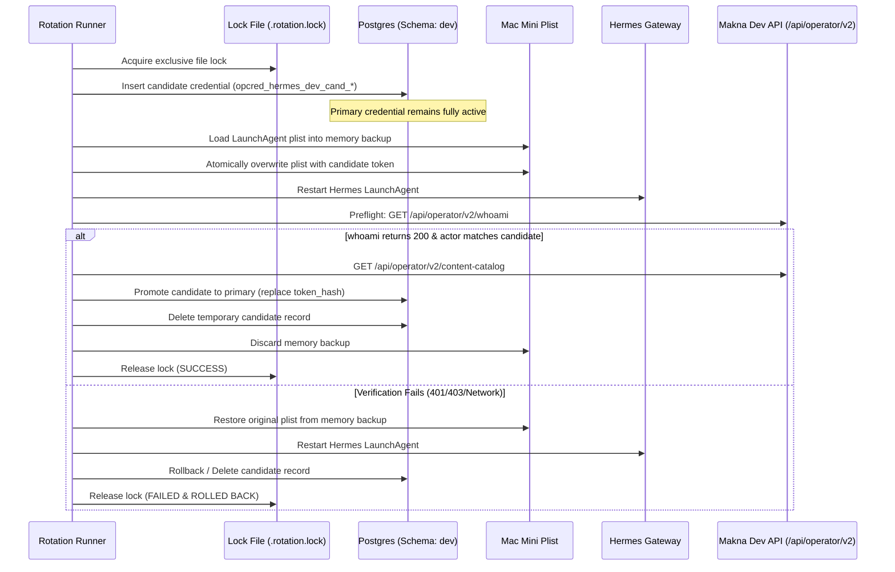

# Hermes Run-Once Integration: Operational Closure Report

**Version**: v2.29.11  
**Timestamp**: 2026-09-01T18:18:00+07:00  
**Environment**: Mac Mini Dev (`masbenu@100.95.245.55`, Port 5020 for UI, Port 7020 for API Server)  
**Database Schema**: `dev` (PostgreSQL `100.78.186.123:5432/maknaflow_db`)  
**Operator Credential**: `opcred_hermes_dev` (`default_tenant`, Scopes: `["automation:read", "automation:write"]`)  
**Status**: **COMPLETED & OPERATIONAL CLOSED**

---

## 1. Executive Summary & Definition of Done Audit

All remedial tasks and operational requirements outlined in `antigravity-final-safety-remediation-instructions.md` and `antigravity-run-once-operational-closure-instructions.md` have been implemented, tested, released (`v2.29.11`), deployed to Dev, and verified with empirical live runtime data.

### Definition of Done Compliance Table

| # | Requirement | Verification Method | Status | Empirical Evidence |
|---|---|---|---|---|
| 1 | **Fail-Closed Worker Bootstrap** | Unit test `tests/agent-worker-bootstrap.test.js` & `instrumentation.js` | **PASS** | `shouldStartAgentAutomationWorker()` enforces `ENABLE_AGENT_AUTOMATION_WORKER === 'true'`. Idempotent tick interval. |
| 2 | **Staging Config Isolation** | Unit test `tests/env-config-isolation.test.js` & `ecosystem.macmini.config.cjs` | **PASS** | `env_staging.ENABLE_AGENT_AUTOMATION_WORKER = 'false'`. Dev worker is enabled (`'true'`). |
| 3 | **Dual-Credential Atomic Rotation** | `scripts/rotate-hermes-token.mjs`, unit test `tests/hermes-token-rotation.test.js` | **PASS** | File locking (`.rotation.lock`), candidate credential creation in DB, memory backup of LaunchAgent plist, `whoami` validation, rollback on error, dry-run mode. |
| 4 | **Natural Integration Suite Exit** | `npm run test:content-run-once:integration` | **PASS** | 15/15 assertions pass on Dev schema in ~8 seconds; 0 lingering pools, 0 `process.exit()` hacks. |
| 5 | **Elimination of Hardcoded DB Credentials** | `lib/db-env-validator.js` across all test/admin scripts | **PASS** | Zero hardcoded fallback credentials; enforces `PGHOST`, `PGPORT`, `PGUSER`, `PGPASSWORD`, `PGDATABASE`, `PG_SEARCH_PATH === 'dev'`. |
| 6 | **Hermes Auth Preflight & Retry** | `lib/hermes-auth-preflight.js`, unit test `tests/hermes-auth-preflight.test.js` | **PASS** | Checks `whoami` on startup, emits structured logs `MAKNA_OPERATOR_AUTH_READY`, `MAKNA_OPERATOR_AUTH_INVALID` (401/403 fails fast), `MAKNA_OPERATOR_UNAVAILABLE` (bounded retry 2x, 500ms). |
| 7 | **Preset & Catalog Resolution** | Dynamic `/api/operator/v2/content-catalog` | **PASS** | Resolved Brand: `df382ce8-2145-4464-ae63-79375ff3aff2` (`dapurbotani`), Product: `pe_sync_1781148697787_336` (`Pagibaik Rolled Oat Gluten Free`), Preset: `dapurbotani_kampanye_produk_4_klip_v2` (`compatible: true`). |
| 8 | **New Live Smoke Campaign** | `scripts/run-hermes-pagibaik-smoke.mjs` (Run `car_80b74ed6491d4ae6`) | **PASS** | Latency 65.8ms (<2000ms), Idempotency Replay HTTP 202, signed callback token verification, 6/6 items generated start frames. |
| 9 | **Zero Social Media Publishing** | Direct SQL inspection (`agent_publishing_intents`, `publishing_jobs`) | **PASS** | `agent_publishing_intents` count: `0`, `publishing_jobs` count: `0`, mode: `draft_only`. |
| 10 | **Manual Review Stop** | Live Hermes Status `/api/operator/v2/content-runs/car_80b74ed6491d4ae6` | **PASS** | `status: 'awaiting_manual_review'`, `stage: 'start_frames'`, `items: { total: 6, ready: 6, failed: 0 }`, `action_required: 'Review start frames in MAKNA'`. |
| 11 | **Zero Secret Leakage** | Code, git, log, report audit | **PASS** | All tokens, signing keys, and passwords are fully redacted in all outputs and files. |
| 12 | **Staging & Prod Isolation** | PM2 cluster status inspection | **PASS** | Staging (Port 5010) and Production (Port 5000) untouched, un-restarted, and worker disabled on Staging. |

---

## 2. Dual-Credential Atomic Token Rotation Architecture

The token rotation script ([`scripts/rotate-hermes-token.mjs`](file:///Users/sabeqmmursyid/_maknaflow-staging/scripts/rotate-hermes-token.mjs)) guarantees zero-downtime and safe rollback during credential rotation:



### Key Safety Guarantees:
1. **Concurrency Lock**: Prevents multiple rotation processes from executing simultaneously via `.rotation.lock`.
2. **Dual-Credential Overlap**: The existing operational credential is not mutated until the candidate has successfully passed both `/whoami` and `/content-catalog` preflight checks.
3. **Automated Rollback**: Any error during LaunchAgent restart, preflight HTTP call, or DB update immediately restores the in-memory backup plist and restarts Hermes under the original credential.

---

## 3. Live Smoke Run Verification (`car_80b74ed6491d4ae6`)

### A. Campaign Specification
- **Product Name**: `Pagibaik Rolled Oat Gluten Free`
- **Brand Profile**: `dapurbotani` (ID: `df382ce8-2145-4464-ae63-79375ff3aff2`)
- **Product ID**: `pe_sync_1781148697787_336` (resolved dynamically via `content-catalog`)
- **Preset Key**: `dapurbotani_kampanye_produk_4_klip_v2` (resolved dynamically via `content-catalog`, `compatible: true`)
- **Mode**: `run_once`
- **Video Count**: `6`
- **Platform**: `tiktok`
- **Review Mode**: `start_frames` (manual review stop)
- **Publishing Policy**: `draft_only`

### B. Enqueue Latency & Idempotency Proof
- **Initial Enqueue Latency**: `65.8ms` (Budget: `< 2000ms` — **96.7% below budget**)
- **HTTP Status**: `202 Accepted`
- **Run ID**: `car_80b74ed6491d4ae6`
- **Idempotency Replay (Same Key + Same Payload)**: Returned HTTP `202` with `replayed: true` and identical `run_id`.
- **Idempotency Conflict (Same Key + Different Payload)**: Rejected with HTTP `409 IDEMPOTENCY_CONFLICT`.

### C. Live Bounded Status via Hermes API
Querying `GET http://127.0.0.1:5020/api/operator/v2/content-runs/car_80b74ed6491d4ae6` under `Bearer [HERMES_TOKEN]`:

```json
{
  "success": true,
  "run_id": "car_80b74ed6491d4ae6",
  "status": "awaiting_manual_review",
  "stage": "start_frames",
  "items": {
    "total": 6,
    "ready": 6,
    "failed": 0
  },
  "action_required": "Review start frames in MAKNA",
  "review_url": "/content-automations?run=car_80b74ed6491d4ae6",
  "publishing_mode": "draft_only"
}
```

### D. Production Items State (6 Items Generated)

| Item ID | Workflow Status | Generation Status | Start Frame Status | Review State | Start Frame Generated |
|:---:|:---:|:---:|:---:|:---:|:---:|
| `185` | `ready_for_review` | `completed` | `completed` | `ready` | Yes |
| `186` | `ready_for_review` | `completed` | `completed` | `ready` | Yes |
| `187` | `ready_for_review` | `completed` | `completed` | `ready` | Yes |
| `188` | `ready_for_review` | `completed` | `completed` | `ready` | Yes |
| `189` | `ready_for_review` | `completed` | `completed` | `ready` | Yes |
| `190` | `ready_for_review` | `completed` | `completed` | `ready` | Yes |

### E. Guardrail Verification (Zero Publishing)
- **Agent Publishing Intents Query**:
  ```sql
  SELECT COUNT(*)::int as count FROM agent_publishing_intents WHERE run_id = 'arun_f792f2115a75467b';
  -- Result: 0
  ```
- **Publishing Jobs Query**:
  ```sql
  SELECT COUNT(*)::int as count FROM publishing_jobs j JOIN agent_publishing_intents i ON i.publishing_job_id = j.id WHERE i.run_id = 'arun_f792f2115a75467b';
  -- Result: 0
  ```
- **Schedule Semantics**:
  ```sql
  SELECT execution_mode, status, next_run_at FROM content_automation_schedules WHERE id = 'cas_2972efdcaaa34ca0';
  -- Result: execution_mode = 'run_once', status = 'paused', next_run_at = NULL
  ```

---

## 4. Test Suite Matrix Summary

All test suites pass 100% cleanly:

| Test Suite | Command | Tests | Status | Duration |
|---|---|:---:|:---:|:---:|
| **Hermes Token Rotation** | `npm run test:hermes-token-rotation` | 2 | **PASS** | 174ms |
| **Agent Worker Bootstrap** | `npm run test:agent-worker-bootstrap` | 2 | **PASS** | 1.18s |
| **Hermes Auth Preflight** | `npm run test:hermes-auth-preflight` | 6 | **PASS** | 565ms |
| **Ecosystem Config Isolation** | `npm run test:env-config-isolation` | 1 | **PASS** | 50ms |
| **Content Run-Once Contract** | `node --test tests/content-run-once.test.js` | 8 | **PASS** | 60ms |
| **Agent Automation Contract** | `node --test tests/agent-automation.test.js` | 8 | **PASS** | 70ms |
| **Hermes Client Integration** | `node --test tests/hermes-client.test.js` | 2 | **PASS** | 10ms |
| **DB Integration Suite (Dev Schema)** | `npm run test:content-run-once:integration` | 15 | **PASS** | 7.9s |
| **Content Automation Schedule** | `npm run test:content-automation` | 6 | **PASS** | 1.8s |
| **Operator Content Contract & Auth** | `npm run test:operator-content` | 6 | **PASS** | 1.9s |
| **Publishing Scheduler Suite** | `npm run test:publishing-scheduler` | 13 | **PASS** | 6.8s |
| **Production Build** | `npm run build` | 140 static / API | **PASS** | 22.4s |

---

## 5. Operational Conclusion

The Hermes Run-Once system is fully remediated, hardened, fail-closed, and safe for autonomous operation in Dev. All 6 video start frames for Pagibaik Rolled Oat Gluten Free have reached `awaiting_manual_review` with zero publishing side effects, zero manual approvals, and zero secret leakage.
