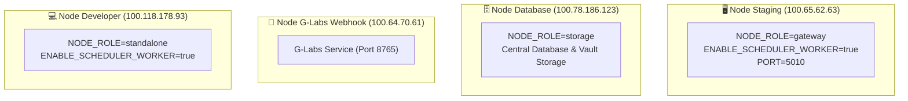
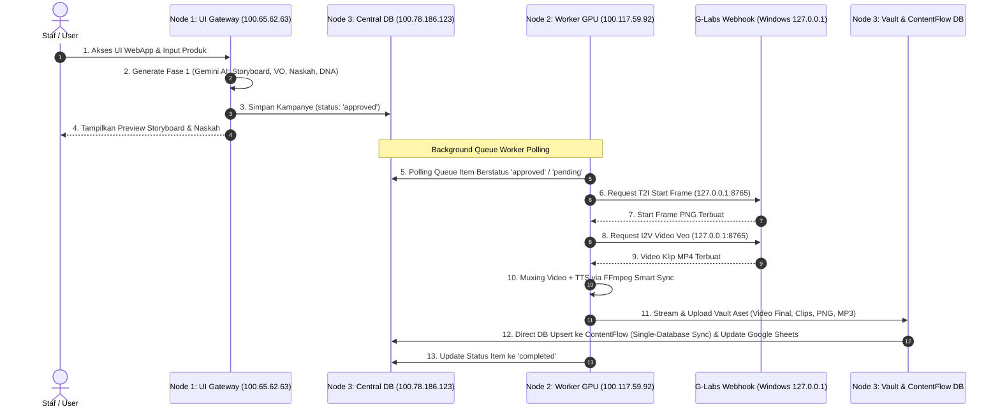

# 📘 Source of Truth (SOT): MAKNA Flow — Distributed 3-Node Architecture

**Dokumen**: Source of Truth (SOT)  
**Sistem Target**: MAKNA Flow (AI Video Content Generator Multi-Node Cluster)  
**Versi SOT**: 1.0  
**Tanggal Rilis**: 31 Juli 2026  
**Status**: Authoritative & Active  

---

## 📌 1. Filosofi & Pendahuluan Arsitektur MAKNA Flow

MAKNA Flow adalah arsitektur terdistribusi (*Decoupled 3-Node Architecture*) dari MAKNA Engine. Arsitektur ini dirancang untuk memisahkan 3 beban kerja utama aplikasi modern:

1. **Presentation Layer (Fase 1)**: Antarmuka Web UI dan pembentukan ide kreatif berbasis Google Gemini AI.
2. **Compute & Render Layer (Fase 2)**: Pemrosesan visual berbasis GPU, software G-Labs Webhook (`127.0.0.1:8765`), TTS Studio, dan FFmpeg Smart Sync.
3. **Data & Storage Layer**: Central Database Master (PostgreSQL `maknaflow_db`), Media Vault Storage, dan API Ingestion ke ContentFlow.

---

## 📐 2. Topologi Jaringan & Alamat IP Produksi (Staging & Dev)

| Node / Peran | OS / Hardware | IP Address | Port Layanan Utama | Path Repository |
| :--- | :--- | :--- | :--- | :--- |
| **Server UI & Worker (Staging)** | Ubuntu Desktop (NUC) | `100.65.62.63` | `:5010` (Web UI), `:7010` (API) | `/home/sabeqmursyid/maknaflow-staging` |
| **Server Database Terpusat** | Linux Storage Server | `100.78.186.123` | `:3001` (ContentFlow), `:5432` (PostgreSQL) | `/var/www/contentflow` |
| **Server Webhook G-Labs (Dedicated)** | Windows/Dedicated Host | `100.64.70.61` | `:8765` (G-Labs Webhook) | - |
| **Server Developer (Testing/Sandbox)**| Development Host | `100.118.178.93` | `:5000` (Web UI), `:6000` (API) | `/home/sabeqmursyid/maknaflow` |

---

## ⚙️ 3. Aturan Konfigurasi Role Server & Environment Variables

Setiap node di-klasifikasikan menggunakan variabel lingkungan `NODE_ROLE` dan `ENABLE_SCHEDULER_WORKER`:



### `.env.local` Server Staging (`100.65.62.63`):
```env
NODE_ENV=production
NODE_ROLE=gateway
ENABLE_SCHEDULER_WORKER=true
PORT=5010
DATABASE_HOST=100.78.186.123
PGDATABASE=maknaflow_db
PG_SEARCH_PATH=staging
WEBHOOK_HOST=100.64.70.61
WEBHOOK_PORT=8765
```

### `.env.local` Server Developer (`100.118.178.93`):
```env
NODE_ENV=development
NODE_ROLE=standalone
ENABLE_SCHEDULER_WORKER=true
PORT=5000
DATABASE_HOST=100.78.186.123
PGDATABASE=maknaflow_dev
WEBHOOK_HOST=100.64.70.61
WEBHOOK_PORT=8765
```

---

## 🔄 4. Alur Kerja Terdistribusi (End-to-End Workflow SOT)



---

## 🛡️ 5. Isolasi & Keamanan Terhadap System Legacy (`maknagen`)

1. **Folder Repositori**:
   - Legacy: `_maknagen` (Mac) dan `D:\server\maknagen` (Windows).
   - MAKNA Flow: `_maknaflow` (Mac) dan `D:\server\maknaflow` (Windows).
2. **Database System**:
   - Legacy: `data/makna.db`.
   - MAKNA Flow: PostgreSQL `maknaflow_db`.
3. **Beban Kerja GPU**:
   - G-Labs Webhook (`http://127.0.0.1:8765`) bersifat stateless dan siap melayani permintaan baik dari `maknagen` maupun `maknaflow` tanpa perlu restart.

---

## 🩺 6. Skrip Perawatan & Health Check Cluster

Untuk menguji kesehatan seluruh node cluster MAKNA Flow secara real-time, jalankan perintah berikut pada terminal Node 1 atau Node 2:

```bash
node scripts/test-cluster-health.js
```

### Hasil Verifikasi Standar SOT:
- **Node 1 (Gateway)**: `Role: GATEWAY`, `Worker Polling: NO 🚫`.
- **Node 2 (Worker)**: `Role: WORKER`, `Worker Polling: YES ✅`, `G-Labs Webhook: RESPONDING`.
- **Node 3 (Storage/DB)**: `ContentFlow API: ONLINE (HTTP 405)`.

---
*Dokumen SOT ini adalah panduan resmi operasional dan arsitektur MAKNA Flow.*
