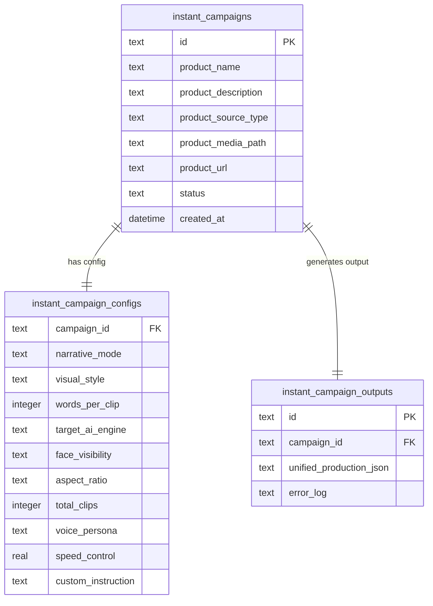
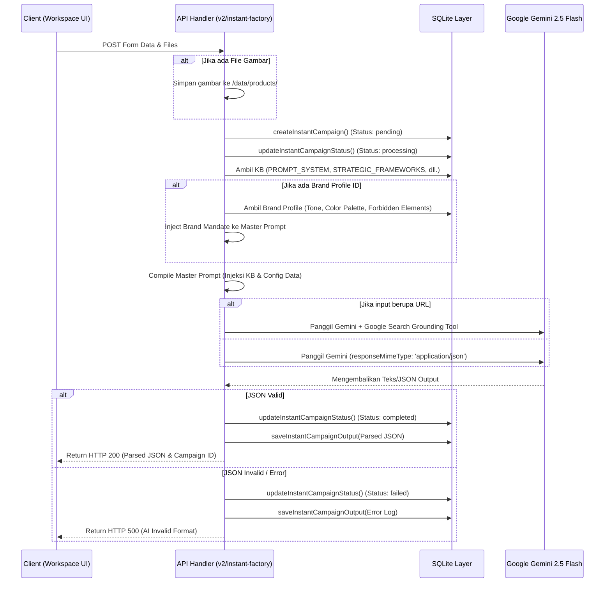

# Blueprint Fitur Instant Factory (MAKNA Engine V5.x)

## 1. Pendahuluan & Filosofi Fitur

**Instant Factory** adalah fitur *super-compact 1-stage AI production pipeline* yang dirancang untuk memotong seluruh birokrasi multi-agen dalam pembuatan draf kampanye video promosi. 

Dalam sekali klik, fitur ini menghasilkan:
*   **Analisis Strategis:** Analisis SWOT, USP produk, dan profil target audiens.
*   **Core Campaign Concept:** Tipe CEP (*Category Entry Point*), konteks situasi, matriks VFO (*Value, Feature, Outcome*), dan strategi hook.
*   **Storyboard Sinematik:** Detail adegan visual dan pergerakan kamera per adegan (*scene*).
*   **Naskah Voiceover (VO):** Naskah berbahasa Indonesia alami yang disesuaikan dengan *Voice Persona* dan regulasi kecepatan kata per detik.
*   **AI Visual Prompts:** Prompt *Text-to-Image* (T2I) berbasis *5-Layer Optical Stack* dan prompt gerakan *Image-to-Video* (I2V) untuk AI Video Generator (seperti Google Veo atau Kling).
*   **Copywriting Media Sosial:** Kumpulan takarir (*captions*) ramah SEO untuk TikTok, Instagram Reels, dan YouTube Shorts.

Fitur ini bekerja secara instan tanpa jeda tunggu (*delay*) antar-stage dengan menyatukan seluruh instruksi ke dalam **satu panggilan API tunggal (Single Stage API Call)** menggunakan teknik *Agentic Chain-of-Thought* yang dipaksa keluar dalam format JSON terstruktur.

---

## 2. Arsitektur Database (Isolasi Data)

Aset dan konfigurasi yang dihasilkan oleh Instant Factory disimpan secara terpisah dalam tiga tabel SQLite terintegrasi pada `makna.db` untuk menghindari pencemaran pada tabel scheduler reguler:



### 2.1 Definisi Skema Tabel

1.  **`instant_campaigns`**
    *   `id` (TEXT, PK): UUID unik untuk setiap kampanye instan.
    *   `product_name` (TEXT): Nama produk (diisi manual atau hasil ekstraksi AI).
    *   `product_description` (TEXT): Manfaat utama, deskripsi, atau USP produk.
    *   `product_source_type` (TEXT): Tipe sumber data, bernilai `'url'`, `'image'`, atau `'text_only'`.
    *   `product_media_path` (TEXT): Jalur file lokal jika pengguna mengunggah gambar produk (disimpan di `/data/products/`).
    *   `product_url` (TEXT): URL halaman produk yang di-scrape.
    *   `status` (TEXT): Status saat ini, bernilai `'pending'`, `'processing'`, `'completed'`, atau `'failed'`.
    *   `created_at` (DATETIME): Waktu pembuatan record otomatis.

2.  **`instant_campaign_configs`**
    *   `campaign_id` (TEXT, PK, REFERENCES `instant_campaigns(id)`): Relasi ke kampanye utama.
    *   `narrative_mode` (TEXT): Gaya narasi (e.g., *Storytelling, Hard Sell, ASMR Review, Edu-Marketing*).
    *   `visual_style` (TEXT): Estetika visual (e.g., *UGC, Cinematic, Symmetrical, Fast/Viral, Investigative Documentary, Macrophotography*).
    *   `words_per_clip` (INTEGER): Batasan kata voiceover maksimal per adegan.
    *   `target_ai_engine` (TEXT): Target AI Video Generator (e.g., *Google Veo (8s), Kling AI (5s), Runway Gen-3 (10s), Sora (Max 60s), Minimax*).
    *   `face_visibility` (TEXT): Kehadiran wajah dalam visual (e.g., *Faceless, POV, Silhouette*).
    *   `aspect_ratio` (TEXT): Rasio aspek video target (e.g., *9:16, 16:9, 1:1*).
    *   `total_clips` (INTEGER): Jumlah klip target adegan (default: 4).
    *   `voice_persona` (TEXT): ID suara pembaca naskah (e.g., *Farah (Aoede), Bilal (Charon)*).
    *   `speed_control` (REAL): Kecepatan membaca suara target (kata per detik).
    *   `custom_instruction` (TEXT): Instruksi tambahan dari pengguna untuk modifikasi AI.

3.  **`instant_campaign_outputs`**
    *   `id` (TEXT, PK): UUID unik output.
    *   `campaign_id` (TEXT, REFERENCES `instant_campaigns(id)`): Relasi ke kampanye utama.
    *   `unified_production_json` (TEXT): Struktur JSON tunggal raksasa berisi data strategi, storyboard, voiceover, prompts, dan takarir sosial media.
    *   `error_log` (TEXT): Pesan kesalahan detail jika status kampanye bernilai `'failed'`.

---

## 3. Alur Kerja & API Pipeline

Saat pengguna mengirimkan data produk dan klik **"🚀 Generate Production Blueprint"**, sistem backend mengeksekusi pipeline terisolasi berikut:



### 3.1 Pipa Endpoint API

#### 1. Ingest Utama (`POST /api/v2/instant-factory`)
*   **Fungsi:** Menerima input data produk, file media, brand profile, dan parameter kreatif. Melakukan *single stage call* ke Gemini 2.5 Flash.
*   **Proteksi Grounding:** Jika `product_url` disediakan, API akan mengaktifkan modul `googleSearch` pada parameter tools Gemini. Namun, karena Gemini menolak format ketat `responseMimeType: 'application/json'` saat tools aktif, backend menggunakan parsing markdown fallback yang fleksibel untuk memisahkan JSON dari format string.
*   **Penyaringan File:** Spoofing header HTTP digunakan saat mengunduh gambar produk e-commerce lokal guna menghindari proteksi hotlinking CDN e-commerce.

#### 2. Dapatkan Riwayat & Hapus (`GET` & `DELETE /api/v2/instant-factory/[id]`)
*   **Fungsi:** Mengambil data spesifik kampanye instan beserta output JSON-nya untuk ditampilkan ulang ke UI, atau menghapus seluruh entri terkait (`instant_campaigns`, `instant_campaign_configs`, `instant_campaign_outputs`) secara transaksional di database.

#### 3. Regenerasi Segmental (`POST /api/v2/instant-factory/regenerate`)
*   **Fungsi:** Memungkinkan pengguna meregenerasi bagian tertentu saja dari storyboard (*Voiceover*, *T2I Prompts*, *I2V Prompts*, atau *Social Copy*) tanpa merusak data kampanye lainnya.
*   **Metode:** Backend mengirimkan output JSON lama sebagai referensi statis, lalu meminta Gemini menulis ulang bagian spesifik saja dalam format parsial yang rapi, kemudian melakukan *deep merging* kembali ke database.

---

## 4. Skema Prompt & JSON Payload Terpadu (Unified Output)

LLM dipaksa mengembalikan data terstruktur satu pintu menggunakan format skema berikut:

```json
{
  "campaign_strategy": {
    "swot_analysis": {
      "strengths": ["...", "..."],
      "weaknesses": ["...", "..."],
      "opportunities": ["...", "..."],
      "threats": ["...", "..."]
    },
    "unique_selling_point": "Kalimat deklarasi USP produk yang tajam",
    "target_audience_profile": "Demografis dan psikografis audiens ideal",
    "core_campaign_concept": {
      "cep_type": "Tipe CEP pilihan dari kerangka kerja",
      "situation_context": "Konteks situasi relevan yang membungkus iklan",
      "vfo_matrix": "Penyelarasan Value, Feature, dan Outcome",
      "hook_strategy": "Metode hook 3 detik pertama"
    }
  },
  "production_storyboard": [
    {
      "scene_number": 1,
      "duration": "8s",
      "audio_segment": {
        "voiceover_text": "Teks Voiceover alami Indonesia...",
        "word_count": 12,
        "audio_mood": "Instruksi intonasi suara"
      },
      "visual_segment": {
        "visual_action": "Deskripsi visual sinkron",
        "camera_movement": "Instruksi kamera sinematik"
      },
      "ai_generation_prompts": {
        "t2i_prompt_plaintext": "ENGLISH PLAINTEXT 5-Layer Optical Stack prompt siap copy-paste. MUST IN ONE LINE. --ar 9:16",
        "i2v_prompt_plaintext": "ENGLISH PLAINTEXT motion prompt siap copy-paste. MUST IN ONE LINE. --ar 9:16"
      }
    }
  ],
  "distribution_assets": {
    "tiktok_caption": "Caption TikTok dengan hashtag relevan",
    "instagram_caption": "Caption Instagram dengan CTA yang kuat",
    "youtube_shorts_title": "Judul clickbait jujur YouTube Shorts",
    "youtube_shorts_desc": "Deskripsi YouTube Shorts ramah SEO"
  }
}
```

---

## 5. Spesifikasi UI & Workspace Editor

Antarmuka Instant Factory dibangun menggunakan halaman interaktif `/instant-factory` yang terbagi ke dalam dua visual utama:

### 5.1 Halaman Form Ingest
Menggunakan tata letak kolom vertikal tunggal (*Single Vertical Column*) untuk pengisian yang minimalis dan teratur:
1.  **Identitas Produk:** Pilihan mode input manual (Nama, Deskripsi, Upload Foto) vs mode Scrape URL (mengisi URL e-commerce langsung).
2.  **Brand Personalization:** *Dropdown* opsional untuk menyuntikkan Brand DNA Profile terpilih.
3.  **Creative Settings:** Pilihan gaya naratif, estetika visual, batasan durasi, dan *Voice Persona*.
4.  **Aksi Utama:** Tombol besar "🚀 Generate Production Blueprint" dengan indikator pemrosesan asinkron.

### 5.2 Workspace Editor (Pasca Produksi)
Menampilkan hasil kompilasi AI dalam format tabbed yang dapat disunting secara *real-time*:
*   **Tab Storyboard:** Tabel adegan visual, pergerakan kamera, dan durasi per scene.
*   **Tab Voiceover:** Area sunting naskah voiceover per klip dengan tombol copy cepat dan tombol regenerasi narasi.
*   **Tab T2I Prompts:** Generator prompt statis yang dapat disalin dan diedit untuk perenderan *Text-to-Image*.
*   **Tab I2V Prompts:** Kontrol gerakan kamera kinetik untuk perenderan adegan video dinamis.
*   **Tab Social Copy:** Kolom teks edit untuk menyalin caption Instagram, TikTok, dan YouTube Shorts secara instan.

### 5.3 Panel Riwayat (History)
Menampilkan tabel riwayat produksi sebelumnya yang mencakup nama produk, asal sumber input, status pemrosesan, dan waktu pembuatan. Pengguna dapat dengan mudah membuka kembali draf lama (*View*) atau menghapusnya secara permanen dari sistem.

---
**Tim Arsitek Sistem MAKNA Engine - Fitur Instant Factory V5 - Terverifikasi Aktif**
