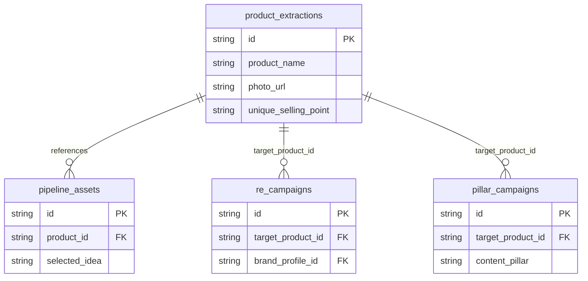

# **CETAK BIRU: DATABASE PRODUK & AI EXTRACTION ENGINE**

Database Produk adalah modul pusat (central repository) dalam ekosistem **MAKNA ENGINE** yang menyimpan data "DNA" produk jualan. Modul ini bertanggung jawab melakukan ekstraksi informasi produk secara otomatis dari berbagai sumber e-commerce, mengolah visual produk melalui AI pipeline, dan menyediakan data produk terstruktur bagi modul kampanye seperti *Pillar Campaigns*, *RE Campaigns*, *Multiplier Lab*, dan *Instant Factory*.

---

## **1. TEKNOLOGI & DEPENDENSI (TECH STACK)**

Modul Database Produk dibangun dengan kombinasi teknologi pemrosesan data, AI, dan manajemen file berikut:

| Layer | Komponen / Library | Peran & Fungsi |
|---|---|---|
| **Database** | SQLite & `better-sqlite3` | Penyimpanan lokal relasional yang cepat dan efisien. |
| **Scraper** | Playwright (`playwright-scraper.js`) | Automasi browser untuk mengambil HTML penuh halaman e-commerce (Shopee, Tokopedia, dll). |
| **AI Extraction** | Google Gemini `gemini-2.5-flash` | Mengekstrak teks deskripsi mentah menjadi terstruktur (USP, target audience, pain point, dll). |
| **Smart Cropping** | Gemini Spatial API & `sharp` | Mendeteksi koordinat objek produk tunggal paling menonjol dan memotong (*cropping*) gambar secara presisi. |
| **BG Removal** | `@imgly/background-removal-node` | Menghapus latar belakang foto asli secara lokal untuk menghasilkan foto produk bersih (*Clean Shot*). |
| **Visual Polish** | G-Labs API (model: `nano_banana_pro`) | Menghasilkan foto studio berkualitas tinggi (*Generative Polish*) menggunakan referensi foto bersih dan prompt visual. |
| **Portabilitas** | `adm-zip` & `archiver` | Mengemas payload JSON beserta seluruh aset gambar produk lokal ke dalam arsip ZIP untuk impor/ekspor. |
| **Cloud Integration**| Google Sheets API & Google Drive API | Mengekspor daftar produk ke Spreadsheet publik serta mengunggah aset gambar ke folder Drive secara otomatis. |

---

## **2. SKEMA DATABASE SQLITE (`lib/db.js`)**

### **2.1 Tabel Utama: `product_extractions`**
Tabel ini merepresentasikan data produk terstruktur versi komplit (termasuk kolom migrasi versi **v9.0** dan **v10.2**):

```sql
CREATE TABLE IF NOT EXISTS product_extractions (
  id TEXT PRIMARY KEY,
  input_source TEXT,                           -- URL sumber atau penanda 'Manual'
  is_url INTEGER DEFAULT 0,                    -- 1 jika dibuat via scraping URL, 0 jika manual
  product_name TEXT NOT NULL,                  -- Nama produk teridentifikasi
  product_description TEXT,                    -- Deskripsi produk hasil ringkasan AI
  unique_selling_point TEXT,                   -- Poin keunikan utama produk (JSON/Plain)
  target_audience TEXT,                        -- Target pasar/audiens produk
  pain_point_solved TEXT,                      -- Masalah audiens yang diselesaikan produk
  key_visuals_extracted TEXT,                  -- Elemen visual utama produk (JSON string)
  raw_response TEXT,                           -- Respons mentah dari LLM Gemini
  category TEXT,                               -- Kategori produk untuk penyaringan (Filter)
  tags TEXT,                                   -- Label pencarian tambahan
  photo_url TEXT,                              -- Path relatif foto produk yang saat ini AKTIF digunakan
  source_url TEXT,                             -- URL e-commerce asli
  affiliate_link TEXT,                         -- URL link afiliasi milik pengguna
  raw_description TEXT,                        -- Deskripsi lengkap asli sebelum diringkas
  scraped_image_url TEXT,                      -- URL CDN gambar produk asli untuk fallback download
  raw_photo_url TEXT,                          -- Path lokal gambar asli hasil unduhan scraper
  clean_photo_url TEXT,                        -- Path lokal gambar bersih (versi lawas)
  cleaned_photo_url TEXT,                      -- Path lokal gambar bersih setelah background removal
  generated_photo_url TEXT,                    -- Path lokal gambar studio hasil generasi AI G-Labs
  active_photo TEXT DEFAULT 'generated_photo_url', -- Indikator tab foto aktif: 'raw_photo_url' | 'cleaned_photo_url' | 'generated_photo_url'
  is_in_packaging INTEGER DEFAULT 0,           -- Apakah produk berada di dalam kemasan/kotak (1/0)
  packaging_type TEXT,                         -- Tipe kemasan (misal: botol, kardus, tube)
  t2i_prompt TEXT,                             -- Prompt teks-ke-gambar untuk AI Generative Polish
  i2v_action_prompt TEXT,                      -- Prompt aksi gambar-ke-video untuk engine animasi
  created_at DATETIME DEFAULT CURRENT_TIMESTAMP
);
```

### **2.2 Hubungan Relasional (Cascade & Referensi)**
Data produk terintegrasi dengan tabel-tabel kampanye dan aset di modul lain:



*   **`pipeline_assets`**: Memiliki *Foreign Key* `product_id` ke `product_extractions(id)`. Ketika produk dihapus, operasi manual `deleteProductExtraction(id)` akan otomatis menghapus aset pipeline yang terkait.
*   **`re_campaigns` & `pillar_campaigns`**: Memiliki referensi `target_product_id` dengan aturan `ON DELETE SET NULL`, menjaga integritas data kampanye jika produk dihapus dari database.

---

## **3. ARSITEKTUR & API ROUTING MAP**

Seluruh operasi database produk diakses melalui Next.js Route Handlers di dalam namespace `/api/v2/products`:

| Metode HTTP | Endpoint | Deskripsi Fungsi | Parameter Utama |
|---|---|---|---|
| **GET** | `/api/v2/products` | Mengambil semua produk dengan filter pencarian kata kunci dan kategori. | `search` (string), `category` (string) |
| **POST** | `/api/v2/products` | Menambahkan produk baru secara manual. | `JSON Payload` (Detail produk) |
| **GET** | `/api/v2/products/[id]` | Mengambil informasi detail dari satu produk spesifik. | `id` (path parameter) |
| **PUT** | `/api/v2/products/[id]` | Memperbarui kolom spesifik produk (misal: link afiliasi, foto aktif). | `id` (path), `JSON Payload` |
| **DELETE** | `/api/v2/products/[id]` | Menghapus produk dari database sekaligus menghapus aset pipeline terkait. | `id` (path parameter) |
| **GET** | `/api/v2/products/image` | Membaca berkas gambar lokal dari disk dan menyajikannya secara aman dengan bypass cache Statis. | `path` (relative path gambar) |
| **POST** | `/api/v2/products/image` | Mengunggah gambar produk baru dari klien dan menyimpannya sesuai sub-direktori tipe gambar. | `file` (form-data), `productId`, `type` ('raw'\|'cleaned'\|'generated') |
| **POST** | `/api/v2/products/scrape` | Mendaftarkan URL produk atau file CSV ke antrean background scraper. | `urls` (array/string), `csv_data`, `category`, `tags` |
| **POST** | `/api/v2/products/import` | Mengekstrak berkas ZIP yang diunggah, memvalidasi duplikasi, mengekstrak aset gambar ke disk, dan mengimpor baris ke DB. | `products_file` (form-data berkas ZIP) |
| **GET** | `/api/v2/products/export` | Mengumpulkan baris data terpilih dan membuat arsip ZIP berisi berkas JSON serta file aset gambar terkait. | `ids` (string dipisahkan koma, opsional) |
| **POST** | `/api/v2/products/export-sheets` | Mengunggah gambar produk terpilih ke Google Drive (folder `MAKNA Assets/_fotoproduk`) dan mencatat data produk ke Google Sheets baru. | `ids` (array id produk, opsional) |

---

## **4. ALUR SCRAPING & VISUAL PROCESSING WORKER FLOW**

Ketika pengguna mengirimkan URL e-commerce, **Scheduler V4** mengeksekusi job `product_scraper` melalui daemon di latar belakang (`processProductScraper`). Proses ini terdiri dari 5 fase utama:

```mermaid
flowchart TD
    Start([Mulai Job Scraper]) --> Scrape[1. Playwright Scraper HTML]
    Scrape --> CheckHTML{HTML Berhasil?}
    CheckHTML -- Ya --> GeminiExtract[2. Gemini AI Metadata Extraction]
    CheckHTML -- Gagal --> EndErr([Simpan Log Error])
    
    GeminiExtract --> DownloadImg[3. Unduh Gambar Asli & AI Spatial Crop]
    DownloadImg --> ImglyBG[4. AI Background Removal (Lokal)]
    ImglyBG --> GlabsPolish[5. G-Labs Generative Polish Studio Shot]
    GlabsPolish --> SaveDB[Simpan Data & File Path ke Database SQLite]
    SaveDB --> EndSuccess([Job Selesai - Ready])
```

### **Fase 1: Playwright Scraping & Normalisasi URL**
*   Sistem menolak duplikasi dengan menormalisasi URL (menghapus query parameter & hash).
*   Jika URL mengarah ke Shopee/Tokopedia, browser Playwright memuat halaman dan mengekstrak teks lengkap (`fullText`).

### **Fase 2: Gemini Metadata Extraction**
LLM Gemini (`gemini-2.5-flash`) menerima teks mentah e-commerce dan memformatnya menjadi skema JSON terstruktur:
*   Mengekstrak `product_name`, `usp`, `scraped_image_url`.
*   Menganalisis kondisi fisik: `is_in_packaging` (boolean) & `packaging_type`.
*   Menyusun prompt generasi visual: `t2i_prompt` dan prompt animasi `i2v_action_prompt`.

### **Fase 3: Smart Cropping (Gemini Spatial API + Sharp)**
*   Gambar asli dari CDN (`scraped_image_url`) diunduh ke `/public/uploads/products/raw/raw_[id].png`.
*   Gemini Spatial API menganalisis gambar untuk mendeteksi item produk utama dan mengembalikan koordinat pembatas (*Bounding Box* `[ymin, xmin, ymax, xmax]`).
*   Library `sharp` melakukan pemotongan terfokus berdasarkan koordinat tersebut untuk membuang elemen promosi, teks diskon, atau latar belakang yang terlalu lebar.

### **Fase 4: Lokal AI Background Removal (Imgly)**
*   Engine `@imgly/background-removal-node` memproses file mentah terpangkas secara lokal tanpa internet.
*   Latar belakang dihapus sepenuhnya menjadi transparan untuk menghasilkan foto produk bersih (*Clean Shot*) yang disimpan di `/public/uploads/products/clean/clean_[id].jpg` (`cleaned_photo_url`).

### **Fase 5: Generative Polish (G-Labs AI & nano_banana_pro)**
*   Foto bersih berbasis base64 dikirim ke API G-Labs sebagai gambar referensi (*Reference Image*).
*   G-Labs menghasilkan gambar baru berskala `9:16` menggunakan prompt `t2i_prompt` dan model `nano_banana_pro`.
*   Hasil render studio diunduh dan disimpan di `/public/uploads/products/generated/generated_[id].jpg` (`generated_photo_url`).

---

## **5. ALUR KERJA ANTARMUKA PENGGUNA (UI WORKFLOW)**

Halaman Database Produk (`app/products/page.js`) menyediakan visualisasi komprehensif bagi pengguna untuk mengelola data:

```
┌────────────────────────────────────────────────────────────────────────┐
│  DATABASE PRODUK                                    [Scrape] [Import]  │
│  [ Cari Produk... ]  [ Filter Kategori  v]          [Tambah Manual]    │
│                                                                        │
│  ┌──────────────────────────────────────────────────────────────────┐  │
│  │  Foto Produk (Tabs)          Detail Produk                       │  │
│  │  [Raw] | *[Clean]* | [Studio]  Nama: Headphone Bluetooth X        │  │
│  │  ┌─────────────────────┐     Kategori: Elektronik                │  │
│  │  │                     │     USP: Audio BASS; Baterai 40 jam     │  │
│  │  │    [Gambar Bersih   │     Target: Pelajar & Pekerja           │  │
│  │  │     Hasil Imgly]    │                                         │  │
│  │  │                     │     Link Afiliasi: [ http://shope.ee..] │  │
│  │  └─────────────────────┘     [Edit] [Hapus] [Create Campaign]    │  │
│  └──────────────────────────────────────────────────────────────────┘  │
└────────────────────────────────────────────────────────────────────────┘
```

### **A. Pengelolaan Visual Fleksibel & Informasi Kemasan (Photo Tabs & Badges)**
Setiap kartu produk menampilkan pratinjau gambar tiga-fase:
1.  **Raw**: Gambar asli produk hasil pengikisan.
2.  **Clean**: Gambar transparan pasca-penghapusan background.
3.  **Studio**: Gambar artistik hasil reka cipta AI G-Labs.
*Pengguna dapat mengganti tab visual aktif dengan mengklik tombol "Set Active" untuk memilih visual mana yang akan diteruskan ke generator video. Pengguna juga dapat mengunggah file gambar baru secara manual untuk menimpa foto di tab mana pun.*

**Lencana Detail Kemasan (Packaging Badges)**:
Setiap kartu produk di UI secara dinamis menampilkan status kemasan produk di bawah nama/tag produk:
*   *Lencana Tipe Kemasan*: Menampilkan tipe wadah fisik produk (misal: `📦 Jar Plastik`, `📦 Botol Kaca`, atau `📦 Tanpa Kemasan`).
*   *Lencana Status Kemasan*: Lencana berwarna hijau/merah yang menunjukkan apakah produk berada di dalam kemasan rapat (`Di dalam Wadah`) atau sudah terbuka/siap pakai (`Tembus Pandang/Terbuka`).

### **B. Input Manual, Pengeditan & Scraping Massal**
*   **Tambah Manual & Pengeditan (Edit Modal)**: Form lengkap untuk membuat produk baru atau mengedit detail produk yang sudah ada (Nama, Kategori, Deskripsi, USP, Kategori, Tipe Kemasan, Status Kemasan, serta referensi Prompt T2I/I2V).
    *   *Kestabilan Prompting*: Modifikasi data secara manual oleh pengguna bertindak sebagai "katup pengaman" (*safety net*). Jika AI prapemrosesan keliru mendeteksi tipe kemasan saat scraping (misal: toples kaca terbaca pouch), pengguna dapat langsung mengoreksinya di UI, dan sistem prompting secara instan menggunakan data yang benar pada runs berikutnya.
*   **Scraping Masukan Baru**:
    *   *Mode URL*: Pengguna memasukkan satu atau beberapa URL e-commerce (dipisahkan baris baru).
    *   *Mode CSV*: Pengguna mengunggah file `.csv` berisi daftar URL produk dan link afiliasi terkait untuk pemrosesan batch instan hingga 50 produk.

### **C. Pencarian & Filter**
*   Pencarian teks instan mencakup kolom **Nama Produk**, **USP**, dan **Tags**.
*   Menu dropdown dinamis memfilter daftar produk berdasarkan nilai kolom `category` yang unik.

---

## **6. MEKANISME IMPOR & EKSPOR (PORTABILITAS)**

Untuk mendukung portabilitas antar instansi server MAKNA, dikembangkan dua metode ekspor/impor:

### **6.1 Ekspor/Impor File ZIP Lokal**
*   **Ekspor (.zip)**:
    *   Sistem membuat *ZipArchive* dengan kompresi tingkat 9.
    *   Menyimpan meta data terenkripsi di `products_payload.json` yang berisi array objek baris database.
    *   Menyalin semua gambar lokal yang terikat dengan produk (`photo_url`, `raw_photo_url`, dll.) ke dalam folder `assets/` di dalam ZIP.
*   **Impor (.zip)**:
    *   Pengguna mengunggah file ZIP.
    *   Sistem mengekstrak `products_payload.json`, membaca daftar produk, dan memeriksa duplikasi ID atau URL.
    *   File gambar di dalam folder `assets/` diekstrak kembali ke struktur folder publik `/public/uploads/products/` pada server baru sebelum baris data disimpan ke database SQLite.

### **6.2 Ekspor Cloud (Google Drive & Google Sheets)**
Operasi ini membantu pengguna membuat dokumen katalog penjualan secara kolaboratif:
1.  **Koneksi Akun**: Memverifikasi otorisasi akun Google via token yang tersimpan di setelan sistem.
2.  **Google Drive Sync**:
    *   Mencari atau membuat folder root bernama `MAKNA Assets`.
    *   Membuat sub-folder khusus foto produk (berdasarkan setelan `drive_product_photo_folder`, default: `_fotoproduk`).
    *   Mengunggah file gambar aktif dari produk terpilih ke Google Drive dan mengatur izin akses file menjadi *public reader* (siapa saja yang memiliki link dapat melihat gambar).
3.  **Google Sheets Creation**:
    *   Membuat spreadsheet baru berjudul `MAKNA Product Export - [Tanggal Hari Ini]`.
    *   Membuat baris header: `Nama Produk`, `USP`, `URL Affiliate`, `URL Produk`, `URL Gambar Produk` (diisi dengan link Google Drive hasil unggahan).
    *   Mengatur hak akses Spreadsheet menjadi publik dan mengembalikan tautan url spreadsheet ke pengguna.

---

## **7. INTEGRASI DATA DENGAN ENGINE KAMPANYE**

Data terstruktur dari `product_extractions` bertindak sebagai pustaka aset penjualan primer yang secara langsung disuntikkan ke modul kampanye lain dengan protokol keamanan visual berikut:

*   **Penyusunan Storyboard (Scripting)**: AI Generator membaca kolom `unique_selling_point` dan `pain_point_solved` dari database produk untuk merumuskan hook naskah promosi yang tajam.
*   **Video Bridging & Hierarki Prioritas Gambar Rujukan**: Pada kampanye tipe *Pillar* atau *RE*, sistem memproses gambar produk melalui prioritas seleksi gambar (*fallback hierarchy*) yang ketat sebelum dikirim ke G-Labs dan Nextcloud/Drive:
    1.  **G-Labs Studio Shot** (`generated_photo_url`): Foto hasil render studio berkualitas tinggi.
    2.  **Clean Shot** (`cleaned_photo_url` / `clean_photo_url`): Foto transparan pasca-BG removal lokal (fallback terbaik untuk menghindari visual berantakan).
    3.  **Active Pointer** (`photo_url`): Pointer foto produk yang aktif di database.
    4.  **Raw Shot** (`raw_photo_url`): Gambar mentah asli e-commerce (fallback terakhir).
*   **Visual Storyboard & Mandat Kemasan (Geometry Lock)**: Prompt gambar `t2i_prompt` dan `i2v_action_prompt` yang diekstraksi ke database produk langsung digunakan oleh modul kampanye untuk merender klip video produk. 
    *   *Product Geometry Mandate*: Sistem secara otomatis meneruskan parameter `packaging_type` ("Jar Plastik", "Botol Kaca", dsb.) dan status `is_in_packaging` ke dalam instruksi visual LLM (Gemini) di klip jembatan (*bridge scene*). Hal ini mengunci geometri visual (misal: tetap digambarkan sebagai toples/jar) dan mencegah AI melakukan halusinasi bentuk kemasan (misal: menggambarkannya sebagai pouch/kantong).
