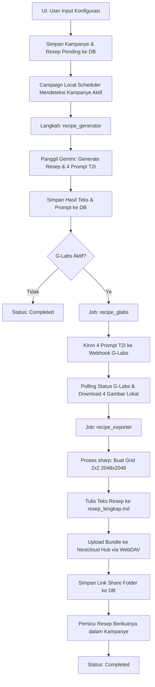

# **CETAK BIRU SISTEM: RECIPE LABS (TEXT & IMAGE CONTENT)**

Dokumen ini mendefinisikan arsitektur dan spesifikasi teknis untuk fitur **Recipe Labs**. Fitur ini dirancang untuk menghasilkan konten resep (Teks Markdown + Gambar Instruksional + Grid Collage) secara otomatis menggunakan AI (Gemini & G-Labs) dan mengekspornya ke Nextcloud Hub untuk kebutuhan tim media sosial.

---

## **1. ALUR KERJA SISTEM (WORKFLOW ARCHITECTURE)**

Modul berjalan secara sekuensial melalui **Campaign Local Scheduler** (`lib/campaign-scheduler.js`) secara *in-memory* untuk menghindari pemblokiran antarmuka pengguna (UI) saat memproses permintaan AI dalam jumlah banyak. Proses berjalan di latar belakang setiap 15 detik secara independen tanpa membebani tabel antrean database.

Sistem mendukung dua mode utama:
1. **Mode Penuh (Teks & Gambar)**: Gemini membuat resep + prompt gambar -> G-Labs me-render 4 gambar -> Node.js Sharp menggabungkan gambar menjadi Grid Collage -> Ekspor seluruh berkas ke Nextcloud.
2. **Mode Teks & Prompt Only**: Gemini membuat resep + prompt gambar -> Proses selesai tanpa generasi gambar atau ekspor Nextcloud.

Berikut adalah diagram alir proses sekuensial (apabila G-Labs diaktifkan):



---

## **2. SKEMA DATABASE SQLITE (lib/db.js)**

Penyimpanan data kampanye dan detail resep menggunakan dua tabel utama di SQLite:

### **Tabel: `recipe_campaigns`**
Menyimpan informasi utama kampanye pembuatan resep.
```sql
CREATE TABLE IF NOT EXISTS recipe_campaigns (
  id TEXT PRIMARY KEY,                       -- Format: rcamp_[timestamp]_[hash]
  category TEXT NOT NULL,                    -- Makanan / Minuman / Kue / Dessert / Jajanan Pasar / Custom Input
  custom_category TEXT,                      -- Diisi jika category bernilai 'Custom Input'
  visual_style TEXT DEFAULT 'Food Porn',     -- Food Porn / Macrophotography / Cinematic Studio / Rustic Aesthetic
  target_recipe_count INTEGER DEFAULT 1,     -- Target jumlah resep yang digenerate (1 s.d. 20)
  images_per_recipe INTEGER DEFAULT 4,       -- Jumlah gambar per resep (default: 4)
  status TEXT DEFAULT 'processing',          -- processing / completed / failed
  nextcloud_folder_url TEXT,                 -- Tautan folder publik di Nextcloud
  created_at DATETIME DEFAULT CURRENT_TIMESTAMP,
  enable_glabs INTEGER DEFAULT 1,            -- Flag status G-Labs (1 = Aktif, 0 = Nonaktif)
  nextcloud_parent_folder TEXT DEFAULT 'MAKNA_Recipes', -- Folder utama di Nextcloud Hub
  post_to_facebook INTEGER DEFAULT 0,        -- Flag posting otomatis ke Facebook (1 = Aktif, 0 = Nonaktif)
  campaign_type TEXT DEFAULT 'static',       -- static / video
  brand_profile_id TEXT REFERENCES brand_profiles(id) ON DELETE SET NULL, -- ID Profil Brand
  spreadsheet_id TEXT,                       -- ID Spreadsheet terkait
  config_json TEXT,                          -- Konfigurasi tambahan JSON
  local_scheduler INTEGER DEFAULT 0,         -- Flag status skeduler lokal (1 = Aktif, 0 = Nonaktif)
  target_image_count INTEGER DEFAULT 4,      -- Jumlah gambar target per resep
  selected_layout_id TEXT DEFAULT '4_editorial_split', -- ID Preset layout grid kolase
  grid_gap_size INTEGER DEFAULT 12,          -- Tebal gap gambar grid (px)
  grid_border_radius INTEGER DEFAULT 16,     -- Border radius gambar grid (px)
  grid_outer_padding INTEGER DEFAULT 16,     -- Padding luar kanvas grid (px)
  grid_bg_color TEXT DEFAULT '#0d0d12',      -- Warna latar belakang kanvas grid
  source_deconstruct_asset_id TEXT REFERENCES re_deconstructed_assets(id) ON DELETE SET NULL -- [RENCANA] ID Aset Dekonstruksi asal
);
```

### **Tabel: `recipe_items`**
Menyimpan detail konten dari tiap resep dalam suatu kampanye.
```sql
CREATE TABLE IF NOT EXISTS recipe_items (
  id TEXT PRIMARY KEY,                       -- Format: rcitem_[campaign_id]_[index]
  campaign_id TEXT REFERENCES recipe_campaigns(id) ON DELETE CASCADE,
  recipe_title TEXT,                         -- Judul Resep dari Gemini
  recipe_markdown_text TEXT,                 -- Konten Markdown resep lengkap
  t2i_prompts_json TEXT,                     -- Objek JSON berisi prompt gambar AI (English)
  img_1_raw_path TEXT,                       -- Path lokal gambar 1 (Bahan Mentah)
  img_2_process_path TEXT,                   -- Path lokal gambar 2 (Proses)
  img_3_result_path TEXT,                    -- Path lokal gambar 3 (Hasil Jadi)
  img_4_plated_path TEXT,                    -- Path lokal gambar 4 (Sajian Plated)
  img_grid_path TEXT,                        -- Path lokal gambar Grid Collage
  status TEXT DEFAULT 'pending_gemini',      -- Status detail per item
  created_at DATETIME DEFAULT CURRENT_TIMESTAMP,
  fb_post_id TEXT,                           -- ID Postingan Draft Facebook
  fb_post_status TEXT,                       -- Status posting draft
  video_storyboard_json TEXT,                -- Storyboard JSON jika campaign_type = 'video'
  video_dna_json TEXT,                       -- DNA video jika campaign_type = 'video'
  seo_data_json TEXT,                        -- SEO metadata & Facebook copy
  img_5_path TEXT,                           -- Path lokal gambar 5
  img_6_path TEXT                            -- Path lokal gambar 6
);
```
*Status detail item:* `pending_gemini` -> `generating_text` -> `pending_glabs` -> `generating_images` -> `pending_export` -> `exporting` -> `completed` (atau `failed`).

---

## **3. GENERASI TEKS & PROMPT: GEMINI AI ENGINE (lib/scheduler-processors.js)**

Generasi teks menggunakan model **`gemini-2.5-flash`** (dengan fallback ke **`gemini-flash-latest`**). AI diinstruksikan untuk bertindak sebagai Koki Profesional dan Ahli Fotografi Makanan.

### **System Prompt Template:**
```text
Anda adalah Koki Profesional dan Ahli Fotografi Makanan.
Tugas Anda adalah membuat 1 resep makanan/minuman yang sangat lezat, menggugah selera, dan teruji untuk kategori: "{category}".

PENTING GAYA VISUAL: Gunakan karakteristik fotografi "{visualStyle}" secara konsisten pada setiap prompt gambar.

Beri jawaban HANYA dalam format JSON valid dengan struktur berikut:
{
  "title": "Nama Resep Legendaris",
  "content_md": "# Nama Resep Legendaris\n\n## Bahan-bahan\n- Bahan 1\n- Bahan 2\n\n## Cara Membuat\n1. Langkah pertama...\n2. Langkah kedua...",
  "prompts": {
    "image_1": "T2I Prompt (English): High quality {visualStyle} photography of raw ingredients for [Recipe Name] neatly arranged on a rustic tabletop, top-down view, natural ambient lighting, soft focus...",
    "image_2": "T2I Prompt (English): [MANDATORY GUARDRAIL: NO HUMANS, NO HANDS, NO BODY PARTS]. Close up shot in {visualStyle} style of cooking process, e.g. bubbling pot or food sizzle on pan, focusing purely on food physics and cookware...",
    "image_3": "T2I Prompt (English): Studio food photography in {visualStyle} style of freshly cooked [Recipe Name] resting in cooking tray, steam rising, rich appetizing texture...",
    "image_4": "T2I Prompt (English): Masterpiece plating in {visualStyle} style, [Recipe Name] beautifully served on an elegant ceramic dish with garnished topping, gourmet restaurant presentation..."
  }
}
```

### **AI Guardrails & Prompt Engineering:**
- **image_1 (Raw)**: Menghasilkan prompt bertema bahan mentah yang ditata rapi secara estetis.
- **image_2 (Process)**: Aturan ketat `[MANDATORY GUARDRAIL: NO HUMANS, NO HANDS, NO BODY PARTS]`. Ini mencegah generator gambar G-Labs menampilkan bagian tubuh manusia (seperti tangan), menjaga fokus visual murni pada peralatan dan proses fisika makanan.
- **image_3 (Finished)**: Menampilkan hidangan setelah matang langsung di atas loyang/wajan dengan uap mengepul untuk efek segar.
- **image_4 (Plated)**: Menampilkan hasil akhir dengan tata saji profesional ala restoran berkelas (plating elegan & garnish).

---

## **4. GENERASI GAMBAR AI: G-LABS ENGINE (lib/scheduler-processors.js)**

Jika opsi G-Labs diaktifkan (`enable_glabs` = 1):
1. Sistem mengirim 4 prompt gambar secara bergantian (sekuensial) ke API G-Labs.
2. Model generator gambar yang digunakan: **`nano_banana_pro`**.
3. Dimensi/Aspect Ratio: **`1:1`** (Square).
4. Mekanisme Polling: Sistem melakukan polling status tugas di G-Labs sebanyak maksimal 40 kali dengan jeda 3 detik per polling.
5. Gambar yang berhasil di-render diunduh dan disimpan ke direktori lokal:
   `public/uploads/recipes/[campaign_id]/[recipe_id]/image_[1-4].jpg`

---

## **5. PEMROSESAN COLLAGE GRID LOKAL (lib/recipe-grid-helper.js)**

Setelah 4 gambar terunduh, sistem menggunakan pustaka **`sharp`** untuk merakit kolase 2x2.
1. Ukuran kanvas akhir: **`2048 x 2048 piksel`**.
2. Setiap gambar input disesuaikan ukurannya secara seragam menjadi **`1024 x 1024 piksel`** menggunakan mode `fit: 'cover'` untuk memastikan keselarasan ukuran.
3. Format output: **JPEG** dengan tingkat kualitas **92%**.
4. Tata letak kolase grid:
   - Kiri Atas: `image_1` (Raw Ingredients)
   - Kanan Atas: `image_2` (Cooking Process)
   - Kiri Bawah: `image_3` (Finished Result)
   - Kanan Bawah: `image_4` (Plated & Served)

---

## **6. EKSPOR KE NEXTCLOUD HUB (lib/nextcloud-helper.js)**

Langkah terakhir untuk setiap item resep adalah memaketkan seluruh berkas dan mengunggahnya ke Nextcloud Hub via WebDAV:

### **Struktur Folder Nextcloud:**
```text
📁 /[nextcloud_parent_folder]
 └── 📁 [Clean_Category]_[Clean_Recipe_Title]
      ├── 📄 resep_lengkap.md       (Dokumen teks resep lengkap)
      ├── 🖼️ 01_raw_ingredients.jpg (Gambar Bahan Mentah)
      ├── 🖼️ 02_processing.jpg      (Gambar Proses Memasak)
      ├── 🖼️ 03_finished.jpg        (Gambar Hasil Jadi)
      ├── 🖼️ 04_plated_served.jpg   (Gambar Sajian Plated)
      └── 🖼️ 05_GRID_POSTER.jpg     (Gambar Kolase Poster 2x2)
```
Tautan publik (*share link*) folder Nextcloud tersebut diambil dari respons unggah file poster (`05_GRID_POSTER.jpg`) dan disimpan ke kolom `nextcloud_folder_url` pada tabel `recipe_campaigns` sebagai referensi akses cepat bagi tim media sosial.

---

## **7. DRAFT POSTING FACEBOOK PAGE (lib/facebook-helper.js)**

Jika opsi Posting Facebook diaktifkan (`post_to_facebook` = 1) saat pembuatan kampanye:
1. **Pemicu Otomatis (Scheduler)**:
   - Jika G-Labs **tidak aktif**, segera setelah Gemini berhasil menulis resep, scheduler memanggil helper Facebook untuk mengirim draf teks.
   - Jika G-Labs **aktif**, posting draf dikerjakan sebagai langkah terakhir di dalam `recipe_exporter` setelah seluruh gambar selesai diunggah ke Nextcloud.
2. **Post Format & Media**:
   - Jika folder Nextcloud tersedia, URL gambar kolase di resolusi penuh (`nextcloud_folder_url/download`) dikirim sebagai parameter `mediaUrl` untuk membuat postingan bergambar (`mediaType = 'image'`).
   - Teks caption secara otomatis diformat oleh `formatFacebookRecipeCaption()` yang memperkaya resep Markdown asli dengan baris judul dekoratif, emoji bahan makanan, nomor instruksi, CTA acak, dan hashtag relevan.
3. **Pemicu Manual (API Route)**:
   - Pengguna juga dapat mengirim draf resep tertentu ke Facebook secara manual melalui halaman detail kampanye di UI, yang memicu API route handler `POST /api/recipe-labs/items/[id]/post-fb`.

---

## **8. ANTARMUKA PENGGUNA (app/recipe-labs/page.js)**

UI Recipe Labs menyediakan:
1. **Status Skeduler Recipe Labs**: Tombol toggle "START/STOP SKEDULER" global dan badge status ("SKEDULER MATI" / "SKEDULER AKTIF") untuk menyalakan/mematikan pemrosesan latar belakang kampanye resep secara manual.
2. **SYSTEM POLLER LOGGER**: Panel log terminal dinamis yang memantau proses asinkronus Recipe Labs langsung dari berkas `recipe_logs.txt` (termasuk tombol refresh manual).
3. **Statistik Ringkas**: Menampilkan total kampanye, jumlah kampanye yang sedang diproses, dan kampanye yang selesai.
4. **Form Pembuatan Kampanye**: Input kategori (Makanan, Minuman, Kue, Dessert, Jajanan Pasar, Custom Input), visual style (Food Porn, Macrophotography, Cinematic Studio, Rustic Aesthetic), nama parent folder Nextcloud, jumlah resep (1-10 di UI), toggle switch Facebook Post, dan toggle switch G-Labs.
5. **Riwayat Kampanye**: Tabel berisi status progress item selesai, tipe kampanye, status global, dan opsi hapus kampanye.
6. **Detail Kampanye**: Panel interaktif yang memuat tautan folder Nextcloud, status posting Facebook draft, status pipeline per resep (`Gemini Resep` -> `G-Labs Gambar` -> `Grid & NC Export`), pratinjau gambar Grid Poster, pratinjau teks resep Markdown, serta daftar lengkap 4 prompt gambar AI beserta tombol salin instan.
