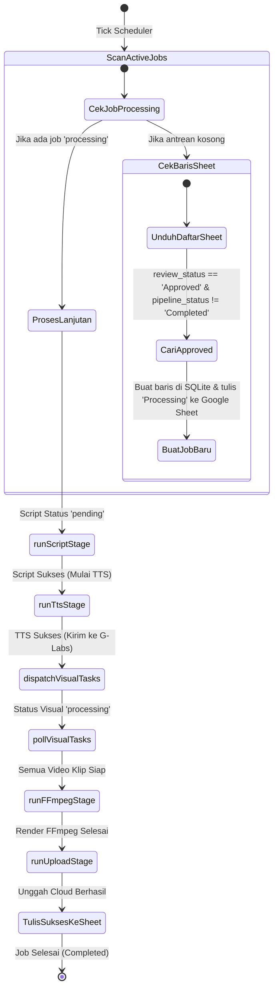

# **CETAK BIRU: GOOGLE SHEETS AUTOPILOT CAMPAIGN SYSTEM**

Modul **Sheets Autopilot** adalah mesin automasi produksi massal berskala perusahaan dalam **MAKNA ENGINE**. Modul ini dirancang untuk memantau (*polling*) Google Spreadsheet secara dinamis, mendeteksi baris kampanye kreatif yang telah disetujui (*Approved*), mengekstrak DNA produk pendukung (*Just-In-Time Sourcing*), dan memicu pipa AI produksi video end-to-end tanpa intervensi manusia, lalu menuliskan kembali hasil rendernya langsung ke baris lembar kerja terkait.

---

## **1. TEKNOLOGI & DEPENDENSI (TECH STACK)**

Modul Sheets Autopilot bekerja dengan menghubungkan API Google Cloud, penyimpanan awan, AI engine, serta pemroses audio-video lokal:

| Layer | Komponen / Library | Peran & Fungsi |
|---|---|---|
| **Google Sheets API** | `@googleapis/sheets` | Membaca status persetujuan kreatif (*Approved*) dan menulis kembali URL video/markdown hasil produksi. |
| **Google Drive API** | `@googleapis/drive` | Mengunggah hasil render video final dan naskah markdown ke folder Google Drive kolaboratif. |
| **Nextcloud WebDAV** | `webdav` (`nextcloud-helper.js`) | Penyimpanan awan alternatif untuk mengunggah file video, aset, dan folder per batch secara otomatis. |
| **Background Runner** | Campaign Local Scheduler | Mesin poller berbasis *interval tick* (setiap 15 detik) yang memicu sinkronisasi latar belakang. |
| **AI Scripting** | Google Gemini `gemini-2.5-flash` | Membuat storyboard kreatif lengkap berdasarkan topik pilar, video referensi kompetitor, atau DNA produk. |
| **AI JIT Sourcing** | Playwright + Gemini | Melakukan pengikisan instan (*Just-in-Time*) ke halaman toko produk e-commerce jika data produk belum ada di DB lokal. |
| **TTS Generation** | MiniMax API V2 & Gemini TTS | Menghasilkan berkas audio sulih suara (*voiceover*) berkualitas studio berdasarkan naskah hasil generasi LLM. |
| **Visual Animation** | G-Labs Webhook Client | Memicu pembuatan gambar awal (T2I) dan animasi video (I2V/T2V) secara sekuensial. |
| **Audio-Video Muxing**| FFmpeg (`video-studio-processor.js`) | Menerima daftar video klip, file audio sulih suara, musik latar (BGM), dan SFX, lalu menggabungkannya (*muxing*) menjadi video utuh. |

---

## **2. SKEMA DATABASE SQLITE (`lib/db.js`)**

### **2.1 Tabel Kampanye Autopilot: `sheets_campaigns`**
Menyimpan konfigurasi dasar kampanye autopilot yang memetakan spreadsheet dan preferensi visual-audio:

```sql
CREATE TABLE IF NOT EXISTS sheets_campaigns (
  id TEXT PRIMARY KEY,
  campaign_name TEXT NOT NULL,
  campaign_type TEXT NOT NULL,                   -- Tipe kampanye: 'RE' (Reverse-Engineer), 'OPC' (Organic Pillar Content), 'IFC' (Instant Factory)
  target_language TEXT DEFAULT 'id-ID',          -- Bahasa narasi/script target
  spreadsheet_id TEXT NOT NULL,                  -- ID Google Spreadsheet dari URL kerja
  gdrive_folder_id TEXT,                         -- ID folder Google Drive target untuk hasil video
  aspect_ratio TEXT DEFAULT '9:16',              -- Skala aspek video (9:16 atau 16:9)
  target_ai TEXT DEFAULT 'Google Veo (8s)',      -- Engine model target
  video_model TEXT DEFAULT 'veo_31_lite',        -- Model video G-Labs yang digunakan
  visual_mode TEXT DEFAULT 'hybrid_lock',        -- Mode visual: 'pure_t2v', 'hybrid_lock', dll.
  words_per_clip TEXT DEFAULT '17-19 kata',      -- Jumlah kata sulih suara per klip
  face_visibility TEXT DEFAULT 'Faceless',       -- Pengaturan wajah AI (Faceless/dengan wajah)
  custom_instruction TEXT DEFAULT '',            -- Instruksi kustom tambahan dari pengguna
  brand_profile_id TEXT,                         -- FK ke tabel brand DNA profile (brand_profiles)
  visual_overrides_json TEXT,                    -- Konfigurasi visual overrides (JSON string)
  is_bridging_active INTEGER DEFAULT 0,          -- Aktivasi penyisipan klip jualan produk (1/0)
  target_clips_count INTEGER DEFAULT 4,          -- Jumlah total klip video yang diproduksi
  bridge_at_clip INTEGER DEFAULT 2,              -- Posisi klip di mana bridging produk dimulai
  bridge_duration_clips INTEGER DEFAULT 1,       -- Durasi klip bridging jualan produk
  bridging_mode TEXT DEFAULT 'select_existing',  -- Mode bridging: 'select_existing', dll.
  target_product_id TEXT,                        -- FK ke database produk lokal (product_extractions)
  promotion_style TEXT DEFAULT 'Softselling',    -- Gaya bahasa promosi (Softselling/Hardselling)
  enable_tts INTEGER DEFAULT 0,                  -- Apakah TTS diaktifkan (1/0)
  enable_glabs INTEGER DEFAULT 0,                -- Apakah visual generator G-Labs diaktifkan (1/0)
  enable_ffmpeg INTEGER DEFAULT 0,               -- Apakah penggabungan video FFmpeg diaktifkan (1/0)
  enable_social_post INTEGER DEFAULT 0,          -- Apakah pos ke media sosial diaktifkan (1/0)
  voice_provider TEXT DEFAULT 'minimax',         -- Penyedia TTS ('minimax' atau 'gemini')
  voice_persona TEXT DEFAULT 'Professional Anchor', -- Karakter suara TTS
  voice_speed REAL DEFAULT 1.0,                  -- Kecepatan suara TTS
  voice_volume REAL DEFAULT 1.0,                 -- Volume suara TTS
  ffmpeg_sync_option TEXT DEFAULT 'smart_sync',  -- Sinkronisasi audio-video FFmpeg
  ffmpeg_video_scale REAL DEFAULT 1.0,           -- Skala resolusi render video
  ffmpeg_sfx_volume REAL DEFAULT 0.0,            -- Volume efek suara (SFX)
  ffmpeg_bgm_volume REAL DEFAULT 0.15,           -- Volume musik latar belakang (BGM)
  tts_model_quality TEXT DEFAULT 'speech-2.8-turbo', -- Kualitas model audio TTS
  status TEXT DEFAULT 'active',                  -- Status kampanye: 'active', 'paused', 'draft'
  visual_style TEXT DEFAULT 'Cinematic',         -- Gaya estetik visual
  created_at DATETIME DEFAULT CURRENT_TIMESTAMP,
  FOREIGN KEY(brand_profile_id) REFERENCES brand_profiles(id) ON DELETE SET NULL,
  FOREIGN KEY(target_product_id) REFERENCES product_extractions(id) ON DELETE SET NULL
);
```

### **2.2 Tabel Detail Job Latar Belakang: `sheets_jobs`**
Menyimpan riwayat dan status pengerjaan setiap baris spreadsheet:

```sql
CREATE TABLE IF NOT EXISTS sheets_jobs (
  id TEXT PRIMARY KEY,
  campaign_id TEXT NOT NULL,                     -- Referensi ke sheets_campaigns(id)
  batch_id TEXT NOT NULL,                        -- ID pengelompokan batch otomatis (contoh: RE_20260626_002)
  row_index INTEGER NOT NULL,                    -- Indeks nomor baris di dalam Google Sheet
  url_or_topic TEXT NOT NULL,                    -- Data input (URL kompetitor atau topik pilar)
  status TEXT DEFAULT 'pending',                 -- Status job utama: 'pending', 'processing', 'completed', 'failed'
  storyboard TEXT,                               -- JSON string hasil naskah storyboard AI
  voiceover TEXT,                                -- JSON string naskah sulih suara per klip
  prompts_json TEXT,                             -- Aset prompt T2I, I2V, dan T2V (JSON)
  captions_json TEXT,                            -- Caption media sosial hasil generate LLM (JSON)
  local_video_path TEXT,                         -- Path video final gabungan di server lokal
  local_audio_path TEXT,                         -- Path audio sulih suara final di server lokal
  gdrive_folder_url TEXT,                        -- Tautan folder Google Drive tempat file diunggah
  retry_count INTEGER DEFAULT 0,                 -- Penghitung jumlah kegagalan (Maksimal 3)
  script_status TEXT DEFAULT 'pending',          -- Status pengerjaan script: 'pending', 'completed'
  tts_status TEXT DEFAULT 'pending',             -- Status pengerjaan TTS: 'pending', 'completed'
  visual_status TEXT DEFAULT 'pending',          -- Status pengerjaan G-Labs: 'pending', 'processing', 'completed', 'failed', 'skipped'
  ffmpeg_status TEXT DEFAULT 'pending',          -- Status pengerjaan FFmpeg: 'pending', 'completed', 'failed', 'skipped'
  upload_status TEXT DEFAULT 'pending',          -- Status pengunggahan cloud: 'pending', 'completed', 'failed', 'skipped'
  visual_clip_paths TEXT,                        -- JSON string daftar klip video mentah hasil unduhan G-Labs
  created_at DATETIME DEFAULT CURRENT_TIMESTAMP,
  FOREIGN KEY(campaign_id) REFERENCES sheets_campaigns(id) ON DELETE CASCADE
);
```

---

## **3. ALUR KERJA PEMROSESAN LATAR BELAKANG (SYNC WORKER STATE MACHINE)**

Scheduler memanggil `runSyncWorker()` secara berkala. Proses ini berjalan dengan skema **State Machine** sekuensial:



### **Fase 1: Just-in-Time (JIT) Product Sourcing & Storyboard (`runScriptStage`)**
*   Sistem memeriksa apakah kampanye membutuhkan *Product Bridging*.
*   Jika ya, sistem mengecek kolom `Link Product` pada Google Sheet. Jika produk belum terdaftar di database lokal, Playwright Scraper memicu pengikisan instan untuk mengekstrak nama produk dan USP menggunakan Gemini, lalu menyimpannya ke `product_extractions`.
*   **Geometri & Penguncian Wadah Produk (Product Geometry Lock)**: Ketika JIT Sourcing aktif, sistem secara otomatis mengekstrak detail fisik produk (`packaging_type` seperti *Jar Plastik* / *plastic jar* dan status `is_in_packaging` dari database) lalu menyisipkannya sebagai input instruksi di prompt storyboard. LLM (Gemini) diikat dengan **Product Geometry Mandate** ketat untuk menyelaraskan parameter `[Product Geometry]` pada klip jembatan (Clip 2) agar sesuai tipe wadah database, mencegah halusinasi bentuk (seperti membuat pouch/sachet padahal produk aslinya toples/jar).
*   Gemini menerima prompt kreatif khusus sesuai tipe kampanye (`RE`, `OPC`, atau `IFC`) dan menyusun naskah per klip dalam format JSON (storyboard, deskripsi visual, naskah narasi).

### **Fase 2: Audio sulih suara (`runTtsStage`)**
*   Naskah narasi per klip dikirim ke MiniMax atau Gemini TTS sesuai konfigurasi suara kampanye.
*   Berkas audio individual tiap klip digenerate, diunduh, dan digabungkan menjadi file audio utuh (`local_audio_path`).

### **Fase 3: Produksi Klip Visual (`dispatchVisualTasks` & `pollVisualTasks`)**
*   Prompt visual dikirim ke antrean G-Labs Webhook.
*   **Hierarki Prioritas Gambar Rujukan (Reference Image Fallback)**: Sebelum mengirimkan gambar rujukan ke G-Labs visual generator, sistem mengecek ketersediaan gambar produk dengan prioritas urutan:
    1.  `generated_photo_url` (Foto hasil studio G-Labs).
    2.  `cleaned_photo_url` / `clean_photo_url` (Foto transparan pasca-BG removal lokal).
    3.  `photo_url` (Pointer foto aktif).
    4.  `raw_photo_url` (Foto mentah asli e-commerce/fallback terakhir).
*   **Konsistensi Visual VSO (Wardrobe, Lighting, & Latar)**:
    *   *Pakaian & Cahaya*: Modul `lib/prompts.js` memaksa LLM menyertakan parameter pakaian `(Wardrobe: [Wardrobe Lock])` dan pencahayaan `(Lighting: [Lighting Mood])` yang seragam tidak hanya pada adegan jembatan (T2I), melainkan juga pada klip-klip standar lainnya (T2V).
    *   *Mandat Konsistensi Latar*: Melalui instruksi visual overrides (`vsoSection`), LLM dipaksa mengunci tema latar belakang (seperti *Clean minimalist studio tabletop*) agar tidak berpindah tempat secara ekstrem antar-klip.
*   Jika adegan adalah *Double-Pass* (Bridge Scene), sistem mengirimkan prompt T2I terlebih dahulu untuk mendapatkan gambar awal (*start frame*) produk, lalu mengirimkan gambar tersebut bersama prompt aksi I2V ke generator video.
*   Sistem melakukan polling berkala menggunakan `task_id` ke API G-Labs hingga status tugas bernilai `completed`, kemudian mengunduh file `.mp4` klip visual tersebut ke server lokal.

### **Fase 4: Render & Muxing (`runFFmpegStage`)**
*   Engine FFmpeg menggabungkan seluruh klip visual, file audio narasi, musik latar belakang (BGM), dan Sound Effect (SFX).
*   Video diskalakan ke dimensi akhir (biasanya portrait `9:16` dengan format MP4) dan disimpan di direktori lokal.

### **Fase 5: Unggah Cloud & Tulis Balik Sheet (`runUploadStage`)**
*   Video final (`local_video_path`) dan ringkasan kreatif dalam format markdown (.md) diunggah ke Google Drive atau Nextcloud.
*   Sistem memperbarui Google Sheet dengan mengisi kolom keluaran:
    *   `batch_id`: ID batch pengerjaan.
    *   `pipeline_status`: Ditulis sebagai `Completed` (atau `Failed` jika gagal).
    *   `markdown_url`: Link ke file deskripsi naskah kreatif di Drive.
    *   `asset_url`: Link ke file video final di Drive.
    *   `processed_at`: Stempel waktu saat eksekusi selesai.

---

## **4. DAFTAR ENDPOINT API KOMPLIT (`/api/sheets-autopilot/*`)**

### **4.1 CRUD Kampanye (`app/api/sheets-autopilot/route.js`)**
*   **`GET`**: Mengambil daftar seluruh kampanye autopilot beserta statistik jobnya (total job, sukses, gagal, sedang diproses) atau detail satu kampanye beserta riwayat job lengkapnya.
*   **`POST`**: Mendaftarkan tautan Google Spreadsheet baru. Sistem akan melakukan uji coba otentikasi dan pembacaan metadata Google Sheet secara langsung untuk mencegah kesalahan setup sebelum menyimpan konfigurasi ke tabel `sheets_campaigns`.
*   **`DELETE`**: Menghapus baris kampanye dari database SQLite, yang juga akan menghapus seluruh data job baris kerja terkait secara berantai (*Cascade DELETE*).
*   **`PATCH`**: Mengubah status keaktifan kampanye (`active`, `paused`, `draft`) atau mengubah status skeduler global (`sheets_autopilot_scheduler_active`) ke disk pengaturan SQLite.

### **4.2 Trigger Sync Manual (`app/api/sheets-autopilot/sync-worker/route.js`)**
*   **`POST` / `GET`**: Memaksa *sync worker* berjalan saat itu juga tanpa menunggu tick scheduler 15 detik berikutnya. Metode dijalankan secara *asynchronous* (non-blocking).

### **4.3 Pengaturan Ulang Status (`app/api/sheets-autopilot/retry/route.js`)**
*   **`POST`**: Menerima parameter `campaignId` dan `rowIndex`. 
    *   *Smart Retry*: Mengosongkan kolom `pipeline_status` di Google Sheets pada baris kreatif terkait agar worker mendeteksinya kembali. Bagian yang sukses dipertahankan untuk meminimalkan kuota token/biaya AI.
    *   *Force Reset* (`force: true`): Menghapus seluruh job terkait di SQLite (tabel `sheets_jobs` dan `glabs_tasks`) dan mengosongkan status sheet agar baris tersebut diolah penuh dari awal.

### **4.4 Perbaikan Klip Tunggal (`app/api/sheets-autopilot/repair-clip/route.js`)**
*   **`POST`**: Melakukan regenerasi visual klip tertentu secara terisolasi. Jika klip bermasalah (misalnya karena kegagalan API G-Labs atau visual kurang pas), API ini memicu regenerasi gambar (T2I) menggunakan gambar produk asli dari database (baik path lokal maupun via download ulang CDN), memodifikasi naskah dengan *I2V Prompt Sanitizer* untuk menghindari sensor keamanan, memproduksi video klip baru via I2V G-Labs, dan melakukan pengunggahan ulang ke cloud.

### **4.5 Penyelarasan Naskah & Klip (`app/api/sheets-autopilot/repair-storyboard-clip/route.js`)**
*   **`POST`**: Menggunakan LLM Gemini untuk menulis ulang naskah narasi dan visual prompt hanya pada satu klip spesifik yang gagal (misalnya karena narasi terlalu panjang), lalu melakukan regenerasi file audio TTS dan video klip visual G-Labs yang baru.

### **4.6 Automasi Perbaikan Massal (`app/api/sheets-autopilot/batch-repair-storyboard/route.js`)**
*   **`POST`**: Menerima array baris terpilih dan secara berurutan memicu fungsi regenerasi visual/storyboard pada klip tertentu (misal: klip bridging jualan) untuk menghemat waktu penanganan error massal.

### **4.7 Unggah File Video Manual (`app/api/sheets-autopilot/upload-existing/route.js`)**
*   **`POST`**: Mengizinkan pengguna mengunggah berkas video alternatif secara manual dari lokal komputer untuk baris pengerjaan tertentu. Sistem akan langsung mengunggah file tersebut ke Drive/Nextcloud dan memperbarui status sheet menjadi `Completed` (berguna sebagai solusi cepat jika terjadi gangguan AI).

---

## **5. ALUR ANTARMUKA PENGGUNA (UI WORKFLOW)**

Antarmuka Pengguna dirancang untuk memantau status secara *real-time* dan memberikan instrumen perbaikan kegagalan secara presisi:

### **A. Dasbor Utama Autopilot (`/sheets-autopilot`)**
*   **Daftar Kampanye**: Menampilkan grid kartu kampanye berisi informasi tipe (`RE`/`OPC`/`IFC`), target Spreadsheet, dan baris progres (contoh: `12 / 15 Selesai`).
*   **Tombol Kontrol Global**: Saklar (*switch toggle*) untuk mengaktifkan atau menonaktifkan daemon scheduler kampanye secara global.
*   **Form Registrasi**: Modal pop-up untuk menambahkan tautan Google Sheet baru, pemilihan profile brand DNA, target bahasa, suara pembaca (TTS voice), dan volume musik latar.

### **B. Halaman Pemantauan & Perbaikan Detail (`/sheets-autopilot/[id]`)**
Halaman ini menampilkan tabel interaktif dari seluruh baris Google Sheet yang terdeteksi:

```
┌────────────────────────────────────────────────────────────────────────┐
│  KAMPANYE: RE_FASHION_SHOPEE                      [ Jalankan Sync ]    │
│  Spreadsheet ID: 1a2b3c...                        Status: Aktif        │
│                                                                        │
│  Tabel Baris Kerja:                                                    │
│  ┌──────────────────────────────────────────────────────────────────┐  │
│  │ Baris  Batch ID     Input           Status      Aksi             │  │
│  │ ──────────────────────────────────────────────────────────────── │  │
│  │ #2     RE_2026_002  tiktok.com/xx   Completed   [Detail] [Reset] │  │
│  │ #3     RE_2026_003  tiktok.com/yy   Failed      [Detail] [Retry] │  │
│  │                                                                  │  │
│  │ Accordion Detail (Baris #3):                                     │  │
│  │ ┌──────────────────────────────────────────────────────────────┐ │  │
│  │ │ Tahapan: [Script: OK] [TTS: OK] [Visual: Failed] [FFmpeg: - ]│ │  │
│  │ │ Storyboard & Naskah Narasi:                                  │ │  │
│  │ │ - Klip 1 (Intro): [Visual Prompt T2I] -> [Generate Ulang]     │ │  │
│  │ │ - Klip 2 (Bridge): [Audio Voiceover Path]                     │ │  │
│  │ │ Konsol Log Detektor (Log Terminal Terakhir):                 │ │  │
│  │ │ [14:02] [ERROR] G-Labs video generation failed on Clip 3.    │ │  │
│  │ └──────────────────────────────────────────────────────────────┘ │  │
│  └──────────────────────────────────────────────────────────────────┘  │
└────────────────────────────────────────────────────────────────────────┘
```

*   **Penyajian Status Visual**: Status tiap tahapan (Script, TTS, Visual, FFmpeg, Upload) divisualisasikan dengan warna badge dinamis (Hijau = Sukses, Biru Berdenyut = Sedang Diproses, Merah = Gagal, Abu-abu = Belum Berjalan).
*   **Troubleshooting Console (Accordion)**: Ketika baris diklik, accordion terbuka untuk menampilkan naskah storyboard AI per klip, pemutar audio sulih suara, tautan klip video mentah, serta ringkasan log kegagalan langsung dari berkas `public/autopilot_logs.txt`.
*   **Smart Action Buttons**:
    *   `Retry`: Menjalankan pengerjaan ulang otomatis.
    *   `Reset Total`: Mengulang baris dari awal.
    *   `Repair Clip` (per klip): Mengulangi rendering video klip visual tertentu yang gagal.
    *   `Realign Clip` (per klip): Memicu penyelarasan ulang naskah narasi dan visual prompt klip spesifik yang kurang pas sebelum dirender ulang.
