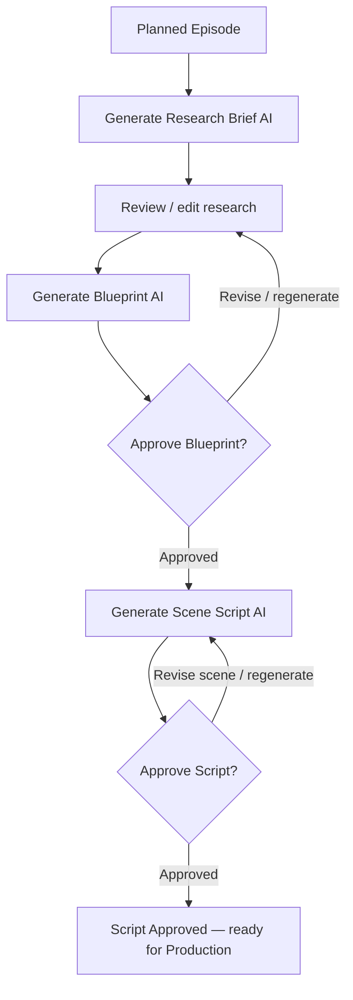

# Implementation Plan — YouTube Studio Fase 2: AI Blueprint & Script Approval

> Status: Planned.  
> Prasyarat: Fase 1 Editorial Workflow telah selesai sampai episode `Planned`.  
> Batas: Tidak mencakup G-Labs, TTS, render, YouTube upload, Shorts, analytics, ataupun monetization.

## 1. Objective

Mengubah Planned Episode menjadi paket editorial yang siap diproduksi melalui AI-assisted, human-approved workflow:

```text
Planned Episode
→ AI Research Brief
→ Review / Edit / Approve Blueprint
→ AI Scene Script
→ Review / Edit / Approve Script
→ Episode: Script Approved
```

AI menghasilkan draft terstruktur. User mengontrol semua keputusan editorial dan hanya versi yang disetujui dapat menjadi input fase Production Factory berikutnya.

## 2. Scope

### In scope

- Halaman/workflow one-column lanjutan di bawah Planned Episodes.
- Explicit action untuk generate/retry/save/review/approve Research Brief, Blueprint, dan Script.
- Research Brief AI yang membawa konteks Channel Strategy, Series, Episode, Universe, Visual Identity, locale, dan target durasi.
- Blueprint AI dengan hook, content promise, chapter, timing, retention moments, CTA, dan next-video bridge.
- Script AI scene-by-scene dengan VO, visual direction, scene purpose, scene type, subtitle cue, timing, transition, dan music/SFX cue.
- Versioning immutable untuk research, blueprint, dan script; pilihan active/latest draft serta histori versi.
- Human edit/review dan approval gates.
- Snapshot editorial context untuk reproduksibilitas.
- Server-side state transition enforcement serta tenant/permission isolation.
- Test contract, repository, API, workflow, and UI smoke coverage.

### Out of scope

- Memanggil G-Labs/TTS/video provider.
- Rendering preview/final, subtitle asset generation, atau timeline assembly.
- Publishing metadata/upload.
- Multi-language dubbing; locale episode tetap digunakan untuk output editorial.
- Analytics dan monetization.

## 3. Workflow and State Model



### Episode state transitions

```text
Planned → Researching → Blueprint Draft → Blueprint Approved
→ Script Draft → Script Approved
```

If an approved blueprint is superseded, set the episode back to `Blueprint Draft` and mark dependent draft scripts superseded. If an approved script is superseded/rejected, set episode back to `Script Draft`. No route may call `UPDATE ... status` without the shared transition guard.

## 4. AI Output Contracts

### Research Brief

```json
{
  "episode_angle": "string",
  "audience_intent": "string",
  "viewer_questions": ["string"],
  "keyword_cluster": ["string"],
  "key_claims": [{ "claim": "string", "risk": "low|medium|high", "source_note": "string" }],
  "editorial_risks": ["string"],
  "recommended_structure": "string",
  "source_requests": ["string"]
}
```

### Blueprint

```json
{
  "content_promise": "string",
  "hook": { "text": "string", "target_duration_seconds": 30 },
  "chapters": [{
    "order": 1,
    "title": "string",
    "target_duration_seconds": 90,
    "narrative_focus": "string",
    "retention_moment": "string",
    "pattern_interrupt": "string"
  }],
  "cta": { "text": "string", "placement": "string" },
  "next_video_bridge": "string"
}
```

### Scene Script

```json
{
  "title": "string",
  "estimated_total_duration_seconds": 600,
  "scenes": [{
    "scene_index": 1,
    "chapter_order": 1,
    "purpose": "string",
    "voiceover": "string",
    "estimated_duration_seconds": 10,
    "scene_type": "generated_visual|broll|diagram|map|text_overlay|archive_style",
    "visual_direction": "string",
    "subtitle_cue": "string",
    "transition_note": "string",
    "audio_cue": "string"
  }]
}
```

All contracts must be validated after AI parsing. Reject unknown/missing critical fields, non-positive duration, invalid scene type, non-sequential scene indexes, chapter mismatch, and material duration mismatch with the episode target.

## 5. Execution Task List

- [ ] Audit current blueprint/script tables, routes, planner, and Fase 1 UI; record compatibility migration needs.
- [ ] Extend the shared YouTube Studio contract with blueprint/research/script schemas, `scene_type` allowlist, version/state rules, and guarded episode transitions.
- [ ] Add idempotent PostgreSQL migration for research briefs, blueprint approval metadata, version uniqueness, editor/reviewer metadata, and snapshot fields.
- [ ] Implement tenant-scoped repository transactions for draft creation, active/latest version lookup, edit, approve, supersede, and dependent-document invalidation.
- [ ] Replace simple planner prompts with context-rich AI research, blueprint, and scene-script services plus strict JSON validation.
- [ ] Add server-authorized APIs for generate/list/get/edit/approve research, blueprint, and script versions.
- [ ] Add a one-column `Blueprint & Script` workflow section beneath Planned Episodes using semantic CSS Module classes and theme tokens only.
- [ ] Ensure selecting an episode is read-only; no AI generation happens without an explicit user action.
- [ ] Add field-level/scene-level editing and targeted regeneration design without running any provider production jobs.
- [ ] Add tests for contracts, tenant isolation, state transitions, versioning, approval/invalidation, and mocked AI output.
- [ ] Run build, relevant tests, Dev-only deployment, and end-to-end editorial smoke test; update this checklist with evidence.

## 6. Planned File Changes

### 6.1 `lib/youtube-studio-contract.js`

**Code Sebelum (Current/Before)**

```js
export const EPISODE_STATES = {
  PLANNED: 'Planned',
  SCRIPT_DRAFT: 'Script Draft',
  SCRIPT_APPROVED: 'Script Approved'
};
```

**Code Sesudah (Proposed/After)**

```js
export const EPISODE_STATES = {
  PLANNED: 'Planned',
  RESEARCHING: 'Researching',
  BLUEPRINT_DRAFT: 'Blueprint Draft',
  BLUEPRINT_APPROVED: 'Blueprint Approved',
  SCRIPT_DRAFT: 'Script Draft',
  SCRIPT_APPROVED: 'Script Approved'
};

export function validateResearchBrief(value) { /* schema validation */ }
export function validateBlueprint(value, targetDuration) { /* timing + chapter validation */ }
export function validateSceneScript(value, blueprint, targetDuration) { /* scene/type/timing validation */ }
```

Use BCP 47 locale canonicalisation already introduced in Fase 1; remove obsolete two-locale constraint if it remains unused.

### 6.2 `lib/db-pg.js`

**Code Sebelum (Current/Before)**

```sql
CREATE TABLE IF NOT EXISTS youtube_episode_blueprints (
  id TEXT PRIMARY KEY,
  content_json JSONB NOT NULL DEFAULT '{}'::jsonb,
  version INTEGER NOT NULL DEFAULT 1,
  status TEXT NOT NULL DEFAULT 'draft'
);
```

**Code Sesudah (Proposed/After)**

```sql
CREATE TABLE IF NOT EXISTS youtube_episode_research_briefs (...);
ALTER TABLE youtube_episode_blueprints
  ADD COLUMN IF NOT EXISTS approved_by TEXT,
  ADD COLUMN IF NOT EXISTS approved_at TIMESTAMP,
  ADD COLUMN IF NOT EXISTS context_snapshot_json JSONB NOT NULL DEFAULT '{}'::jsonb;
ALTER TABLE youtube_episode_scripts
  ADD COLUMN IF NOT EXISTS context_snapshot_json JSONB NOT NULL DEFAULT '{}'::jsonb;
```

Add an advisory-lock migration, tenant indexes, unique `(tenant_id, episode_id, version)` indexes, and status checks. Preserve existing drafts/data.

### 6.3 `lib/youtube-studio-repository.js`

**Code Sebelum (Current/Before)**

```js
export async function updateEpisodeStatus(id, status, actor) {
  return pgQuery('UPDATE youtube_episodes SET status = $1 ...', [status, id]);
}
```

**Code Sesudah (Proposed/After)**

```js
export async function transitionEpisode(id, nextState, actor) {
  // transaction: load tenant-scoped episode → assertEpisodeTransition → update
}

export async function approveBlueprint(blueprintId, actor) {
  // archive/supersede prior approved blueprint + invalidate dependent drafts
}
```

Add functions for versioned research/blueprint/script CRUD. Repository—not client routes—must resolve episode ownership, context snapshot, next version, and invalidation.

### 6.4 `lib/youtube-studio-planner.js`

**Code Sebelum (Current/Before)**

```js
export async function generateBlueprint(episode, strategy) { /* simple prompt */ }
export async function generateScript(episode, blueprint) { /* scene VO + visual direction */ }
```

**Code Sesudah (Proposed/After)**

```js
export async function generateResearchBrief(context) { /* structured, locale-aware output */ }
export async function generateBlueprint(context) { /* uses approved research + snapshot */ }
export async function generateSceneScript(context) { /* uses approved blueprint + snapshot */ }
```

Build prompts from authoritative context: Channel Strategy, Series, Episode, Universe snapshot, Visual Identity snapshot, locale, duration, user sources, and review instruction. Keep all provider calls here; routes only validate and orchestrate.

### 6.5 `app/api/v2/youtube-studio/episodes/[id]/blueprint/generate/route.js`

**Code Sebelum (Current/Before)**

```js
const blueprint = await generateBlueprint(episode, strategy);
```

**Code Sesudah (Proposed/After)**

```js
// Require an approved/current research brief, then create a versioned Blueprint Draft.
const blueprint = await generateBlueprint({ episode, strategy, research, contextSnapshot });
```

Add route-level permission guard and explicit state prerequisite. Create sibling research generate/list/edit/approve routes rather than overloading blueprint generation.

### 6.6 `app/api/v2/youtube-studio/episodes/[id]/scripts/generate/route.js`

**Code Sebelum (Current/Before)**

```js
const script = await generateScript(episode, blueprint);
```

**Code Sesudah (Proposed/After)**

```js
// Require approved blueprint and write a versioned Script Draft.
const script = await generateSceneScript({ episode, strategy, approvedBlueprint, contextSnapshot });
```

Block script creation until blueprint approval. Keep generation explicit and idempotency-keyed per blueprint version and user action.

### 6.7 `app/api/v2/youtube-studio/episodes/[id]/research/route.js` — new

**Code Sebelum (Current/Before)**

```js
// Route does not exist.
```

**Code Sesudah (Proposed/After)**

```js
export const GET = withYouTubeStudioAccess('read', listResearchVersions);
export const POST = withYouTubeStudioAccess('write', generateOrSaveResearchDraft);
```

Create analogous focused endpoints for research approval, blueprint list/edit/approve, script list/edit/approve, and scene regeneration request. Do not expose provider secrets or raw hidden prompt internals.

### 6.8 `app/youtube-studio/components/YouTubeStudioWorkspace.js`

**Code Sebelum (Current/Before)**

```jsx
// Planned Episodes is the last editorial workflow step.
<section className={styles.workflowStep} aria-labelledby="episodes-step-title">...</section>
```

**Code Sesudah (Proposed/After)**

```jsx
<section className={styles.workflowStep} aria-labelledby="blueprint-step-title">
  <ResearchBriefStep episode={selectedEpisode} />
  <BlueprintStep episode={selectedEpisode} />
  <ScriptReviewStep episode={selectedEpisode} />
</section>
```

Keep the existing one-column style. Generation starts only from explicit buttons. Show prerequisite messages, version selector, review status, JSON-free readable content, and action notices.

### 6.9 `app/youtube-studio/components/YouTubeStudioWorkspace.module.css`

**Code Sebelum (Current/Before)**

```css
.workflowStep { /* phase 1 step styling */ }
```

**Code Sesudah (Proposed/After)**

```css
.editorialDocument { background: var(--surface-raised); }
.reviewStatus { background: var(--status-neutral-soft); color: var(--status-neutral); }
.sceneList { display: grid; }
```

Extend only with semantic classes. Use MAKNA Flow theme tokens; no inline styles, hex/RGB/RGBA color values, or hard-coded visual values.

### 6.10 `scripts/test-youtube-studio-blueprint-script.mjs` — new

**Code Sebelum (Current/Before)**

```js
// No dedicated research → blueprint → script approval workflow test exists.
```

**Code Sesudah (Proposed/After)**

```js
test('approved blueprint is required before a scene script can be created', async () => {
  // mocked AI, tenant isolation, version, and transition assertions
});
```

Test invalid AI structures, duration mismatch, cross-tenant IDs, approve/supersede behavior, scene regeneration, and no provider/render execution.

### 6.11 `sot/menus/youtube-studio-blueprint-script-implementation-plan.md`

**Code Sebelum (Current/Before)**

```md
- [ ] Add tests ...
```

**Code Sesudah (Proposed/After)**

```md
- [x] Add tests ...
```

Update task status only after evidence-based verification. Add any newly required file to this section before editing it, with before/after snippets.

## 7. Acceptance Criteria

1. Only an accessible `Planned` episode can begin research generation.
2. AI research output is parsed and contract-validated before persistence.
3. User can edit/review research and explicitly trigger blueprint generation.
4. Blueprint includes validated chapter timing and cannot be used for script generation until approved.
5. Script contains valid, sequential scene records with supported scene type, duration, VO, and visual direction.
6. User can edit/review a script and explicitly approve one version.
7. Approving script transitions the episode exactly to `Script Approved`; only then may production be enabled in a later phase.
8. Superseding a blueprint/script invalidates dependent drafts without deleting history.
9. No request to episode selection triggers research, blueprint, or script generation.
10. Tenant and `youtube_studio` permission boundaries hold for every new endpoint.
11. One-column UI uses semantic CSS Module classes and MAKNA Flow theme tokens only.
12. Build/test and Dev-only staging smoke test pass.

## 8. Verification and Dev-only Deployment

Run focused tests and:

```bash
npm run build
npm run deploy:macmini-dev
```

Verify only on Mac Mini Dev:

- UI: `http://100.95.245.55:5020/youtube-studio`
- API: `http://100.95.245.55:7020`

Do not deploy to staging or production.

## 9. Release

After all verification succeeds:

```bash
npm run release-non-interactive -- --type patch --title "YouTube Studio AI Blueprint and Script" --points "Tambah research brief AI dan blueprint episode tervalidasi|Tambah script scene-by-scene dengan approval gate|Tambah versioning editorial dan workflow Script Approved"
```

Release/push does not authorize staging or production deployment.

