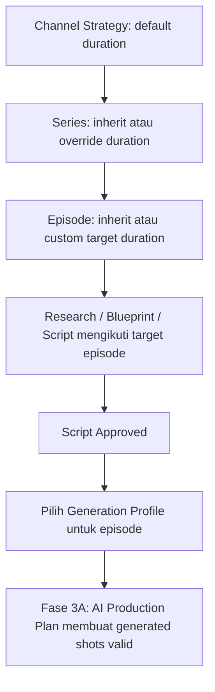

# Implementation Plan — YouTube Studio Fase 2.5: Flexible Duration & Generation Profiles

> Status: Planned.  
> Prasyarat: Editorial workflow hingga `Script Approved` telah selesai.  
> Batas: Fase ini belum memanggil Google Flow/G-Labs, TTS, render, atau YouTube publishing.

## 1. Objective

Menghapus asumsi durasi 600 detik sebagai perilaku produk dan menambahkan _generation profile_ yang memastikan production plan berikutnya hanya memakai durasi generated visual shot yang didukung model.

```text
Channel Strategy default duration
→ Series duration override (optional)
→ Episode target duration override (optional)
→ Blueprint/script inherits selected episode duration
→ Generation profile selected for episode
→ Future production plan validates each generated shot duration
```

## 2. Product Decisions

### 2.1 Hierarchy duration

| Level | Tanggung jawab | Nilai saat tidak diisi |
|---|---|---|
| Channel Strategy | Default creative duration channel | Platform fallback untuk legacy data saja |
| Content Series | Override durasi format series | Inherit Channel Strategy |
| Episode | Target yang dipakai Research/Blueprint/Script | Inherit Series, lalu Channel Strategy |
| Chapter | Distribusi narasi yang dibuat AI | Menjumlah ke target episode |
| Narrative scene | Durasi VO/cerita per scene | Menjumlah ke target episode |
| Generated visual shot | Durasi klip provider visual | Tunduk ke capability generation profile |

`600` hanya menjadi fallback migration bagi record lama yang tidak memiliki konfigurasi. Ia tidak boleh dipasang sebagai nilai tetap dalam UI/prompt baru.

### 2.2 Generation profiles awal

| Key | Label | Provider | Allowed generated-shot duration |
|---|---|---|---|
| `google_flow_omni_flash` | Google Flow — Omni Flash | Google Flow | 4, 6, 8, 10 detik |
| `google_flow_veo_3_1_lite` | Google Flow — Veo 3.1 Lite | Google Flow | 8 detik |

Profile bersifat **config-driven** melalui registry service. UI/client tidak boleh menjadi sumber capability model. Model baru dapat ditambahkan tanpa mengubah contract domain atau planner.

### 2.3 Penting: narrative scene bukan generated shot

Satu narrative scene 30 detik boleh terdiri dari beberapa generated visual shot. Contoh:

```text
Narrative scene: 30s
  ├── Shot 1: generated_visual / Omni Flash / 10s
  ├── Shot 2: generated_visual / Omni Flash / 10s
  └── Shot 3: generated_visual / Omni Flash / 10s
```

`broll`, `diagram`, `map`, `text_overlay`, dan `archive_style` tidak diwajibkan memakai allowed duration Google Flow; timeline mereka dapat mengisi narrative duration sesuai production plan.

## 3. UX Flow



### UI requirement

1. **Channel Strategy**: preset 5/8/10/12/15/20/30 menit dan mode Custom minutes/seconds.
2. **Series**: switch `Inherit channel default` / `Override`, dengan duration picker sama.
3. **Episode**: tampilkan resolved duration dan source (`Channel`, `Series`, atau `Episode override`); user dapat override sebelum Research dimulai.
4. **Script Approved**: tampilkan required `Generation Profile` selection.
5. **Fase 3A nanti**: only generated visual shot rows receive duration choices rendered from server-provided capability; controls Omni Flash = 4/6/8/10, Veo 3.1 Lite = 8 only.

## 4. Data and Contract Design

### 4.1 Persisted fields

```text
youtube_channel_strategies.config_json.video_format.default_target_duration_seconds
youtube_series.config_json.duration_mode = inherit | override
youtube_series.config_json.target_duration_seconds (nullable)
youtube_episodes.target_duration_seconds (resolved, required)
youtube_episodes.duration_source = channel | series | episode
youtube_episodes.generation_profile_key (nullable until Script Approved)
```

Do not retroactively alter approved research/blueprint/script. Their context snapshots retain the target duration at generation time.

### 4.2 Registry contract

```js
{
  key: 'google_flow_omni_flash',
  label: 'Google Flow — Omni Flash',
  provider: 'google_flow',
  generatedShotDurations: [4, 6, 8, 10],
  active: true
}
```

The registry exposes safe public metadata only. API keys, quotas, provider internals, and routing secret must not appear in UI responses.

### 4.3 Future production-plan contract (introduced now as validator only)

```js
{
  narrative_duration_seconds: 30,
  shots: [{
    shot_index: 1,
    asset_type: 'generated_visual',
    generation_profile_key: 'google_flow_omni_flash',
    generation_duration_seconds: 10
  }]
}
```

For `asset_type === 'generated_visual'`, `generation_duration_seconds` must be one of profile allowed values. The sum of shot durations should cover the narrative scene duration within a configurable tolerance; it must not silently create invalid provider jobs.

## 5. Execution Task List

- [x] Audit all current 600-second fallback, UI fields, prompts, ideas, blueprint, script, and migrations; identify legacy compatibility path.
- [x] Add duration and generation profile validation to the shared contract, including safe bounds and inheritance resolver.
- [x] Create config-driven generation profile registry and read-only capability API.
- [x] Add idempotent migration/backfill for series duration config, episode duration source, and generation profile key.
- [x] Update repository transactions so Series/Episode resolve duration server-side and do not trust client-provided source/strategy values.
- [x] Update AI Strategy, Series suggestions, Episode Idea, Blueprint, and Script prompts to use resolved duration rather than literal 600.
- [x] Refactor one-column UI to edit/display Channel, Series, and Episode duration inheritance/override with accessible custom input validation.
- [x] Add Generation Profile selector available only at Script Approved, backed by server registry and persisted per episode.
- [x] Add production-plan duration validator and tests, but do not call generation providers or create render jobs.
- [x] Add contract/repository/API/UI smoke tests for duration inheritance, overrides, invalid model durations, and legacy data.
- [x] Run build, relevant tests, Dev-only deployment, and workflow smoke test; update checklist with evidence.

## 6. Planned File Changes

### 6.1 `lib/youtube-studio-contract.js`

**Code Sebelum (Current/Before)**

```js
export function validateSceneScript(script, blueprint, targetDuration) {
  // validates scene duration only
}
```

**Code Sesudah (Proposed/After)**

```js
export function normalizeTargetDuration(input) { /* bounded seconds */ }
export function resolveEpisodeDuration({ channelStrategy, series, episodeOverride }) { /* hierarchy */ }
export function validateGeneratedShotDuration(shot, profile) { /* allowed duration */ }
export function validateProductionShotPlan(scene, profile) { /* coverage and asset type */ }
```

Use explicit duration source enum and validation. Never silently convert an invalid selected model duration to another value.

### 6.2 `lib/youtube-studio-generation-profiles.js` — new

**Code Sebelum (Current/Before)**

```js
// Model capability registry does not exist.
```

**Code Sesudah (Proposed/After)**

```js
const profiles = [
  { key: 'google_flow_omni_flash', generatedShotDurations: [4, 6, 8, 10] },
  { key: 'google_flow_veo_3_1_lite', generatedShotDurations: [8] }
];

export function listPublicGenerationProfiles() { /* safe public metadata */ }
export function getGenerationProfile(key) { /* authoritative lookup */ }
```

Keep provider capability logic centralized and separate from UI, planner, and future job executor.

### 6.3 `lib/db-pg.js`

**Code Sebelum (Current/Before)**

```sql
target_duration_seconds INTEGER NOT NULL DEFAULT 600
```

**Code Sesudah (Proposed/After)**

```sql
ALTER TABLE youtube_episodes
  ADD COLUMN IF NOT EXISTS duration_source TEXT NOT NULL DEFAULT 'channel',
  ADD COLUMN IF NOT EXISTS generation_profile_key TEXT;
```

Add an advisory-lock migration that backfills legacy records safely, adds checks for duration source, and keeps 600 only as legacy fallback. No destructive duration rewrite.

### 6.4 `lib/youtube-studio-repository.js`

**Code Sebelum (Current/Before)**

```js
target_duration_seconds: idea.target_duration_seconds || 600
```

**Code Sesudah (Proposed/After)**

```js
const duration = await resolveAndPersistEpisodeDuration({ channelId, seriesId, requestedDuration });
// writes target_duration_seconds + duration_source transactionally
```

Ensure manual create/adopt idea resolves duration from authorized channel/series records. Add update-duration and select-generation-profile operations with state preconditions.

### 6.5 `lib/youtube-studio-strategy-ai.js`

**Code Sebelum (Current/Before)**

```js
"target_duration_seconds": 600
```

**Code Sesudah (Proposed/After)**

```js
"default_target_duration_seconds": "Use the duration selected in the user brief"
```

Strategy AI must respect user-selected default rather than inventing/hardcoding a target duration.

### 6.6 `lib/youtube-studio-idea-planner.js` and `lib/youtube-studio-planner.js`

**Code Sebelum (Current/Before)**

```js
Target Duration: ${episode.target_duration_seconds || 600} detik.
```

**Code Sesudah (Proposed/After)**

```js
Target Duration: ${episode.target_duration_seconds} detik.
Duration source: ${episode.duration_source}.
```

Pass resolved duration into AI functions; reject missing resolved target before prompt execution. Idea planner uses series/channel default as an explicit input.

### 6.7 `app/api/v2/youtube-studio/generation-profiles/route.js` — new

**Code Sebelum (Current/Before)**

```js
// Route does not exist.
```

**Code Sesudah (Proposed/After)**

```js
export const GET = withYouTubeStudioAccess('read', async () => {
  return Response.json({ success: true, data: listPublicGenerationProfiles() });
});
```

Add tenant-authorized routes for episode duration update and generation profile selection. Server validates profile key and episode state.

### 6.8 `app/youtube-studio/components/YouTubeStudioWorkspace.js`

**Code Sebelum (Current/Before)**

```jsx
<span>Duration: {ep.target_duration_seconds}s</span>
```

**Code Sesudah (Proposed/After)**

```jsx
<DurationField value={resolvedDuration} source={durationSource} onSave={updateEpisodeDuration} />
<GenerationProfileSelector episode={selectedEpisode} profiles={profiles} />
```

Add controls into existing vertical sections—no new dashboard/tab. A script-approved episode can choose a profile; earlier episode states show a concise prerequisite message.

### 6.9 `app/youtube-studio/components/YouTubeStudioWorkspace.module.css`

**Code Sebelum (Current/Before)**

```css
/* Current phase 1/2 one-column styles. */
```

**Code Sesudah (Proposed/After)**

```css
.durationControl { /* semantic, token-based form layout */ }
.inheritanceHint { /* semantic status text */ }
.profileOption { /* accessible selectable option */ }
.shotDurationChoice { /* future plan control; theme tokens only */ }
```

Use semantic CSS Module classes and existing MAKNA Flow tokens only. No inline style, hex/RGB/RGBA, or hardcoded visual design values.

### 6.10 `scripts/test-youtube-studio-duration-profiles.mjs` — new

**Code Sebelum (Current/Before)**

```js
// Duration inheritance and model capability tests do not exist.
```

**Code Sesudah (Proposed/After)**

```js
test('Omni Flash accepts 4/6/8/10s and rejects other generated-shot durations', () => {});
test('Veo 3.1 Lite accepts only 8s', () => {});
```

Test hierarchy, episode override, legacy fallback, profile visibility, server-side invalid profile rejection, and no production provider call.

### 6.11 This plan

Update each checkbox only after verifiable completion. If a file is added, append it to this section with its before/after snippet before editing it.

## 7. Acceptance Criteria

1. New Channel Strategy can store a user-selected default duration; `600` is not forced in UI or AI prompt.
2. Series can inherit or override channel duration.
3. Manual and AI-adopted episodes receive an explicit resolved target duration and source.
4. Episode duration may be overridden before editorial generation; previously generated artifacts retain their own snapshot.
5. Research, Blueprint, and Script use the resolved episode duration.
6. Script Approved episode can select only an active registry profile.
7. Omni Flash exposes/accepts only 4/6/8/10 generated-shot seconds; Veo 3.1 Lite only 8 seconds.
8. Non-generated visual asset types are not incorrectly constrained to Flow shot durations.
9. Invalid profile/duration is rejected server-side; no provider/render job is created in this phase.
10. UI remains one-column, accessible, semantic-CSS, and theme-token aligned.
11. Build/tests and Dev-only smoke test pass.

## 8. Verification and Dev-only Deployment

Run focused tests plus:

```bash
npm run build
npm run deploy:macmini-dev
```

Verify only:

- UI: `http://100.95.245.55:5020/youtube-studio`
- API: `http://100.95.245.55:7020`

Do not run staging or production deployment commands.

## 9. Release

After successful verification:

```bash
npm run release-non-interactive -- --type patch --title "YouTube Studio Flexible Duration Profiles" --points "Tambah hierarchy durasi Channel Series dan Episode|Tambah generation profile Google Flow berbasis capability|Validasi durasi generated shot sebelum Production Factory"
```

