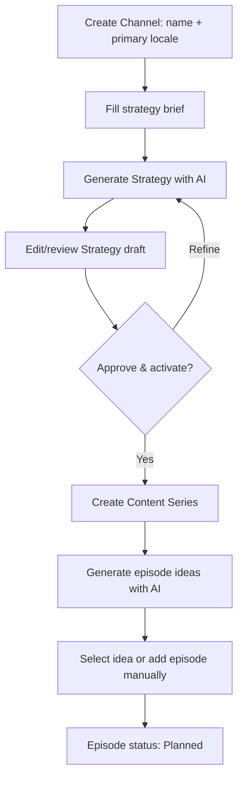

# Implementation Plan — YouTube Studio Fase 1: Editorial Workflow

> Status: Planned. Dokumen ini hanya mengatur workflow channel hingga episode; tidak mengubah render, G-Labs, atau publishing.  
> Dependensi: [YouTube Studio MVP](youtube-studio-mvp.md) dan [Implementation Plan MVP](youtube-studio-implementation-plan.md).

## 1. Tujuan Fase

Membuat workflow editorial yang benar-benar dapat digunakan sebelum melanjutkan ke produksi video:

```text
Buat Channel
→ isi brief singkat
→ AI menghasilkan Channel Strategy draft
→ user review/edit/approve strategy
→ buat Content Series
→ AI menyarankan backlog episode
→ user pilih atau buat Episode
→ Episode berstatus Planned dan siap masuk Blueprint/Script pada fase berikutnya
```

**Ya, Channel Strategy dapat dan sebaiknya powered by AI.** AI berfungsi sebagai _strategist copilot_, bukan pengganti keputusan user. Tidak ada strategy yang aktif hanya karena AI menghasilkannya; user wajib meninjau dan menyimpan/approve draft tersebut.

## 2. Scope Fase Ini

### In scope

- Channel creation yang tervalidasi dan dapat langsung dipilih pada UI.
- Strategy brief manual dengan AI-assisted generation/refinement.
- Strategy draft, editor, save, dan activate workflow.
- Pemilihan Universe dan Visual Identity dari data tenant yang valid.
- Series CRUD minimum di bawah channel yang memiliki strategy aktif.
- AI episode ide/backlog generator berbasis strategy + series + locale.
- Create episode dari ide atau input manual; episode menjadi `Planned`.
- Episode list/detail ringan: title, locale, target duration, priority, target publish date, status.
- Tenant/relationship validation dan error/empty/loading state yang jelas.
- Test workflow end-to-end sampai episode `Planned`.

### Out of scope

- Blueprint generation dan script generation.
- Script approval.
- TTS, G-Labs, visual generation, preview, render, upload YouTube, dan Shorts derivative.
- Analytics serta Monetization Readiness.

## 3. Product Workflow dan Approval



### Strategy brief minimum

- Niche/topic channel.
- Target audience dan geography.
- Primary locale.
- Goal: authority, AdSense, affiliate, sponsorship, digital product, atau leads.
- Format/durasi target serta upload cadence.
- Optional: Universe dan Visual Identity preset.
- Optional: brand/CTA constraints dan forbidden claims.

### AI Strategy output contract

AI mengembalikan JSON tervalidasi dengan:

```json
{
  "positioning": "...",
  "audience_persona": { "who": "...", "need": "...", "geography": "..." },
  "content_pillars": [{ "name": "...", "purpose": "...", "example_angles": ["..."] }],
  "editorial_tone": "...",
  "video_format": { "target_duration_seconds": 600, "cadence": "weekly" },
  "monetization_path": ["adsense"],
  "cta_strategy": "...",
  "risk_guardrails": ["..."]
}
```

JSON ini disimpan sebagai draft config. AI tidak boleh mengisi klaim fakta, referensi Universe, atau Visual Identity yang tidak dipilih user.

## 4. Execution Task List

- [x] Audit schema/route/UI aktual dan tetapkan migration minimal untuk strategy draft/activation serta episode idea backlog.
- [x] Tambahkan authorization helper khusus `youtube_studio` dan gunakan pada seluruh route workflow ini.
- [x] Tambahkan contract validation untuk channel brief, strategy draft, AI output, series, episode idea, dan relational ownership.
- [x] Implementasikan repository transaction/queries untuk strategy draft→active, series ownership, episode idea backlog, dan create episode `Planned`.
- [x] Implementasikan AI Channel Strategy generator/refiner dengan structured JSON, locale-aware prompt, dan safe parsing.
- [x] Implementasikan AI episode ide generator dari strategy aktif + series + locale.
- [x] Tambahkan API routes untuk generate/refine/activate strategy serta generate/adopt/reject episode ideas.
- [x] Refactor workspace UI menjadi workflow Channel → Strategy → Series → Episodes dengan loading, empty, and actionable error states.
- [x] Hilangkan side effect otomatis yang menghasilkan blueprint/script saat user hanya memilih episode.
- [x] Tambahkan test contract, authorization, tenant/relationship isolation, AI mock, dan happy path sampai status `Planned`.
- [x] Jalankan migration/test/build dan smoke test staging; perbarui checklist hanya setelah bukti tersedia.


## 5. Technical Design

### 5.1 Status dan data tambahan

- `youtube_channel_strategies.status`: `draft | active | archived`.
- Hanya satu strategy `active` per channel. Gunakan partial unique index bila PostgreSQL schema memungkinkan.
- Tambahkan `youtube_episode_ideas` agar hasil AI tidak langsung menjadi episode produksi:

```text
id, tenant_id, channel_id, series_id, strategy_id, locale,
title, angle, content_promise, rationale, target_duration_seconds,
status (suggested | adopted | rejected), source, created_at, updated_at
```

- Episode yang diadopsi dari idea menyimpan `source_idea_id` atau reference dalam `production_snapshot_json`/kolom baru yang eksplisit.
- Create episode manual harus menggunakan strategy aktif milik channel yang sama; server menentukan `strategy_id`, bukan mempercayai payload browser.

### 5.2 API surface

| Method | Route | Fungsi |
|---|---|---|
| POST | `/api/v2/youtube-studio/channels/:id/strategy/generate` | Membuat AI strategy draft dari brief |
| POST | `/api/v2/youtube-studio/channels/:id/strategy/refine` | Memperbaiki draft dengan instruksi user |
| PATCH | `/api/v2/youtube-studio/channels/:id/strategy` | Menyimpan perubahan draft manual |
| POST | `/api/v2/youtube-studio/channels/:id/strategy/activate` | Validasi dan mengaktifkan strategy |
| POST | `/api/v2/youtube-studio/series/:id/ideas/generate` | Membuat backlog episode idea |
| GET | `/api/v2/youtube-studio/series/:id/ideas` | Membaca backlog ide |
| POST | `/api/v2/youtube-studio/episode-ideas/:id/adopt` | Mengubah satu idea menjadi episode `Planned` |
| POST | `/api/v2/youtube-studio/episode-ideas/:id/reject` | Mengarsipkan/reject ide tanpa menghapus histori |

### 5.3 Authorization rules

- Semua route harus mengecek login, tenant context, tenant menu-disable state, dan permission `youtube_studio` di server.
- `GET` membutuhkan read permission; write/generate/activate/adopt membutuhkan write permission.
- Channel, strategy, series, idea, dan episode harus selalu berada dalam tenant yang sama dan dalam rantai kepemilikan yang benar.
- Client tidak boleh menentukan `tenant_id`, active strategy ID, atau ownership relation secara bebas.

## 6. Planned File Changes

### 6.1 `lib/auth.js`

**Code Sebelum (Current/Before)**

```js
export function withTenantContext(handler) {
  // validates logged-in user and tenant only
}
```

**Code Sesudah (Proposed/After)**

```js
export function requireMenuPermission(user, menuKey, mode = 'read') {
  // admin behavior + menu permission + tenant disabled-menu enforcement
}
```

Add a reusable server-side permission guard and apply it through a YouTube Studio route wrapper or each handler. Do not rely on Sidebar visibility.

### 6.2 `lib/youtube-studio-contract.js`

**Code Sebelum (Current/Before)**

```js
export const ALLOWED_LOCALES = ['id-ID', 'en-US'];
```

**Code Sesudah (Proposed/After)**

```js
export function normalizeLocale(value) {
  return Intl.getCanonicalLocales(String(value || ''))[0];
}

export function normalizeStrategyBrief(input) { /* required brief fields */ }
export function validateStrategyDraft(input) { /* JSON output contract */ }
```

Replace the two-locale allowlist with BCP 47 canonicalisation plus product guardrails. Add validators for every browser/AI payload and ownership/state assertion helpers.

### 6.3 `lib/db-pg.js`

**Code Sebelum (Current/Before)**

```sql
youtube_channel_strategies (... status TEXT NOT NULL DEFAULT 'active', ...)
-- no youtube_episode_ideas table
```

**Code Sesudah (Proposed/After)**

```sql
ALTER TABLE youtube_channel_strategies
  ALTER COLUMN status SET DEFAULT 'draft';

CREATE UNIQUE INDEX IF NOT EXISTS idx_yts_one_active_per_channel
  ON youtube_channel_strategies (tenant_id, channel_id)
  WHERE status = 'active';

CREATE TABLE IF NOT EXISTS youtube_episode_ideas (...);
```

Create an idempotent follow-up migration with an advisory lock. Preserve existing strategy records by migrating current active records safely; do not alter them into draft.

### 6.4 `lib/youtube-studio-repository.js`

**Code Sebelum (Current/Before)**

```js
export async function createEpisode(input, actor) {
  // accepts channel_id, series_id, strategy_id directly from input
}
```

**Code Sesudah (Proposed/After)**

```js
export async function createPlannedEpisode({ channelId, seriesId, title, locale, sourceIdeaId }, actor) {
  // transaction: verify tenant/channel/series/active strategy → INSERT status Planned
}

export async function activateStrategy(channelId, draftId, actor) {
  // transaction: archive previous active → activate validated draft
}
```

Repository owns relationship verification and status transitions. Add list/create/update strategy drafts and idea backlog functions.

### 6.5 `lib/youtube-studio-strategy-ai.js` — new

**Code Sebelum (Current/Before)**

```js
// No Channel Strategy AI service exists.
```

**Code Sesudah (Proposed/After)**

```js
export async function generateChannelStrategy({ brief, locale, universe, visualIdentity }) {
  // prompt → parse structured JSON → validate contract → return draft config
}

export async function refineChannelStrategy({ currentDraft, instruction, locale }) {
  // preserve approved user selections and return a new draft
}
```

Use `getGeminiModel` and safe JSON parsing following existing patterns. The service must not write to the database directly.

### 6.6 `lib/youtube-studio-idea-planner.js` — new

**Code Sebelum (Current/Before)**

```js
// No separate long-form episode-idea generator exists.
```

**Code Sesudah (Proposed/After)**

```js
export async function generateEpisodeIdeas({ strategy, series, locale, count }) {
  // returns structured ideas with title, angle, promise, rationale, duration
}
```

Generate ideas only from an active strategy and the selected series. Deduplicate against active/adopted ideas and existing episode titles server-side.

### 6.7 `app/api/v2/youtube-studio/channels/[id]/strategy/generate/route.js` — new

**Code Sebelum (Current/Before)**

```js
// Route does not exist.
```

**Code Sesudah (Proposed/After)**

```js
export const POST = withYouTubeStudioAccess('write', async (req, { params }, user) => {
  // validate channel + brief → AI service → persist strategy draft
});
```

Create matching routes for refine, draft update, and activate. Each route resolves the channel under tenant context before calling AI or persistence.

### 6.8 `app/api/v2/youtube-studio/series/[id]/ideas/generate/route.js` — new

**Code Sebelum (Current/Before)**

```js
// Route does not exist.
```

**Code Sesudah (Proposed/After)**

```js
export const POST = withYouTubeStudioAccess('write', async (req, { params }, user) => {
  // validate series + active strategy → generate/persist suggested ideas
});
```

Create companion list/adopt/reject routes. Adopting an idea uses a transaction and results in exactly one `Planned` episode.

### 6.9 `app/api/v2/youtube-studio/episodes/route.js`

**Code Sebelum (Current/Before)**

```js
const result = await createEpisode(body, user);
```

**Code Sesudah (Proposed/After)**

```js
const result = await createPlannedEpisode({
  channelId: body.channel_id,
  seriesId: body.series_id,
  title: body.title,
  locale: body.locale,
  sourceIdeaId: body.source_idea_id
}, user);
```

Remove `strategy_id` from client authority. Return validation errors for missing active strategy or cross-channel series.

### 6.10 `app/youtube-studio/components/YouTubeStudioWorkspace.js`

**Code Sebelum (Current/Before)**

```js
async function selectEpisode(episode) {
  const bpRes = await fetch(`/api/.../${episode.id}/blueprint/generate`, { method: 'POST' });
  const scRes = await fetch(`/api/.../${episode.id}/scripts/generate`, { method: 'POST' });
}
```

**Code Sesudah (Proposed/After)**

```js
async function selectEpisode(episode) {
  setSelectedEpisode(episode);
  // Read existing editorial state only; never generate as a selection side effect.
}
```

Refactor the page into four explicit workflow panels/tabs: Channel, AI Strategy, Series, Episodes. Include strategy brief form, AI draft preview/editor, explicit Activate button, backlog generator, adopt/reject controls, and manual episode form. Preserve the current styling language.

### 6.11 `scripts/test-youtube-studio-editorial-workflow.mjs` — new

**Code Sebelum (Current/Before)**

```js
// No test focuses on Channel → Strategy → Series → Planned Episode workflow.
```

**Code Sesudah (Proposed/After)**

```js
test('adopting an AI idea creates exactly one planned episode in its own channel', async () => {
  // tenant/relationship/state assertions with AI mocked
});
```

Add tests for permission denial, cross-tenant access, cross-channel series rejection, strategy activation uniqueness, locale normalisation, AI output validation, and idempotent idea adoption.

## 7. Acceptance Criteria

1. A permitted user creates a channel and immediately sees/selects it without a page refresh race.
2. The user supplies a brief and receives a structured AI strategy draft in the chosen BCP 47 locale.
3. The user can edit the AI draft before activation; an AI call alone does not activate it.
4. A channel has at most one active strategy, and all old active strategies remain archived for audit.
5. A series cannot be created for a channel without an active strategy.
6. AI can create a reviewable backlog of episode ideas for a selected series.
7. Adopting one idea creates one episode with status `Planned`; retrying the action does not create a duplicate.
8. Manual episode creation also results in `Planned`, using the server-resolved active strategy.
9. Selecting an episode has no generation side effect and does not call blueprint/script APIs.
10. An unauthorized user, a tenant-disabled user, and another tenant cannot access or mutate workflow data.
11. Migration, automated tests, Next.js build, and staging smoke test pass before this phase is marked complete.

## 8. Handoff to the Next Workflow

Only after this phase meets the acceptance criteria, start a separate implementation plan for:

```text
Planned Episode → AI Blueprint → Script Draft → Human Approval
```

The production/render workflow remains blocked until an approved script exists. This keeps debugging and product validation focused: first validate that users can plan a channel and a useful episode backlog, then validate editorial generation, then validate visual production.

