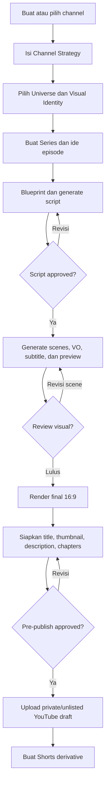

# YouTube Studio — MVP Scope

> Status: Product specification untuk MVP  
> Prasyarat: [Roadmap YouTube Studio](youtube-studio-roadmap.md)  
> Target: Membuktikan alur lengkap **strategy → episode → faceless AI render → YouTube draft → Shorts derivative** untuk channel long-form.

## 1. Tujuan MVP

MVP YouTube Studio harus memungkinkan satu tenant premium mengelola beberapa channel YouTube faceless AI dan menerbitkan episode long-form pertama secara end-to-end dari MAKNA Flow.

MVP dinilai berhasil bila pengguna dapat:

1. Membuat dan mengonfigurasi channel strategy multilingual.
2. Menghubungkan strategy tersebut ke Universe Manager dan Visual Identity Studio.
3. Membuat series, backlog, serta blueprint episode.
4. Menghasilkan, mengedit, dan menyetujui script long-form.
5. Menghasilkan video faceless AI 16:9 dengan voice-over, subtitle, dan render final.
6. Membuat paket metadata YouTube dan mengunggahnya sebagai private/unlisted draft.
7. Membuat minimal satu Shorts derivative dari episode tersebut.

## 2. Sasaran Pengguna

- Operator/creator yang membangun faceless AI channel edukasi, storytelling, explainer, tutorial, atau dokumenter ringan.
- Tenant premium yang dapat mengelola lebih dari satu channel.
- Editor/approver yang meninjau script, visual, thumbnail, dan keputusan publikasi.

## 3. Batasan Produk yang Dikunci

| Area | Ketetapan MVP |
|---|---|
| Tipe channel | Faceless AI channel |
| Format utama | Landscape 16:9 untuk video long-form YouTube |
| Produksi | End-to-end di MAKNA Flow; tidak bergantung pada handoff editor eksternal |
| Channel per tenant | Multi-channel |
| Akses | Premium permission `youtube_studio` |
| Bahasa | Multilingual; primary language dikonfigurasi per channel |
| Publish | Upload YouTube sebagai `private` atau `unlisted` draft; publish publik/scheduling belum wajib untuk MVP |
| Quality gate | Human approval wajib sebelum render final dan sebelum upload |

## 4. In Scope MVP

## 4.1 Access, tenancy, dan navigation

- Menu top-level **YouTube Studio**.
- Permission module `youtube_studio`; pengguna tanpa izin menerima state akses yang jelas.
- Semua data terisolasi berdasarkan tenant.
- Satu tenant dapat membuat, memilih, mengarsipkan, dan berpindah antar channel.
- Overview sederhana yang menunjukkan jumlah episode per status untuk channel aktif.

### Kriteria penerimaan

- User berizin dapat melihat menu dan hanya channel milik tenant-nya.
- User tanpa izin tidak dapat membuka page maupun API YouTube Studio.
- Tenant dapat membuat minimal dua channel dengan konfigurasi berbeda.

## 4.2 Channel Strategy

Setiap channel memiliki satu strategy aktif yang menjadi sumber kebenaran editorial dan produksi.

### Field minimum

- Channel name dan internal label.
- Niche, positioning, target audience, serta target geography.
- Primary language dan locale.
- Default target duration dan upload cadence.
- Monetization objective: AdSense, affiliate, sponsorship, digital product, atau lead generation.
- Voice persona/default voice locale.
- Editorial tone, forbidden claims, dan CTA strategy.
- Referensi Universe Manager opsional.
- Referensi Visual Identity Studio opsional.

### Kriteria penerimaan

- Pengguna dapat create, edit, archive, dan activate strategy.
- Episode baru mengambil default strategy aktif.
- Episode menyimpan snapshot strategy/Universe/Visual Identity saat mulai diproduksi.

## 4.3 Series, episode backlog, dan planner

### Fungsi minimum

- Membuat Content Series di bawah channel: nama, description, pillar, target duration, cadence, dan CTA.
- Membuat episode secara manual dari sebuah series.
- AI menghasilkan daftar ide episode dari strategy + series + bahasa channel.
- Pengguna dapat memilih ide untuk masuk ke backlog.
- Episode memiliki status: `Idea`, `Planned`, `Script Draft`, `Script Approved`, `In Production`, `Rendering`, `Ready to Publish`, `Uploaded`.
- List/backlog dengan filter channel, series, bahasa, dan status.

### Kriteria penerimaan

- Satu series dapat mempunyai beberapa episode backlog.
- Operator dapat mengubah urutan/prioritas dan target publish date episode.
- Episode yang dibuat dari AI idea membawa context channel dan series yang benar.

## 4.4 Blueprint, research brief, dan script engine

### Episode blueprint minimum

- Working title dan content promise.
- Target audience dan target duration.
- Hook awal 30–60 detik.
- Chapter/section outline dengan estimasi durasi.
- Retention moments dan CTA placement.
- Conclusion serta next-video bridge.

### Script engine minimum

- Generate VO script per chapter/scene dari blueprint.
- Bahasa output mengikuti `primary_language` serta locale channel.
- Natural localisation; sistem tidak sekadar menerjemahkan format Bahasa Indonesia.
- Estimasi durasi berdasarkan word count/speech rate.
- Editor naskah dan versi draft.
- Approve/reject workflow dengan catatan reviewer.

### Kriteria penerimaan

- Operator dapat menghasilkan, mengedit, regenerate, dan menyimpan versi script.
- Hanya versi script yang sudah disetujui yang dapat memulai produksi.
- Snapshot script approved immutable dan direferensikan render job.

## 4.5 Production Factory dan final render

MVP harus menghasilkan video faceless AI yang utuh. Kualitas visual dapat memakai template produksi yang terukur dahulu; MVP tidak perlu mendukung seluruh kemungkinan format sinematik.

### Pipeline minimum

1. Memecah approved script menjadi sequence/scene.
2. Membuat visual plan per scene dengan arahan Visual Identity.
3. Menghasilkan atau memilih visual sesuai provider yang tersedia.
4. Menghasilkan voice-over sesuai language, locale, dan voice persona.
5. Menyusun timeline: visual + VO + text overlay + subtitle + intro/outro.
6. Menambahkan background music dengan aturan volume/loudness dasar.
7. Render preview 16:9.
8. Memungkinkan regenerate scene tertentu dan render ulang final.
9. Menyimpan final video, subtitle, manifest scene/aset, dan log job.

### Guardrail minimum

- Progress dan status job dapat dipantau.
- Retry hanya pada sub-job yang gagal bila arsitektur provider mendukungnya.
- Tidak boleh ada final render tanpa script approved.
- Setiap asset mencatat asal/provider dan waktu pembuatan.
- Cost guardrail atau quota per tenant/channel harus tersedia sebelum job berat dijalankan.

### Kriteria penerimaan

- Episode approved menghasilkan preview dan final video 16:9 yang dapat diputar di dalam aplikasi.
- User dapat melihat error yang actionable dan menjalankan retry pada job gagal.
- Output final memiliki video file dan subtitle yang dapat diunduh/dipakai untuk upload.

## 4.6 Publishing Package dan YouTube Draft Upload

### Paket publikasi minimum

- Tiga atau lebih title candidate dengan satu pilihan aktif.
- Thumbnail brief atau thumbnail image dari template/generator yang tersedia.
- Description dengan summary, SEO keyword, CTA, dan placeholder links.
- Chapter timestamp dari blueprint/timeline.
- Video language, category, audience setting, serta subtitle attachment.
- Pre-publish checklist: final video, title, thumbnail, description, chapter, subtitle, rights/disclosure.

### Upload minimum

- Koneksi akun YouTube per channel dengan OAuth/credential yang aman.
- Upload video final menjadi `private` atau `unlisted` draft.
- Simpan YouTube video ID, URL YouTube Studio, upload status, dan pesan kegagalan.
- Approval gate sebelum upload.

### Kriteria penerimaan

- Pengguna dapat mereview dan menyunting package sebelum upload.
- Episode dapat di-upload sebagai draft dan tautan YouTube Studio tampil di MAKNA Flow.
- Kegagalan upload tidak menghapus render artifact maupun package metadata.

## 4.7 Repurpose to Shorts

### Fungsi minimum

- Sistem atau operator memilih minimal satu range scene dari episode long-form.
- Create derivative record yang menyimpan parent channel, series, episode, dan time range.
- Kirim derivative ke pipeline/video engine short-form MAKNA Flow yang ada.
- Generate YouTube Shorts title/description serta CTA menuju episode penuh.

### Kriteria penerimaan

- Minimal satu episode dapat menghasilkan satu Shorts derivative yang traceable ke parent episode.
- Status derivative terlihat dari halaman episode.
- CTA long-form pada metadata derivative dapat diedit sebelum dipublish.

## 5. Out of Scope MVP

Berikut tidak menghalangi peluncuran MVP dan dipindahkan ke release berikutnya:

- Analytics YouTube mendalam: retention graph, traffic sources, subscriber attribution, dan growth insight engine.
- Monetization Readiness dashboard lengkap serta kalkulator RPM/ROI.
- A/B testing title dan thumbnail otomatis.
- Public publish/scheduling dari MAKNA Flow.
- Banyak format produksi sinematik atau editor timeline manual penuh.
- Kolaborasi real-time/multi-user editing tingkat lanjut.
- Auto-dubbing satu episode ke banyak bahasa sekaligus.
- Auto-generated end screen/cards yang dikonfigurasi visual secara kompleks.
- Advanced copyright clearance atau legal review otomatis.

## 6. Alur Pengguna MVP

## 7. Minimal Data Model MVP

| Entitas | Tujuan |
|---|---|
| `youtube_channels` | Channel milik tenant dan konfigurasi koneksi YouTube |
| `youtube_channel_strategies` | Strategy aktif, bahasa, target audience, revenue objective, serta referensi kreatif |
| `youtube_series` | Container serial di bawah channel |
| `youtube_episodes` | Unit backlog dan lifecycle produksi |
| `youtube_episode_blueprints` | Struktur editorial episode |
| `youtube_episode_scripts` | Versioned script dan approval state |
| `youtube_production_packages` | Scene plan, VO, asset manifest, subtitle, dan snapshot |
| `youtube_render_jobs` | Status orchestration, output, retry, error, dan cost telemetry |
| `youtube_publishing_packages` | Metadata, thumbnail, chapter, checklist, dan hasil upload |
| `youtube_episode_short_derivatives` | Hubungan episode penuh ke asset/pipeline Shorts |

## 8. Non-Functional Requirements MVP

- Semua API dan query harus tenant-scoped serta permission-checked.
- State job harus idempotent; job retry tidak membuat episode/video duplikat tanpa intent pengguna.
- Artefak render disimpan dengan relasi episode dan akses yang sesuai tenant.
- Secret OAuth/provider tidak pernah dikirim ke browser atau dicatat dalam log biasa.
- Error dari provider diterjemahkan menjadi status yang dapat dipahami operator.
- Prompt, provider config, strategy, script, dan visual identity yang dipakai produksi dicatat sebagai snapshot.
- UI minimal mendukung locale Bahasa Indonesia dan Inggris, dengan struktur siap bahasa tambahan.
- Cost/quota guardrail diaktifkan sebelum generation/render berat tersedia secara umum.

## 9. Definition of Done MVP

MVP dinyatakan selesai bila skenario berikut berhasil pada tenant premium uji:

1. Membuat dua channel dengan bahasa dan Visual Identity berbeda.
2. Membuat series dan backlog episode untuk salah satu channel.
3. Menghasilkan blueprint serta script, kemudian menyetujui script tersebut.
4. Menjalankan produksi faceless AI hingga preview dan final render 16:9 tersedia.
5. Melengkapi title, thumbnail, description, chapters, subtitle, dan checklist.
6. Mengunggah final video sebagai YouTube private/unlisted draft dan menerima URL Studio.
7. Membuat setidaknya satu Shorts derivative yang tersambung dengan parent episode.
8. Memastikan user dari tenant atau tanpa permission yang salah tidak dapat mengakses data tersebut.

## 10. Tahap Berikutnya Setelah Dokumen MVP Disetujui

Dokumen ini menentukan **scope rilis pertama**, tetapi belum merupakan urutan coding. Setelah disetujui, langkah berikutnya adalah menyusun `implementation_plan.md` khusus YouTube Studio yang memuat:

1. Architecture dan keputusan provider/queue/storage.
2. Migration database dan kontrak data.
3. API, permission, serta UI per layar.
4. Integrasi Universe, Visual Identity, renderer, YouTube OAuth/upload, dan short-form engine.
5. Rencana test, acceptance test, rollout, observability, serta cost guardrail.

Implementation plan tersebut akan berisi task checklist yang diperbarui selama pengerjaan dan snippet kode sebelum/sesudah untuk setiap file yang diubah, sesuai SOP repository.

