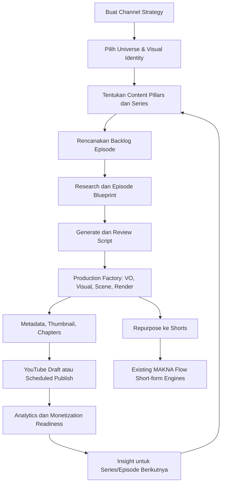

# YouTube Studio — Roadmap Produk & Implementasi

> Status: Draft product roadmap  
> Target: MAKNA Flow Staging  
> Fokus: Produksi video YouTube long-form 16:9 berbasis **faceless AI channel**, dari strategi hingga evaluasi monetisasi.

## 1. Ringkasan Produk

**YouTube Studio** adalah modul premium MAKNA Flow untuk membangun, menjalankan, dan menumbuhkan banyak channel YouTube long-form dalam satu tenant. Modul ini bukan sekadar generator video; ia adalah _channel operating system_ yang menghubungkan strategi, perencanaan seri, produksi video otomatis end-to-end, publikasi, distribusi short-form, dan pembelajaran dari analytics.

YouTube Studio memakai fondasi kreatif yang telah tersedia:

- **Universe Manager** sebagai sumber world-building, lore, karakter, tema, dan aturan naratif.
- **Visual Identity Studio** sebagai sumber identitas visual, gaya sinematik, palet, karakter, serta aturan konsistensi aset.
- **Content Flow dan publishing infrastructure** untuk status distribusi, jadwal, dan histori publikasi.

### Sasaran bisnis

- Meningkatkan produksi konten long-form bernilai tinggi dan berkelanjutan.
- Membangun aset channel yang dapat memperoleh pendapatan melalui AdSense, affiliate, sponsorship, digital product, atau lead generation.
- Menjadikan video long-form sebagai konten pusat; Shorts/Reels/TikTok sebagai kanal discovery dan funnel menuju video penuh.
- Menjaga kualitas, originalitas, dan nilai editorial agar channel lebih siap menghadapi evaluasi monetisasi YouTube.

## 2. Keputusan Produk yang Sudah Dikunci

| Keputusan | Ketetapan |
|---|---|
| Model creator awal | **Faceless AI channel** |
| Produksi video | **End-to-end di MAKNA Flow**, termasuk rendering long-form; bukan sekadar handoff ke editor eksternal |
| Kepemilikan channel | Satu tenant dapat mengelola **banyak channel YouTube** |
| Akses modul | **Premium dan permission-gated** dengan permission `youtube_studio` |
| Bahasa | **Multilingual sejak awal**; bahasa merupakan konfigurasi di level channel dan dapat dioverride di level series/episode bila diizinkan |
| Orientasi video | YouTube-first, landscape 16:9; turunan short-form dibuat setelah atau bersamaan dengan episode penuh |
| Kualitas editorial | Human approval tetap tersedia pada gate strategis, script, thumbnail, dan publish |

## 3. Batasan dan Prinsip Desain

1. **Long-form bukan mode tambahan short-form.** Lifecycle, metrik, biaya produksi, serta UX-nya berdiri sendiri.
2. **Shared foundations, independent workflow.** Universe dan Visual Identity direferensikan, bukan diduplikasi.
3. **Channel-first.** Semua keputusan episode harus dapat ditelusuri ke strategi dan pillar channel.
4. **Episode sebagai unit produksi; series sebagai unit strategi.**
5. **Snapshot untuk reproducibility.** Episode menyimpan snapshot Universe, Visual Identity, prompt, dan konfigurasi produksi saat dieksekusi.
6. **End-to-end namun dapat diaudit.** Semua generation/render memiliki job status, artefak, log, retry policy, dan approval gate.
7. **Monetization readiness, bukan janji kelulusan.** Kelayakan YouTube Partner Program tetap merupakan keputusan YouTube.
8. **Multilingual by design.** Jangan menghard-code Bahasa Indonesia ke schema, prompt, metadata, atau UI contract.

## 4. Information Architecture

```text
YouTube Studio
├── Overview
├── Channel Strategy
├── Content Series
├── Episode Planner
├── Production Factory
├── Publishing Studio
├── Repurpose to Shorts
├── Analytics
└── Monetization Readiness
```

| Area | Fungsi utama |
|---|---|
| Overview | Pipeline semua channel: ide, draft, produksi, render, jadwal, publish, dan performa |
| Channel Strategy | Niche, positioning, audience, bahasa, revenue objective, Universe, dan Visual Identity |
| Content Series | Content pillar, format serial, cadence, template episode, dan CTA |
| Episode Planner | Backlog, kalender editorial, research brief, dan episode blueprint |
| Production Factory | Script, VO, storyboard, asset plan, scene generation, assembly, subtitle, dan render 16:9 |
| Publishing Studio | Title, thumbnail, description, chapters, playlist, cards/end-screen, upload draft, serta scheduling |
| Repurpose to Shorts | Klip discovery dari episode penuh ke engine short-form |
| Analytics | CTR, retention, watch time, subscriber conversion, traffic source, dan insight |
| Monetization Readiness | Milestone, risk/compliance checklist, serta revenue-model planning |

## 5. Alur Produk End-to-End



## 6. Domain Model Tingkat Tinggi

```text
Tenant
  └── YouTube Channel
       └── Channel Strategy
            └── Content Pillar
                 └── Content Series
                      └── Episode
                           ├── Research Brief
                           ├── Blueprint
                           ├── Script Versions
                           ├── Production Package
                           ├── Render Job & Video Asset
                           ├── Publishing Package
                           ├── Analytics Snapshot
                           ├── Monetization Check
                           └── Short-form Derivatives
```

### Entitas minimum

- `youtube_channels`
- `youtube_channel_strategies`
- `youtube_content_pillars`
- `youtube_series`
- `youtube_episodes`
- `youtube_episode_research`
- `youtube_episode_blueprints`
- `youtube_episode_scripts`
- `youtube_production_packages`
- `youtube_render_jobs`
- `youtube_publishing_packages`
- `youtube_analytics_snapshots`
- `youtube_monetization_checks`
- `youtube_episode_short_derivatives`

### Lifecycle episode

```text
Idea → Planned → Researching → Script Draft → Script Approved
→ In Production → Rendering → Ready to Publish → Scheduled
→ Published → Analyzed → Iterated / Archived
```

## 7. Roadmap per Fase

## Fase 0 — Product Foundation

**Tujuan:** membangun kontrak produk, data, akses, dan observability sebelum generator atau rendering dibuat.

### Ruang lingkup

- Tambahkan menu utama **YouTube Studio** dan permission premium `youtube_studio`.
- Definisikan capability access: view, create, edit, approve, publish, analytics, dan admin.
- Rancang schema multi-tenant dan multi-channel.
- Tetapkan lifecycle episode, job state machine, ownership, audit trail, retry policy, serta soft-delete policy.
- Buat kontrak API awal serta type/validation contract.
- Hubungkan referensi Channel Strategy ke Brand Profile, Universe Manager, Visual Identity Studio, dan akun YouTube.
- Definisikan model localisation: `primary_language`, `target_locale`, `voice_locale`, `metadata_locale`, serta fallback language.
- Sediakan dashboard shell dan empty states.
- Pastikan log aktivitas, error tracking, dan cost/accounting event untuk setiap generation/render job.

### Kriteria selesai

- Tenant dengan permission dapat masuk ke menu YouTube Studio.
- Tenant dapat membuat lebih dari satu shell channel tanpa kebocoran data antar tenant.
- Semua entitas inti memiliki relasi, audit field, dan policy akses yang teruji.
- Lifecycle episode dan kontrak job disetujui sebagai sumber kebenaran.

## Fase 1 — Channel Strategy dan Series Planner

**Tujuan:** mengubah niat membangun channel menjadi sistem konten yang berulang dan konsisten.

### Ruang lingkup

- Form Channel Strategy:
  - nama channel, niche, positioning, dan audience persona;
  - negara/region, bahasa utama, bahasa target, serta target locale;
  - target durasi dan frekuensi upload;
  - objective: authority, AdSense, affiliate, sponsorship, digital product, atau lead generation;
  - style narasi, voice persona, CTA strategy, dan editorial guardrails.
- Pilih Universe dan Visual Identity dengan snapshot/revision reference.
- Kelola Content Pillars.
- Series builder dengan format serial, cadence, durasi target, template intro/outro, CTA, dan playlist association.
- AI planner untuk membuat backlog ide episode berdasarkan strategy, pillar, dan series.
- Editorial calendar dengan filter per channel/series/bahasa/status.
- Duplicate, archive, dan compare strategy/series tanpa menghilangkan histori episode.

### Kriteria selesai

- Pengguna dapat mengelola beberapa strategi channel dalam satu tenant.
- Satu series dapat menghasilkan dan menampung backlog episode berbahasa berbeda.
- Setiap episode baru dapat ditelusuri ke channel, strategy, pillar, series, Universe, dan Visual Identity asalnya.

## Fase 2 — Episode Blueprint dan Script Engine

**Tujuan:** menghasilkan materi editorial long-form yang kuat sebelum aset video dibuat.

### Ruang lingkup

- Research brief: topic, keyword/intent, competitive angle, audience question, target outcome, source list, serta risk flags.
- Episode blueprint:
  - working title dan content promise;
  - hook 30–60 detik;
  - struktur bab dan durasi tiap bab;
  - retention moments, pattern interrupts, dan CTA placement;
  - conclusion dan next-video bridge.
- Script engine multilingual:
  - tone mengikuti Channel Strategy;
  - naskah VO per scene/segment;
  - natural localisation, bukan translasi literal;
  - pronunciation notes dan terminology glossary;
  - estimasi durasi serta word count per segmen.
- Versioning script, compare/revert version, dan human edit.
- Approval gate: script tidak dapat masuk produksi sebelum disetujui oleh role yang berwenang.
- Citation/source handling untuk konten factual dan risk flag untuk klaim yang perlu review.

### Kriteria selesai

- Episode memiliki blueprint yang dapat diedit dan disetujui.
- Script lengkap dapat dihasilkan dalam bahasa konfigurasi channel dengan struktur yang sesuai durasi.
- Setiap revisi tercatat dan snapshot script yang disetujui bersifat immutable untuk produksi.

## Fase 3 — Production Factory (End-to-End Render)

**Tujuan:** menghasilkan video long-form faceless AI di MAKNA Flow, sampai render final siap upload.

### Ruang lingkup

- Breakdown script menjadi scene/sequence/shot timeline.
- Storyboard dan visual direction per segmen dari Visual Identity snapshot.
- Asset planning: AI visual/video, B-roll, motion graphics, text overlays, maps, diagrams, dan reusable channel assets.
- VO generation multilingual berdasarkan voice locale, persona, speed, pronunciation notes, serta segment timing.
- Music/SFX cue sheet dan aturan loudness/mixing.
- Subtitle/caption generation dan localisation captions.
- Automated timeline assembly:
  - scene duration alignment;
  - voice, visual, music, SFX, overlay, dan subtitle tracks;
  - intro/outro serta channel branding;
  - chapters markers.
- Render orchestration untuk 16:9 dengan preset kualitas yang disepakati, progress monitoring, retry, dan artifact storage.
- Preview/review player, scene-level revision, selective re-render, serta final approval gate.
- Copyright/compliance metadata untuk aset dan audit penggunaan asset.

### Kriteria selesai

- Episode approved dapat menghasilkan preview dan final render melalui MAKNA Flow.
- Kegagalan tiap sub-job dapat diidentifikasi dan di-retry tanpa memulai ulang seluruh episode.
- Output final memiliki video, subtitle, chapter marker, manifest aset, serta produksi snapshot yang dapat diaudit.

## Fase 4 — Publishing Studio

**Tujuan:** membuat paket YouTube yang lengkap, dapat ditinjau, lalu diterbitkan sebagai draft atau terjadwal.

### Ruang lingkup

- Title Lab: beberapa variasi judul, angle, target audience, dan rationale CTR tanpa misleading clickbait.
- Thumbnail Factory/Brief:
  - visual concept, composition, focal subject, expression/emotion, headline, dan contrast guidance;
  - integrasi dengan Visual Identity;
  - generation/review thumbnail bila capability image tersedia.
- Description builder multilingual: SEO, summary, links, source/attribution, affiliate disclosure, CTA, dan template channel.
- Chapters, tags/keywords, playlist, category, audience setting, language, subtitles, cards, serta end screen recommendation.
- Pre-publish quality gate: format, duration, thumbnail, metadata, subtitles, rights, disclosure, dan compliance flags.
- YouTube upload sebagai private/unlisted draft, status sync, dan direct link ke YouTube Studio.
- Scheduling/publish action melalui policy akses yang eksplisit.
- Riwayat metadata agar eksperimen title/thumbnail dan perubahan pascapublikasi dapat dilacak.

### Kriteria selesai

- Video final dapat diunggah dari MAKNA Flow menjadi YouTube draft beserta metadata lengkap.
- Hanya role yang berwenang dapat menjadwalkan atau mempublikasikan video.
- Metadata dan hasil upload dapat ditelusuri kembali ke episode serta render artifact yang benar.

## Fase 5 — Repurpose to Shorts

**Tujuan:** menjadikan episode long-form sebagai sumber sistematis bagi konten discovery short-form.

### Ruang lingkup

- AI clip candidate detection berdasarkan hook, standalone value, emotional peak, curiosity, dan CTA potential.
- Review range dan prioritas klip oleh pengguna.
- Generate vertical cut plan: crop/reframe, subtitle treatment, hook text, dan duration target.
- Kirim klip yang disetujui ke engine short-form MAKNA Flow yang telah ada.
- Generate metadata per platform: YouTube Shorts title/description, TikTok caption, Instagram Reels caption, CTA menuju episode penuh.
- Tracking asal-usul: setiap klip menyimpan parent episode/series/channel.
- Dashboard funnel long-form → short-form dengan status produksi dan publish.

### Kriteria selesai

- Satu episode dapat menghasilkan beberapa kandidat clip dan diproses ke pipeline short-form.
- Semua short-form derivative dapat ditelusuri ke parent episode.
- CTA dan tautan episode penuh dapat dikelola konsisten per channel/bahasa.

## Fase 6 — Analytics dan Growth Loop

**Tujuan:** memakai data performa untuk memperbaiki strategi, packaging, dan produksi episode berikutnya.

### Ruang lingkup

- Sinkronisasi YouTube Analytics terjadwal untuk channel dan video.
- Dashboard per tenant, channel, series, dan episode:
  - impressions, CTR, views, watch time, average view duration;
  - audience retention dan drop-off chapters;
  - subscriber gained/lost;
  - traffic source, geography, language, device, new vs returning viewers;
  - performa playlist dan series.
- Compare forecast vs actual: topik, target durasi, target CTR, dan publish schedule.
- Insight engine:
  - hook lemah atau drop-off awal;
  - judul/thumbnail dengan CTR rendah;
  - CTR tinggi namun retention lemah;
  - topic/pillar/series yang efektif menghasilkan subscriber atau watch time;
  - rekomendasi next episode.
- A/B experiment record untuk title/thumbnail, dengan catatan hasil dan keputusan operator.
- Long-form-to-short-form attribution jika data platform memungkinkan.

### Kriteria selesai

- Pengguna dapat membandingkan performa antar series dan episode.
- Insight yang dibuat sistem memiliki tautan ke data pendukung, bukan klaim tanpa dasar.
- Planner dapat memakai rekomendasi performa sebagai input untuk ide episode baru.

## Fase 7 — Monetization Readiness

**Tujuan:** membantu channel menyiapkan strategi monetisasi yang bertanggung jawab, lebih luas dari AdSense semata.

### Ruang lingkup

- Tracker milestone monetisasi: subscriber, public watch hours, Shorts views (bila relevan), konsistensi upload, serta eligibility progress berdasarkan data yang tersedia.
- Originality/value-add checklist:
  - nilai editorial, analisis, atau narasi asli;
  - transformasi yang memadai untuk aset pihak ketiga;
  - hak penggunaan asset dan attribution;
  - policy disclosure AI/affiliate/sponsored content;
  - risk flag untuk reused/repetitious content.
- Revenue model planner: AdSense, affiliate, sponsorship, membership, digital product, dan lead generation.
- Scenario calculator berbasis asumsi editable: views, RPM/CPM, affiliate conversion, sponsor rate, dan biaya produksi.
- Channel health view: production cost, render cost, revenue assumption, payback period, dan ROI scenario.
- Remediation checklist untuk gaps yang harus ditinjau manusia.
- Disclaimer yang jelas: MAKNA Flow menyediakan readiness assessment; kelulusan YPP dan monetisasi selalu bergantung pada kebijakan serta review YouTube.

### Kriteria selesai

- Pengguna dapat melihat milestone dan risiko monetisasi untuk tiap channel.
- Checklist monetisasi memiliki bukti/link ke asset, episode, atau metadata pendukung.
- Semua estimasi pendapatan dibedakan secara eksplisit dari pendapatan aktual.

## 8. Urutan Rilis yang Direkomendasikan

| Release | Cakupan | Nilai utama |
|---|---|---|
| R1 — Foundation | Fase 0 | Aman untuk multi-tenant, premium, dan siap dikembangkan |
| R2 — Planning | Fase 1–2 | Channel dapat merencanakan serta menyetujui episode berkualitas |
| R3 — Production | Fase 3 | Video faceless long-form dapat diproduksi dan dirender end-to-end |
| R4 — Publish & Distribution | Fase 4–5 | Video dapat masuk YouTube dan menjadi sumber konten short-form |
| R5 — Intelligence | Fase 6–7 | Growth loop dan kesiapan monetisasi berbasis data |

## 9. MVP yang Disarankan

MVP sebaiknya mencakup Fase 0, Fase 1, Fase 2, serta subset prioritas Fase 3 dan Fase 4:

1. Multi-channel premium access dan Channel Strategy.
2. Series, backlog, kalender, blueprint, serta multilingual script approval.
3. Produksi faceless AI: VO, sequence/scene plan, assembly, subtitle, dan render final 16:9.
4. Publishing package: title, thumbnail, description, chapters, dan upload sebagai private draft.
5. Minimal satu alur repurpose episode ke YouTube Shorts.

Analytics mendalam dan Monetization Readiness sebaiknya dibangun setelah data publikasi nyata sudah mulai masuk, agar metrik dan insight dibangun dari kebutuhan operasional yang terbukti.

## 10. Risiko Utama dan Mitigasi

| Risiko | Mitigasi |
|---|---|
| Render long-form mahal atau gagal | Job orchestration granular, checkpoints, retry per scene, quota/cost guardrail, dan artifact reuse |
| Output terasa repetitif atau kurang original | Strategy/series guardrail, human approval, asset provenance, originality checklist, dan insight loop |
| Ketidakkonsistenan identitas | Snapshot Universe/Visual Identity, reusable channel assets, serta scene-level validation |
| Kualitas multilingual rendah | Locale-aware prompts, glossary, voice locale, review gate, dan per-language metadata templates |
| Metadata clickbait atau klaim berisiko | Pre-publish policy gate, factual risk flag, serta editor approval |
| Kebocoran data lintas channel/tenant | Tenant-scoped queries, permission enforcement, audit log, dan automated access tests |
| Ekspektasi monetisasi berlebihan | Pisahkan forecast dari actual, tampilkan disclaimer, dan jangan menyatakan kelulusan YPP |

## 11. Metrik Keberhasilan

### Product adoption

- Jumlah channel aktif per tenant.
- Jumlah series dan episode yang mencapai status published.
- Lead time dari idea ke render final dan dari render ke published.
- Tingkat keberhasilan render/job tanpa intervensi manual.

### Content quality dan growth

- CTR, average view duration, retention awal, serta watch time per episode/series.
- Subscriber conversion per 1.000 views.
- Persentase episode yang menghasilkan short-form derivatives.
- Rasio episode yang menggunakan Universe/Visual Identity secara konsisten.

### Business

- Attach rate permission premium YouTube Studio.
- Render/generation cost per published episode.
- Revenue actual dan estimated revenue yang dipisahkan jelas.
- Persentase channel yang menyelesaikan Monetization Readiness checklist.

## 12. Keputusan Implementasi Berikutnya

Sebelum mulai coding, buat rancangan teknis terpisah yang menetapkan:

1. Database migration dan data ownership model multi-channel.
2. Permission matrix serta bentuk premium entitlement.
3. Kontrak job/render orchestrator, queue, storage, retry, dan cost limit.
4. Provider AI untuk script, voice, visual/video, subtitle, dan rendering.
5. Kontrak YouTube OAuth/upload/analytics serta token lifecycle.
6. Lokalisasi UI, prompt, voice, subtitle, metadata, dan fallback behavior.
7. Quality/compliance policy untuk originalitas, aset, disclosure, dan publish approval.

